# Code Documentation

**Generated:** 2026-02-24 10:57:11 UTC

**Note:** Diagrams generated from AI analysis of documentation using PlantUML

## Table of Contents

1. [Project Overview](#project-overview)
2. [Architecture Analysis](#architecture-analysis)
3. [Database & Microservice Analysis](#database--microservice-analysis)
4. [Diagrams](#diagrams)
5. [File Documentation](#file-documentation)
6. [Statistics](#statistics)

## Project Overview

## 📌 Executive Summary

Nautilus Trader is an advanced software platform designed to facilitate automated trading across multiple financial markets. It is intended for quantitative traders, algorithm developers, and trading firms who need a reliable, flexible, and extensible system to implement and manage trading strategies. By integrating with various market data sources and trading venues, Nautilus Trader streamlines decision-making and order execution, reducing manual effort and improving trade performance.

## 🏗️ Technology Stack

| Technology          | Purpose                                                                                 |
|---------------------|-----------------------------------------------------------------------------------------|
| **Rust**            | Core system components, performance-critical modules, and new adapter implementations.  |
| **Python**          | High-level application logic, strategy development, scripting, and orchestration.       |
| **JSON**            | Data interchange format for configuration and API communication.                        |
| **TOML**            | Configuration management, particularly for project and dependency settings.            |
| **YAML**            | Human-readable configuration files for deployment and integration.                     |
| **Shell Scripts**   | Automation of build, deployment, and maintenance tasks.                                |
| **C/C++ Headers**   | Interfacing with native libraries or performance-optimized components.                 |
| **SQL**             | Database schema definitions and queries for persistent storage.                        |
| **Serde (Rust Library)** | Serialization/deserialization of data structures for API communication.               |

## 🧱 Architecture Overview

Nautilus Trader employs a **modular layered architecture** with a mix of event-driven and service-oriented patterns. Imagine the system as a well-organized factory assembly line:

- **Input Layer:** Market data feeds and user commands come into the system.
- **Processing Layer:** Trading logic modules process data, run strategies, and decide on actions.
- **Output Layer:** Orders and trade instructions are sent to exchanges or brokers via adapters.

Communication happens asynchronously through streaming messages and REST APIs, allowing components to operate independently yet cohesively. This modularity supports adding new market adapters or trading strategies without disrupting the entire system.

## 📦 Key Modules & Components

| Module/Component            | Responsibility                                                                                              |
|----------------------------|-------------------------------------------------------------------------------------------------------------|
| **Market Data Adapters**    | Connect to various financial exchanges and data sources to stream live market data into the system.          |
| **Trading Engine**          | Core logic that executes trading strategies, manages orders, and monitors positions in real-time.            |
| **REST API Layer**          | Provides HTTP/JSON-RPC endpoints for external clients to interact with the system — submitting orders, querying status, etc. |
| **Rust Betfair Adapter**    | A new Rust crate scaffolding specifically designed to interface with the Betfair exchange, handling streaming messages and API calls. |
| **Serialization Layer**     | Uses Serde to efficiently deserialize mixed-type API fields into usable Rust/Python data structures.         |
| **Configuration Management**| Manages system settings and dependencies via TOML and YAML files, enabling flexible deployment and tuning.    |
| **Persistence Layer**       | Handles storage of trade history, configuration, and operational state using SQL databases.                   |
| **Automation Scripts**      | Shell scripts for building, deploying, and maintaining the software environment.                              |

## 🔄 How It Works (High-Level Flow)

1. **Market Data Intake:** The system continuously receives live market data from connected exchanges via streaming adapters.
2. **Data Processing:** Incoming data is normalized and passed to the trading engine where algorithms analyze market conditions.
3. **Decision Making:** Based on predefined strategies, the trading engine decides whether to place, modify, or cancel orders.
4. **Order Execution:** Orders are sent through the appropriate market adapter (e.g., Betfair adapter) to the external exchange.
5. **Order & Position Tracking:** The system monitors order statuses and updates position information in real-time.
6. **User Interaction:** External users or systems interact with Nautilus Trader through the REST API to monitor activity, adjust strategies, or retrieve reports.
7. **Persistence:** All relevant data, including trades and system states, is saved to a database for compliance and analysis.
8. **Maintenance & Updates:** Developers and operators use automation scripts for smooth deployment and ongoing system health.

## 📊 Codebase Health Snapshot

- **Size & Complexity:** The codebase is large and complex, with 2,769 files spanning multiple languages, reflecting a mature and feature-rich platform.
- **Language Distribution:** Heavy use of Rust (1,670 files) for performance-sensitive components and Python (530 files) for flexibility and rapid development.
- **Organization:** Modular and layered, enabling separation of concerns but requiring careful coordination across components.
- **Dependencies:** A large dependency set (1,944) suggests rich functionality but also implies a need for vigilant dependency management.
- **Recent Activity:** The addition of the Betfair adapter Rust crate scaffolding and enhancements to streaming message types and API models indicate active development and ongoing expansion.
- **Maintainability:** Use of modern serialization libraries (Serde), configuration standards (TOML/YAML), and automated scripts supports maintainability, though the scale demands thorough documentation and testing to prevent technical debt.

---

This overview should provide newcomers and stakeholders a clear understanding of Nautilus Trader’s purpose, technical foundation, structure, and operational flow. For developers, it highlights key areas to focus on and how to navigate the system effectively.

## Architecture Analysis

## 🏗️ Architecture Pattern

This codebase appears to follow a **modular monolith** architecture. In simple terms, this means the entire system is built as a single application but clearly divided into distinct modules or packages, each responsible for a specific area of functionality.

Think of it like a department store: each department (modules like accounting, core, analysis) manages its own products and staff but operates under one roof. This pattern is often chosen to balance ease of deployment (one app) with maintainability (separation of concerns).

The modular monolith pattern is likely chosen here because the system deals with tightly related financial trading features that benefit from sharing data structures and logic without the overhead of distributed systems.

---

## 📦 Module Organization

The codebase is organized into these key modules/packages:

- **.config**: Central configuration settings and environment variables.
- **.docker**: Docker setup and containerization scripts for deployment.
- **nautilus_trader** (root package): Main application namespace, containing all core functionality.
  - **accounting**: Handles financial records, transactions, and bookkeeping.
  - **accounting/accounts**: Specific submodule for managing individual accounts.
  - **core**: Fundamental building blocks and shared utilities.
  - **core/includes**: Possibly helper functions or common includes used across core.
  - **analysis**: Data analysis, reporting, and decision-making logic.
  - **cache**: Caching mechanisms to improve performance.
  - **config**: Configuration related to the nautilus_trader package specifically.

This hierarchy shows a clear separation between core system logic, financial/accounting concerns, analysis features, and infrastructure-related concerns like configuration and caching.

---

## 🔗 Coupling & Cohesion Assessment

- **Coupling**:  
  With 1944 total dependencies and 570 classes, there is significant interaction between modules. The heavy reuse of a few core files (e.g., `nautilus_trader/config/__init__.py` imported 162 times) suggests some central components serve as shared resources, which can increase coupling. However, the modular structure helps contain dependencies within logical boundaries. Without full dependency graphs, the coupling seems **medium** — modules are connected but not overly intertwined.

- **Cohesion**:  
  Each module appears focused on a distinct domain area (e.g., accounting, analysis, caching). Submodules like `accounting/accounts` indicate further breakdown into focused responsibilities. This points to **high cohesion**, where each module has a clear purpose and does not mix unrelated concerns.

**Overall health:**  
- Coupling: Medium  
- Cohesion: High

---

## 🔑 Critical Components

The most critical components are the files and modules that are heavily imported across the codebase:

- `nautilus_trader/config/__init__.py` (imported 162 times): Central configuration — likely a foundational piece for managing settings and environment variables.
- `nautilus_trader/model/enums.py` (146 imports) and `nautilus_trader/common/enums.py` (84 imports): Shared enumerations defining constants used throughout the system.
- `nautilus_trader/model/instruments/__init__.py` (83 imports): Core domain models related to financial instruments.
- `nautilus_trader/core/__init__.py` (64 imports): Core utilities and foundational logic.

These files act as the "load-bearing walls" of the system. Any changes here require careful review since many parts of the codebase depend on them.

---

## ✅ Strengths

- **Clear modular separation**: The codebase is logically divided into domain-specific modules (accounting, core, analysis), making it easier to understand and maintain.
- **High cohesion within modules**: Each package appears focused on a single area of responsibility, reducing complexity and improving code quality.
- **Centralized configuration management**: Heavy reuse of a single configuration module simplifies environment handling and ensures consistency across components.

---

## ⚠️ Areas for Improvement

- **Manage dependency volume**: With nearly 2000 dependencies, there is a risk of tight coupling or dependency sprawl. Consider reviewing dependency graphs to identify and reduce unnecessary links.
- **Avoid overly central components**: The heavy reliance on a few core files (e.g., config and enums) can create bottlenecks and increase the risk of unintended side effects. Introducing interfaces or abstractions might help decouple these.
- **Documentation and boundaries clarity**: While modules are well separated, ensuring clear API boundaries and documentation between them will prevent accidental misuse and improve onboarding.

---

This architecture balances modular design with practical integration needs, making it well-suited for a complex financial trading system. With ongoing attention to dependencies and clear module contracts, it will remain maintainable and scalable.

## Database & Microservice Analysis

## 🗄️ Database Schema Overview

This project’s database schema models a trading system capturing entities related to financial instruments, trading activity, and account management. The 28 tables primarily store:

- **Participants and Roles**:  
  - *trader*, *client*, *account* — represent users and their financial accounts.  
- **Financial Entities**:  
  - *currency*, *instrument* — define the tradable assets and their denominations.  
- **Trading Operations**:  
  - *order*, *order_event*, *trade*, *position* — track orders placed, their lifecycle events, executed trades, and resulting positions.  
- **Strategy and Signals**:  
  - *strategy*, *signal* — encapsulate trading strategies and signals triggering trades or analysis.  
- **Market Data**:  
  - *quote*, *bar* — store real-time or historical price data and aggregated bars/candlesticks.  
- **Event Logging**:  
  - *account_event* — logs changes or activities related to accounts.  
- **Miscellaneous/Support**:  
  - *general* — possibly for configuration or metadata, though minimal columns suggest a lightweight role.

Overall, the database records comprehensive trading lifecycle data, from client and account setup, through order management and execution, to analysis via strategies and signals.

---

## 🔗 Entity Relationships

Interestingly, the schema has **no declared foreign key constraints**, which leaves relationships implicit rather than enforced at the database level. Based on common trading domain logic, we can infer:

| Parent Entity | Child Entity | Relationship Type         | Description                                          |
|---------------|--------------|--------------------------|------------------------------------------------------|
| trader        | account      | One-to-many              | Each trader may own multiple accounts                |
| client        | account      | One-to-many (likely)     | Clients control one or more accounts                  |
| account       | order        | One-to-many              | Accounts place many orders                             |
| order         | order_event  | One-to-many              | Orders have multiple lifecycle events                  |
| order         | trade        | One-to-many              | Orders can result in multiple trades                   |
| strategy      | signal       | One-to-many              | Strategies generate multiple signals                   |
| instrument    | quote/bar    | One-to-many              | Market data is collected per instrument                |
| account       | position     | One-to-many              | Positions are tracked per account                       |
| account       | account_event| One-to-many              | Account-related events logged                           |

Without foreign keys, these relationships depend on application-level integrity and consistent use of key columns. This reduces built-in database referential integrity and increases risk of orphaned or inconsistent data.

---

## ⚙️ Stored Procedures & Business Logic

There are **7 stored procedures**, mainly focusing on:

- Metadata queries: *get_all_tables*  
- Maintenance operations: *truncate_all_tables*  
- Partition management: *create_block_partition*, *delete_block_partition*, *create_token_partition*, *delete_token_partition*  
- Data retrieval: *get_last_continuous_block*

No stored procedures implement core business logic like order processing or risk checks. This suggests a **thin database logic layer** primarily used for maintenance and optimization (partitioning), with core business rules implemented in the application.

**Assessment:**  
- This approach aligns with microservices best practices, keeping the database as a data store and delegating logic to services.  
- The lack of triggers or complex stored procedures reduces coupling and improves maintainability.  
- However, the absence of foreign keys and constraints means the application must rigorously enforce data integrity.

---

## 🔄 Data Flow Across Services

Only one service, **nautilus_trader**, accesses the database directly, via multiple modules:

| Module                             | Database Interaction Type        | Description                              |
|----------------------------------|---------------------------------|------------------------------------------|
| backtest/node.py                 | Engine creation                  | Initializes DB connections for backtests |
| adapters/kraken/execution.py     | Batch cancel commands            | Executes batch cancel operations          |
| system/kernel.py                 | Data & execution engine connects| Connects to DB for data and command processing |
| live/execution_engine.py          | Command execution                | Executes live trading commands            |
| live/data_engine.py               | Command execution                | Data-related DB commands                   |
| live/risk_engine.py               | Command execution                | Risk checks and related DB access          |
| persistence/catalog/parquet.py    | Query execution & file management| Manages query execution and parquet files |

**Key observations:**

- A single service handles all DB interactions, which avoids the **shared database anti-pattern** across microservices.  
- The database is effectively a **single source of truth** for the trading domain state.  
- Multiple modules within the same service share DB access, which is appropriate given they belong to one bounded context.

---

## ⚠️ Potential Concerns

- **No Foreign Keys or Constraints:**  
  Lack of enforced referential integrity risks data inconsistencies (orphan records, invalid references). This shifts burden to the application layer.  
- **Minimal Column Counts:**  
  Several tables have very few columns (e.g., account, client with 1 column), which may indicate incomplete modeling or reliance on external systems for details.  
- **Partitioning Logic in DB:**  
  While partitioning aids scalability, the use of stored procedures for partition management requires careful operational controls to avoid partition mismanagement.  
- **Scalability and Performance:**  
  Without indexes or constraints defined, query performance might degrade as data volume grows. Also, no mention of indexing strategy is a red flag.  
- **Single Service Access:**  
  While single-service DB access avoids cross-service coupling, it also creates a potential bottleneck and single point of failure.  
- **Lack of Audit and Validation:**  
  No triggers or audit logs on key tables might limit ability to track changes or enforce data quality.

---

## ✅ Recommendations

1. **Introduce Referential Integrity Constraints:**  
   Add foreign key constraints where appropriate to enforce relationships between traders, accounts, orders, etc. This improves data consistency and simplifies debugging data anomalies.

2. **Define and Implement Indexing Strategy:**  
   Analyze query patterns and add indexes on commonly filtered or joined columns (e.g., order IDs, account IDs, timestamps) to improve read/write performance as data scales.

3. **Enhance Data Validation and Auditing:**  
   Consider lightweight triggers or application-level validation to enforce business rules and maintain audit trails for critical tables like orders, trades, and account events.

4. *(Bonus)* **Document Data Ownership and Access Patterns:**  
   Since only one service accesses the DB, clearly define module responsibilities and ensure transactional boundaries are well managed to avoid coupling and facilitate future scaling.

---

This analysis highlights a well-structured trading domain model with a clean separation of concerns between database and application logic but recommends strengthening data integrity and performance safeguards for long-term robustness.

## System Diagrams

*These diagrams were generated by AI based on the documentation above.*

### Business Flow Diagram

This diagram shows the end-to-end business flow and user journeys through the system.

### System Architecture

This diagram shows the overall system architecture with service layers and communication patterns.

### Data Flow

This diagram illustrates how data flows through different components of the system.

### Service Dependencies

This diagram shows dependencies between services and modules.

### Entity-Relationship Diagram

This diagram shows the database schema and entity relationships.

### Cross-Service Database Access

```mermaid
graph LR
    classDef svc fill:#dbeafe,stroke:#3b82f6,stroke-width:2px,color:#1e3a5f,font-weight:bold;
    classDef db fill:#fef3c7,stroke:#f59e0b,stroke-width:2px,color:#78350f,font-weight:bold;
    classDef tbl fill:#e0e7ff,stroke:#6366f1,stroke-width:2px,color:#1e1b4b,font-weight:bold;
    DB[("<b>🗄️ Database</b>")]:::db
    nautilus_trader["<b>🔧 nautilus_trader</b>"]:::svc
    nautilus_trader -->|"<b>2 calls</b>"| DB
    nautilus_trader -->|"<b>1 calls</b>"| DB
    nautilus_trader -->|"<b>2 calls</b>"| DB
    nautilus_trader -->|"<b>2 calls</b>"| DB
    nautilus_trader -->|"<b>1 calls</b>"| DB
    nautilus_trader -->|"<b>1 calls</b>"| DB
    nautilus_trader -->|"<b>3 calls</b>"| DB
    subgraph Tables ["<b>📋 Tables</b>"]
        direction TB
        general["<b>general</b>"]:::tbl
        trader["<b>trader</b>"]:::tbl
        account["<b>account</b>"]:::tbl
        client["<b>client</b>"]:::tbl
        strategy["<b>strategy</b>"]:::tbl
        currency["<b>currency</b>"]:::tbl
        instrument["<b>instrument</b>"]:::tbl
        order["<b>order</b>"]:::tbl
        order_event["<b>order_event</b>"]:::tbl
        position["<b>position</b>"]:::tbl
    end
    DB --- Tables
```

### Stored Procedures

## File Documentation

### nautilus_trader/adapters/interactive_brokers/parsing/instruments.py

### 📄 File Overview

This file, `nautilus_trader/adapters/interactive_brokers/parsing/instruments.py`, serves as a critical component in the Nautilus Trader system for adapting Interactive Brokers (IB) market data and contract representations into the internal instrument and symbology models used by Nautilus. Given the substantial size (~1390 lines) and complexity (score 143), it is responsible for parsing, translating, and constructing a wide variety of financial instrument identifiers and contract objects across asset classes such as equities, options, futures, and spreads. 

The large code volume stems from the complexity of IB's contract model and the need to support multiple symbology standards, instrument types, and conversions between IB contracts and Nautilus's internal `InstrumentId` and contract representations. This module essentially acts as the translation layer that reconciles IB's verbose and sometimes ambiguous contract formats into a normalized, Nautilus-friendly domain model for instruments.

---

### 🏗️ Architecture & Organization

The file is organized as a collection of approximately 30 functions, each specializing in a different aspect of contract parsing or conversion. There are no classes defined here, reflecting a functional programming style focused on transformations and pure functions without maintaining state.

The main mental model when reading this file is that it provides **two-way converters** and **parsers**:

- **IB contract to internal instrument ID**: Functions that take IB `Contract` or `ContractDetails` objects and parse them into `InstrumentId` or more complex instrument types like `OptionSpread` or `FuturesSpread`.
- **Instrument ID to IB contract**: Functions that reverse the process, constructing IB contracts from Nautilus's instrument identifiers.
- **Parsing spread and complex instruments**: Functions dedicated to handling spread instruments, which require special logic because they bundle multiple legs.
- **Symbology methods**: There are variants of parsing functions that support different symbology standards (e.g., simplified symbology vs. raw IB symbology).
- **Utility and helper functions**: Supporting operations like JSON serialization, asset class inference, and ISIN extraction.

The file also maintains a global state in the form of 23 global variables (likely constants or mappings), which are used across functions to standardize or cache information needed for parsing.

---

### 🏛️ Key Classes

This file does **not** define any classes. Instead, it operates entirely through functions, relying on domain model classes (`InstrumentId`, `OptionSpread`, `FuturesSpread`, `IBContract`, etc.) imported from elsewhere in the codebase. Those classes represent financial instruments or IB contract abstractions, while this module focuses on procedural logic for converting to/from those classes.

---

### ⚙️ Key Functions

Below is an overview of the most complex and central functions, highlighting their roles and usage contexts.

- **`ib_contract_to_instrument_id_simplified_symbology(contract, venue, contract_details_map) -> InstrumentId`**  
  Converts an IB `Contract` to a Nautilus `InstrumentId` using a simplified symbology standard. This function handles complex mappings and relies on a contract details cache (`contract_details_map`) to disambiguate instruments. It is a core entry point for ingesting IB contracts into Nautilus's internal representation.

- **`instrument_id_to_ib_contract_simplified_symbology(instrument_id, exchange, contract_details_map) -> IBContract`**  
  The inverse of the above function. Given an internal `InstrumentId`, it builds an IB `Contract` object using simplified symbology rules. It uses cached contract details and exchange information to ensure accurate contract creation.

- **`parse_instrument(contract_details, venue, symbology_method, contract_details_map) -> Instrument`**  
  Parses a single instrument from IB `ContractDetails`. This function supports different symbology methods and uses the contract details map to resolve ambiguous cases. Returns a fully parsed `Instrument` domain object.

- **`_serialize_for_json(obj) -> object`**  
  Recursively converts objects such as `Decimal` and `Enum` into JSON-serializable types. This helper is useful when instrument or contract data needs to be serialized for logging or transmission.

- **`parse_option_spread_instrument_id(instrument_id, leg_contract_details, clock_timestamp_ns) -> OptionSpread`**  
  Parses an `OptionSpread` instrument from a spread `InstrumentId` and the contract details of its legs. This function uses the first leg's contract details to determine the spread's properties and reconstructs a rich domain model.

- **`_has_futures(contract, contract_details_map) -> bool`**  
  Determines whether a given IB contract or its underlying legs contain futures contracts. This boolean check helps differentiate between asset classes and adjust parsing logic accordingly.

- **`bag_contract_to_instrument_id(contract, venue, contract_details_map) -> InstrumentId`**  
  Converts an IB BAG (multi-leg) contract into a Nautilus spread `InstrumentId`. This function is the reverse of `_create_bag_contract_from_spread` and handles the complexity of multi-leg instruments.

- **`instrument_id_to_bag_contract(instrument_id, exchange, contract_details_map) -> IBContract`**  
  Converts a Nautilus spread `InstrumentId` back into an IB BAG contract for submission or querying.

- **`parse_option_spread(contract_details, instrument_id) -> OptionSpread`**  
  Parses an option spread instrument solely from IB contract details, without needing leg contracts. Useful for static contract info ingestion.

- **`parse_futures_spread(contract_details, instrument_id) -> FuturesSpread`**  
  Similar to the above but for futures spreads, parsing spread properties from contract details.

- **`parse_futures_spread_instrument_id(instrument_id, leg_contract_details, clock_timestamp_ns) -> FuturesSpread`**  
  Parses a futures spread instrument from spread `InstrumentId` and leg contract details, reconstructing a complete spread domain object.

- **`instrument_id_to_ib_contract_raw_symbology(instrument_id) -> IBContract`**  
  Converts an `InstrumentId` to an IB contract using raw IB symbology (as opposed to simplified). This function handles edge cases where exact IB symbology is needed.

- **`_extract_isin(contract_details) -> int`**  
  Extracts the ISIN code from IB contract details, returning it as an integer. ISINs are important for uniquely identifying securities.

- **`parse_option_contract(contract_details, instrument_id, symbology_method) -> OptionContract`**  
  Parses a single option contract from IB details, respecting the symbology method to correctly interpret strike, expiry, and option type.

- **`sec_type_to_asset_class(sec_type) -> AssetClass`**  
  Maps IB security types (`secType`) to Nautilus asset classes. This function standardizes the asset class classification.

- **`contract_details_to_dict(contract_details) -> dict`**  
  Converts IB contract details into a plain dictionary for easier manipulation or serialization.

- **`decade_digit(last_digit, contract) -> int`**  
  Helper function used in expiry year parsing, calculates the decade digit for options/futures expiry dates.

- **`ib_contract_to_instrument_id(contract, venue

#### Additional Functions (#21-30)

21. **expiry_timestring_to_datetime(contract_details)**
- **Purpose:** Converts the expiry date and time string from a contract's details into a pandas Timestamp object.
- **Parameters:** 
  - `contract_details`: The details object of a contract, expected to contain expiry information as a string.
- **Returns:** A `pd.Timestamp` representing the expiry date and time.
- **Notable Logic:** Parses the expiry time string associated with the contract, handling formats with or without explicit time components. It converts the string into a datetime object that pandas can manipulate, providing a consistent timestamp for expiry across various instrument types.

22. **parse_cfd_contract(contract_details, instrument_id)**
- **Purpose:** Parses contract details specific to a Contract for Difference (CFD) instrument and constructs a `Cfd` domain object.
- **Parameters:** 
  - `contract_details`: The IB contract details to parse.
  - `instrument_id`: A unique identifier for the instrument.
- **Returns:** A `Cfd` instance representing the parsed CFD instrument.
- **Notable Logic:** Extracts relevant fields such as symbol, exchange, currency, and multiplier from the IB contract details, then initializes the `Cfd` class with these values alongside the passed `instrument_id`. Handles any CFD-specific conventions or fields.

23. **contract_details_to_ib_contract_details(contract_details)**
- **Purpose:** Converts a generic contract details object into an `IBContractDetails` type used internally.
- **Parameters:** 
  - `contract_details`: Raw contract details from IB.
- **Returns:** An `IBContractDetails` instance encapsulating the contract information.
- **Notable Logic:** Wraps or adapts the incoming contract details into a typed structure that the system uses for further processing, possibly normalizing or validating fields.

24. **parse_equity_contract(contract_details, instrument_id)**
- **Purpose:** Parses equity contract details to create an `Equity` instrument object.
- **Parameters:** 
  - `contract_details`: The contract details from IB for an equity.
  - `instrument_id`: Unique ID for the equity instrument.
- **Returns:** An `Equity` instance.
- **Notable Logic:** Extracts symbol, exchange, currency, and other equity-specific attributes from the contract details, then constructs an `Equity` object. Ensures attributes align with the expected equity instrument model.

25. **parse_index_contract(contract_details, instrument_id)**
- **Purpose:** Parses index contract details into an `IndexInstrument`.
- **Parameters:** 
  - `contract_details`: IB contract details for an index.
  - `instrument_id`: Unique identifier.
- **Returns:** An `IndexInstrument` instance.
- **Notable Logic:** Processes fields such as symbol, exchange, and currency from the contract details, setting properties that define an index instrument. May handle IB-specific quirks for index instruments.

26. **parse_futures_contract

### nautilus_trader/analysis/tearsheet.py

### 📄 File Overview

The `nautilus_trader/analysis/tearsheet.py` file is a comprehensive module dedicated to the generation of interactive, data-rich tearsheets and visual analytics for backtesting trading strategies. It plays a critical role in the post-backtest analysis workflow by transforming raw backtest output and statistical summaries into insightful visual reports. The file’s large size and high complexity stem from the extensive variety of charts, tables, and layouts it supports, as well as its integration with multiple backtest and portfolio analysis data sources. By leveraging Plotly for interactive visualizations, it enables users to deeply explore performance metrics, equity curves, drawdowns, and trading activity in a highly customizable manner.

### 🏗️ Architecture & Organization

This module is functionally organized around creating and rendering various components of a trading tearsheet, such as equity curves, returns distributions, monthly returns heatmaps, rolling Sharpe ratios, and detailed statistics tables. It primarily consists of 29 functions—there are no classes defined here—which collectively serve to:

- Extract and format performance and trade data,
- Construct individual charts and tables as Plotly figures or traces,
- Assemble these components into a unified tearsheet layout,
- Render and export the tearsheet as an interactive HTML file.

The mental model for a developer approaching this file is to think of it as a layered pipeline where raw backtest data flows through statistical summarization, chart creation, and finally layout assembly. Key helper functions handle specific visualization tasks (e.g., rendering fills on price bars, generating heatmaps), while higher-level functions orchestrate the overall tearsheet creation process. There is also a dynamic chart registration system enabling extensibility by allowing users to add custom charts.

### 🏛️ Key Classes

_No classes are defined in this file._

### ⚙️ Key Functions

- **`create_tearsheet(engine, output_path, title, currency, config, benchmark_returns, benchmark_name) -> str | None`**  
  The primary entry point to generate a full interactive tearsheet HTML report directly from a completed backtest engine instance. It gathers all necessary statistics, configures layout and themes, creates charts and tables, and writes the output file. Returns the path to the generated HTML or `None` if generation fails. Use this function for end-to-end tearsheet generation after running a backtest.

- **`_render_bars_with_fills(fig, row, col, engine, bar_type, title, theme_config) -> None`**  
  Adds a candlestick or OHLC price bar chart to the given Plotly figure, overlaying trade fills (executed orders) as scatter markers. This visually correlates price action with trading activity. Intended for internal use when assembling the tearsheet.

- **`_create_stats_table(stats_pnls, stats_returns, stats_general, theme_config, run_info, account_info) -> go.Table`**  
  Constructs a styled Plotly table presenting key performance statistics separated into sections (PnL stats, returns stats, general info). This table summarizes backtest results in a compact, readable format. Used internally by the tearsheet creation pipeline.

- **`_create_tearsheet_figure(stats_returns, stats_general, stats_pnls, returns, title, config, benchmark_returns, benchmark_name) -> go.Figure`**  
  Builds the complete tearsheet figure composed of multiple subplots arranged dynamically based on selected charts and configuration. It registers and places each chart function, applies themes, and sets up overall layout. This function encapsulates the complex layout logic.

- **`create_tearsheet_from_stats(stats_pnls, stats_returns, stats_general, returns, output_path, title, config, benchmark_returns) -> str | None`**  
  Similar to `create_tearsheet` but takes precomputed statistics and returns series instead of a backtest engine. Useful for offline analysis scenarios where the backtest engine is unavailable. Generates and saves the interactive HTML tearsheet.

- **`_calculate_grid_layout(charts, custom_layout) -> tuple[int, int, list, list[str], list[float], float, float]`**  
  Determines the optimal grid layout (rows, columns, subplot titles, row heights, spacing) for the tearsheet based on the set of charts to render and any custom layout overrides. Ensures charts are arranged neatly and responsively.

- **`_render_run_info(fig, row, col, theme_config, run_info, account_info) -> None`**  
  Renders a summary table of run metadata and account info into the tearsheet figure. Provides context about the backtest environment and trading account settings.

- **`create_bars_with_fills(engine, bar_type, title, theme, output_path) -> go.Figure`**  
  Generates a standalone Plotly figure containing a candlestick or OHLC chart with order fills overlaid. Can be used independently to visualize trade execution relative to price bars.

- **`_normalize_theme_config(theme_config) -> dict`**  
  Ensures the theme configuration dictionary contains all necessary keys with default values for backward compatibility. This normalization prevents missing colors or styles in older theme definitions.

- **`register_chart(name, func) -> Callable | None`**  
  Registers a custom chart function under a specified name for inclusion in tearsheets. Supports decorator usage or direct calls. This extensibility mechanism lets users add their own chart types to the tearsheet framework.

- **`create_monthly_returns_heatmap(returns, output_path, title) -> go.Figure`**  
  Creates a heatmap visualization showing monthly returns over multiple years, highlighting seasonality and performance variability.

- **`create_rolling_sharpe(returns, window, output_path, title) -> go.Figure`**  
  Produces a rolling Sharpe ratio chart over a specified window, illustrating risk-adjusted performance dynamics through time.

- **`create_yearly_returns(returns, output_path, title) -> go.Figure`**  
  Generates an interactive bar chart of annual returns, useful for quickly assessing year-over-year performance.

- **`_add_fill_scatter_trace(fig, fills_df, row, col, marker_symbol, marker_color, name) -> None`**  
  Adds scatter plot traces representing trade fills (buy/sell executions) on the specified subplot. Used internally for enhancing bar charts with order information.

- **`create_equity_curve(returns, output_path, title, benchmark_returns, benchmark_name) -> go.Figure`**  
  Constructs an equity curve plot showing cumulative portfolio value growth, optionally overlaying a benchmark index for comparison.

- **`_render_equity(fig, row, col, returns, theme_config, benchmark_returns, benchmark_name) -> None`**  
  Internal function to render the equity curve and benchmark traces on the tearsheet figure.

- **`create_drawdown_chart(returns, output_path, title, theme) -> go.Figure`**  
  Produces a drawdown chart illustrating peak-to-trough portfolio declines, highlighting periods of loss severity and duration.

- **`create_returns_distribution(returns, output_path, title) -> go.Figure`**  
  Creates a histogram showing the distribution of periodic returns, useful for understanding return skewness and kurtosis.

- **`_render_monthly

#### Additional Functions (#21-29)

21. **_render_yearly_returns**  
**Purpose:** Render a bar chart showing yearly returns on a given subplot of a Plotly figure.  
**Key Parameters:**  
- `fig`: Plotly figure object to add the chart to.  
- `row`, `col`: Position in the subplot grid.  
- `returns`: pd.Series of returns indexed by datetime, used to calculate annual returns.  
- `theme_config`: Configuration dict for colors, fonts, and styling.  

**Returns:** None (modifies `fig` in-place).  

**Notable Logic:**  
The function aggregates the input daily returns into yearly returns, typically using a resampling method like `.resample('Y').apply(...)`. It then adds a bar trace to the specified subplot position, coloring bars according to whether returns are positive or negative (using theme colors). The x-axis is labeled with years, and the y-axis shows return percentages. The function also applies theme styling for fonts, gridlines, and background to maintain visual consistency. This chart helps visualize return performance over multiple years in a compact format.

---

22. **_calculate_drawdown**  
**Purpose:** Compute the drawdown series from a series of returns.  
**Key Parameters:**  
- `returns` (pd.Series): Returns indexed by datetime.  

**Returns:** pd.Series representing drawdown values over time.  

**Notable Logic:**  
This function converts returns into cumulative wealth index, typically via `(1 + returns).cumprod()`. It then computes the running maximum of this wealth index to identify peaks. Drawdown is calculated as the percentage decline from the running maximum, i.e., `(wealth_index / running_max) - 1`. The resulting series quantifies the magnitude of losses from peak to trough over time, which is critical for risk assessment in portfolio analysis.

---

23. **get_chart**  
**Purpose:** Retrieve a registered chart function by its name string.  
**Key Parameters:**  
- `name` (str): The chart name key.  

**Returns:** Callable chart function associated with the name.  

**Notable Logic:**  
The function looks up the input name in an internal registry (likely a dict mapping names to functions). If the name is not found, it raises an exception (not fully shown). This mechanism enables modular and dynamic selection of chart rendering functions by string keys, supporting extensibility in the tearsheet framework.

---

24. **_render_distribution**  
**Purpose:** Render a histogram showing the distribution of returns.  
**Key Parameters:**  
- `fig`: Plotly figure object.  
- `row`, `col`: Subplot grid position.  
- `returns`: pd.Series of returns data.  
- `theme_config`: Styling configuration dict.  

**Returns:** None (modifies `fig` in-place).  

**Notable Logic:**  
This function plots a histogram of returns to visualize their frequency distribution, highlighting characteristics like skewness

### nautilus_trader/cache/transformers.py

### 📄 File Overview

The `nautilus_trader/cache/transformers.py` file is a critical component of the Nautilus Trader system responsible for data transformation between different representations of core trading entities. It acts as a bridge layer converting Python-native objects to Rust/Pyo3-backed counterparts and vice versa, facilitating seamless interoperability between Python and Rust components. Due to the complexity and volume of trading domain objects—such as orders, trades, accounts, and instruments—this file contains numerous functions that handle serialization, deserialization, and conversion logic. The large size reflects the breadth of data types and the detailed mapping required to maintain data integrity across language boundaries.

### 🏗️ Architecture & Organization

This file is functionally organized around bidirectional transformation functions, each pair targeting a specific domain object or event type. The transformations typically occur in pairs:

- `transform_<entity>_to_pyo3` converts a native Python object to a Pyo3-wrapped Rust object.
- `transform_<entity>_from_pyo3` performs the reverse operation.

Additionally, specialized functions handle event-specific transformations (e.g., order events initialized from Cython or Pyo3), snapshot conversions, and partial transformations (e.g., currency or account state).

The mental model for reading this file is to think of it as a "translator" layer: for each domain concept (Order, Account, Instrument, TradeTick, Position, etc.), there is a dedicated set of functions that translate state and events between Python and Rust representations. The functions are mostly pure transformations without side effects, focused on field-by-field mapping, type conversions, and occasionally invoking nested transformations for composite attributes.

### ⚙️ Key Functions

Below is a summary of the most complex and central functions, illustrating their responsibilities and when to use them:

- **`transform_order_event_to_pyo3(order_event)`**  
  Converts a Python-native `OrderEvent` object into its Pyo3 Rust-backed counterpart. This is essential when order events generated or processed in Python must be passed to Rust components for execution or caching. The function handles nested transformations of orders and related entities, ensuring full fidelity of the event's state.

- **`transform_order_event_from_pyo3(order_event_pyo3)`**  
  The inverse of the above, this converts a Rust/Pyo3 `OrderEvent` back into a native Python `OrderEvent`. This is used when data flows from Rust back to Python, such as when retrieving cached events or processing Rust-originated messages.

- **`transform_instrument_from_pyo3(instrument_pyo3) -> Instrument | None`**  
  Transforms a Pyo3 `Instrument` object into a native Python `Instrument` domain object. Returns `None` if the input is invalid or missing. Instruments are foundational for identifying traded assets, so accurate transformation is crucial for order and trade processing.

- **`transform_instrument_to_pyo3(instrument)`**  
  Converts a native Python `Instrument` into its Pyo3 representation. Used when sending instrument data into Rust logic or caching layers.

- **`transform_order_to_pyo3(order)`** and **`transform_order_from_pyo3(order_pyo3) -> Order`**  
  These functions handle the bidirectional conversion of individual `Order` objects. They are building blocks for higher-level event transformations.

- **`from_order_initialized_cython_to_order_pyo3(order_event)`** and **`from_order_initialized_pyo3_to_order_cython(order_event)`**  
  These specialized converters handle order event initializations between Cython- and Pyo3-backed representations. They are vital for interoperability in systems where both Cython and Rust extensions coexist.

- **`transform_account_from_pyo3(account_pyo3) -> Account`** and **`transform_account_to_pyo3(account)`**  
  Convert account objects between Python and Pyo3. Account objects encapsulate user or system financial states, so maintaining consistent transformations is important for correctness in portfolio calculations.

- **`from_account_state_pyo3_to_account_cython(account_state_pyo3, calculate_account_state) -> Account`** and **`from_account_state_cython_to_account_pyo3(account_state, calculate_account_state)`**  
  These functions transform account state snapshots between Pyo3 and Cython representations, optionally recalculating derived state metrics. They enable smooth transitions of account data across different extension modules.

- **`transform_currency_from_pyo3(currency) -> Currency`** and **`transform_currency_to_pyo3(currency) -> nautilus_pyo3.Currency`**  
  Handle currency enumeration conversions, ensuring that currency codes and related metadata are consistent between Python and Rust.

- **`transform_order_to_snapshot_pyo3(order) -> nautilus_pyo3.OrderSnapshot`** and **`transform_position_to_snapshot_pyo3(position, unrealized_pnl) -> nautilus_pyo3.PositionSnapshot`**  
  Produce lightweight snapshot representations of orders and positions optimized for caching or serialization in Rust. These snapshots strip down complex objects to their essential state.

- **`transform_account_state_cython_to_pyo3(account_state) -> nautilus_pyo3.AccountState`** and **`transform_account_state_pyo3_to_cython(account_state_pyo3) -> Account`**  
  Convert full account state objects between Cython and Pyo3, facilitating state synchronization across modules.

- **`transform_trade_tick_to_pyo3(trade) -> nautilus_pyo3.TradeTick`** and **`transform_trade_tick_from_pyo3(trade_pyo3) -> TradeTick`**  
  Convert trade tick data structures between Python and Rust. Trade ticks represent executed trades and are critical for real-time analytics.

### 🧩 Design Patterns

The predominant pattern in this file is the **Adapter Pattern**, where each function acts as an adapter converting one interface (or data representation) into another. This allows the Python codebase to interoperate with Rust extensions without leaking implementation details or requiring each component to understand both representations.

Additionally, the file embraces the **Single Responsibility Principle** by dedicating each function to a single transformation task, improving maintainability and testability.

The file also implicitly uses **Data Transfer Object (DTO)** concepts: many of the Pyo3 objects serve as DTOs optimized for Rust-side caching or processing, while the Python-native objects are richer domain models.

Finally, the modular function-based design supports **Separation of Concerns**, keeping transformation logic isolated from business logic or persistence, enabling clear tracing and debugging of data flow between language boundaries.

---

This file is a cornerstone for cross-language data integrity within Nautilus Trader. Understanding its transformation functions is key for developers extending system interoperability or debugging issues related to inconsistent state representations between Python and Rust components.

#### Additional Functions (#21-28)

21. **Function:** `transform_quote_tick_to_pyo3`  
**Purpose:** Converts a native quote tick object into its corresponding PyO3 (Rust Python bindings) representation.  
**Parameters:**  
- `quote`: The native quote tick instance to be transformed.  
**Return Value:**  
- Returns a `nautilus_pyo3.QuoteTick` object that represents the input quote tick in the PyO3 layer.  
**Notable Logic:**  
- The function likely performs a straightforward field-by-field mapping from the native quote tick data structure to the PyO3 `QuoteTick` class, preserving all relevant quote tick details such as bid, ask, timestamp, and possibly sizes or exchange info.  
- This function is crucial for interoperability between Python and Rust components, enabling quote tick data to be passed efficiently across the FFI boundary.

22. **Function:** `transform_bar_to_pyo3`  
**Purpose:** Transforms a native bar (candlestick) data object into a PyO3-compatible `Bar` object.  
**Parameters:**  
- `bar`: The native bar data instance to be converted.  
**Return Value:**  
- Returns a `nautilus_pyo3.Bar` object representing the same bar data.  
**Notable Logic:**  
- The transformation involves mapping bar attributes such as open, high, low, close, volume, and timestamp into the PyO3 structure.  
- Ensures that the bar data can be seamlessly consumed by Rust components or extensions expecting the PyO3 `Bar` type.

23. **Function:** `transform_signal_to_pyo3`  
**Purpose:** Converts a native trading signal object into its PyO3 representation.  
**Parameters:**  
- `signal`: The native signal object to be transformed.  
**Return Value:**  
- Returns a `nautilus_pyo3.Signal` object encapsulating the signal data.  
**Notable Logic:**  
- The function performs direct attribute conversion, ensuring signal attributes like signal type, timestamp, and any associated metadata are accurately reflected.  
- This enables signals generated or manipulated in Python to be processed or consumed by Rust-based logic.

24. **Function:** `transform_signal_from_pyo3`  
**Purpose:** Converts a PyO3 `Signal` object back into its native Python signal class instance.  
**Parameters:**  
- `signal_cls`: The Python native signal class to instantiate.  
- `signal_pyo3`: The PyO3 `Signal` object to convert from.  
**Return Value:**  
- Returns an instance of the native Python signal class populated with data from the PyO3 object.  
**Notable Logic:**  
- The function likely calls the constructor of `signal_cls` with attributes extracted from `signal_pyo3`.  
- This reverse transformation is essential for bringing signals back into the Python domain after being processed or created on the Rust side.

25. **Function:**

### nautilus_trader/adapters/binance/common/schemas/market.py

### 📄 File Overview

The `nautilus_trader/adapters/binance/common/schemas/market.py` file serves as a comprehensive schema definition module for Binance market data within the Nautilus Trader framework. Its primary role is to provide structured, strongly-typed representations of the diverse data payloads received from Binance's REST and WebSocket market data endpoints. Given Binance’s rich and complex API with numerous data types—ranging from order book snapshots, trades, candlesticks, tickers, to exchange info—this file is naturally large and dense, encapsulating 24 distinct classes that model these varied message formats. This schema layer is crucial for enabling type-safe parsing, validation, and transformation of raw Binance data into the internal data models used downstream in the trading system.

### 🏗️ Architecture & Organization

The file is organized as a collection of `msgspec.Struct` subclasses, each defining a distinct data schema corresponding to a specific Binance market data message or component thereof. These classes can be mentally grouped into several logical categories:

- **Order Book and Depth Data:** Classes like `BinanceDepth`, `BinanceOrderBookData`, and `BinanceOrderBookDelta` represent snapshot and incremental order book updates.
- **Trade Data:** `BinanceTrade`, `BinanceAggTrade`, and `BinanceAggregatedTradeData` model individual and aggregated trade messages.
- **Candlestick/Kline Data:** `BinanceKline` and `BinanceCandlestick` represent candlestick bars and their nested formats.
- **Ticker Data:** `BinanceTickerData` and `BinanceTicker24hr` capture ticker updates and 24-hour statistics.
- **Exchange Information:** Classes such as `BinanceExchangeFilter`, `BinanceRateLimit`, and `BinanceSymbolFilter` model metadata about the exchange and its symbols.
- **Utility Schemas:** `BinanceTime` provides server time responses.

Each class typically includes one key method named `parse_to_*` that converts the raw Binance schema into a more generic or internal domain model (e.g., order book snapshots, trade ticks, bars). This method encapsulates the transformation logic necessary for adapting Binance-specific message formats into the standardized data structures used by Nautilus Trader.

The file contains no standalone functions; all logic is encapsulated within the schema classes, emphasizing a data-centric design where classes act as both schema validators and parsers.

### 🏛️ Key Classes

- **BinanceDepth**  
  Represents the REST API response for order book depth snapshots. Contains bid and ask arrays with price and quantity levels. The method `parse_to_order_book_snapshot` transforms this snapshot into the internal order book representation, initializing the state before real-time updates are applied.  
  *Relation:* Works with `BinanceOrderBookDelta` and `BinanceOrderBookData` which represent incremental updates.

- **BinanceOrderBookData**  
  Models the WebSocket message inner structure for both partial snapshots and differential order book updates in Binance’s book depth streams. The `parse_to_order_book_deltas` method extracts bid and ask changes as deltas, facilitating incremental book updates.  
  *Relation:* Complements `BinanceDepth` by handling streaming updates.

- **BinanceTrade**  
  Encapsulates the schema of a single trade event from Binance. The method `parse_to_trade_tick` converts the raw trade message into a normalized trade tick format used internally.  
  *Relation:* Works alongside `BinanceAggTrade` and `BinanceAggregatedTradeData` which handle aggregated trade data.

- **BinanceAggTrade**  
  Represents compressed aggregate trade data, combining multiple trades into a single event. Like `BinanceTrade`, it provides a `parse_to_trade_tick` method for conversion into the internal trade representation.

- **BinanceKline**  
  Models the array-like schema of a single Binance kline (candlestick) used in REST or WebSocket data. The method `parse_to_binance_bar` converts it into a bar object with open, high, low, close, and volume values.  
  *Relation:* Related to `BinanceCandlestick` which is used in streaming kline messages.

- **BinanceCandlestick**  
  Represents the inner structure of Binance kline/candlestick WebSocket streams, providing detailed fields such as open time, close time, and interval. Its `parse_to_binance_bar` method transforms the message into the internal bar format.  
  *Relation:* Complementary to `BinanceKline`, but structured for streaming data.

- **BinanceQuoteData**  
  Models individual symbol book ticker stream messages from Binance, containing best bid and ask information. The `parse_to_quote_tick` method converts this data into a normalized quote tick for downstream consumption.

- **BinanceAggregatedTradeData**  
  Represents aggregated trade messages from Binance’s WebSocket streams, with the `parse_to_trade_tick` method to convert to internal trade ticks.

- **BinanceOrderBookDelta**  
  Defines the schema for a single order book delta (either ask or bid). The `parse_to_order_book_delta` method converts this delta into a standardized format indicating price level changes.  
  *Relation:* Used by `BinanceOrderBookData` to represent incremental updates.

- **BinanceTickerData**  
  Represents the WebSocket 24-hour ticker update messages, including fields like price change, volume, and weighted average price. The `parse_to_binance_ticker` method converts it into a ticker object.  
  *Relation:* Complements `BinanceTicker24hr` which models static ticker snapshots.

- **BinanceTime**  
  A simple schema for the server time response from Binance’s REST API, used for synchronization purposes.

- **BinanceExchangeFilter**  
  Models an exchange-level filter from the `exchangeInfo` REST API response, describing constraints or restrictions applied globally.

- **BinanceRateLimit**  
  Represents rate limit information included in the exchange info, detailing request limits and intervals.

- **BinanceSymbolFilter**  
  Defines symbol-specific filter details from exchange info, such as price or quantity filters.

- **BinanceTicker24hr**  
  Provides the schema for a full or mini 24-hour ticker snapshot, containing price and volume statistics over the last day.

### ⚙️ Key Functions

This file does not define standalone functions. Instead, all parsing and transformation logic is encapsulated within class methods, primarily the `parse_to_*` methods on each schema class. These methods serve the purpose of converting Binance raw data formats into standardized internal data models used throughout Nautilus Trader.

### 🧩 Design Patterns

- **Data Transfer Object (DTO) Pattern:** Each class acts as a DTO, representing Binance API data payloads with strongly typed fields, enabling clear, unambiguous data handling.

- **Adapter/Translator Pattern:** The `parse_to_*` methods implement the adapter pattern, translating Binance-specific data formats into the internal domain models. This separation isolates Binance API changes from the core trading logic.

- **Schema Validation:** By leveraging `msgspec.Struct`, the classes implicitly perform schema validation and efficient deserialization, ensuring incoming data matches expected formats before processing.

- **Single Responsibility Principle:** Each class has a focused responsibility—modeling one type of Binance message and providing a conversion method

#### Additional Classes (#16-24)

16. **BinanceTickerPrice**  
*Purpose:* Represents a single Binance Price Ticker snapshot, encapsulating the latest price data for a symbol.  
*Key Methods:* None defined explicitly; relies on `msgspec.Struct` for serialization/deserialization.  
*Design Patterns:* Acts as a simple data transfer object (DTO) designed for efficient message parsing and validation, facilitating seamless conversion between JSON and Python objects.

17. **BinanceTickerBook**  
*Purpose:* Models a single Binance Order Book Ticker, providing current best bid/ask prices and quantities for a trading pair.  
*Key Methods:* None explicitly defined; inherits from `msgspec.Struct`.  
*Design Patterns:* Serves as a structured schema for streaming order book ticker data, enabling typed and validated data interchange typical in event-driven systems.

18. **BinanceDataMsgWrapper**  
*Purpose:* Serves as a generic wrapper for all data WebSocket messages from Binance, encapsulating different message types under a unified interface.  
*Key Methods:* None explicitly; designed for polymorphic message handling via structured data fields.  
*Design Patterns:* Wrapper/facade pattern that abstracts diverse Binance data message formats, simplifying downstream message processing and routing.

19. **BinanceOrderBookMsg**  
*Purpose:* Represents WebSocket messages related to Binance Partial & Diff Book Depth Streams, encapsulating incremental or snapshot order book updates.  
*Key Methods:* None explicitly defined.  
*Design Patterns:* Implements a specialized DTO pattern capturing incremental state changes in order book data, supporting efficient real-time market data processing.

20. **BinanceQuoteMsg**  
*Purpose:* Models WebSocket messages from Binance Individual Symbol Book Ticker Streams, delivering real-time best bid and ask quotes per symbol.  
*Key Methods:* None explicitly defined.  
*Design Patterns:* Acts as a lightweight event schema optimized for streaming quote updates, supporting event-driven trading strategies.

21. **BinanceAggregatedTradeMsg**  
*Purpose:* Represents aggregated trade WebSocket messages from Binance, summarizing multiple trades into a single event for efficiency.  
*Key Methods:* None explicitly defined.  
*Design Patterns:* Employs an aggregation pattern to reduce message volume while preserving essential trade information, facilitating downstream trade analysis.

22. **BinanceTickerMsg**  
*Purpose:* Encapsulates general ticker-related WebSocket messages, possibly including 24hr rolling window statistics for a symbol.  
*Key Methods:* None explicitly defined.  
*Design Patterns:* DTO pattern for streaming ticker data, enabling consistent access to dynamic market statistics.

23. **BinanceCandlestickData**  
*Purpose:* Represents the inner data structure of Binance Kline/Candlestick WebSocket messages, holding detailed OHLCV and volume information for a time interval.  
*Key Methods:* None explicitly defined.  
*Design Patterns:* Structured nested DTO enabling hierarchical message parsing, supporting granular candlestick data extraction.

24. **BinanceCandlestickMsg**  
*

### nautilus_trader/adapters/betfair/parsing/requests.py

### 📄 Purpose
This module contains a comprehensive set of functions designed to convert between Nautilus trading commands and Betfair API request/response formats. It acts as a translation layer that prepares trading instructions, order updates, cancellations, and account information for Betfair's protocol, and conversely, parses Betfair order and bet data into Nautilus-native data structures like `OrderStatusReport` and `FillReport`. The file exists to isolate Betfair-specific request/response formatting logic, enabling the broader Nautilus trading system to operate independently of Betfair's API idiosyncrasies.

### 🏛️ Classes
This file does not define any classes. Instead, it provides a procedural API composed of functions that map domain commands and data structures between Nautilus and Betfair representations.

### ⚙️ Functions

- **`bet_to_order_status_report(order, account_id, instrument_id, venue_order_id, client_order_id, ts_init, report_id, cached_filled_qty)`**  
  Converts a Betfair bet object into a Nautilus `OrderStatusReport`. This includes translating Betfair order states and quantities into the unified order status used internally. Call this when processing Betfair order updates to maintain Nautilus order state consistency.

- **`determine_order_status(order)`**  
  Analyzes a Betfair order object to determine the corresponding Nautilus `OrderStatus`. Useful for interpreting raw Betfair order states into a normalized status for internal use.

- **`nautilus_order_to_place_instructions(command, instrument)`**  
  Converts a generic Nautilus order command into a Betfair `PlaceInstruction`. This function dispatches to more specific converters depending on order type (limit, market, on-close). Use this when preparing new order placement requests.

- **`batch_cancel_to_cancel_order_params(command, instrument, cancels)`**  
  Converts a batch cancel command from Nautilus into a Betfair batch `CancelOrders` request. This function supports efficient cancellation of multiple orders in one API call.

- **`betfair_account_to_account_state(account_detail, account_funds, event_id, ts_event, ts_init, reported, account_id, fallback_currency)`**  
  Translates Betfair account and funds data into a Nautilus `AccountState`, consolidating balance and position info. Useful for syncing Nautilus account views with Betfair data.

- **`nautilus_limit_to_place_instructions(command, instrument)`**, **`nautilus_limit_on_close_to_place_instructions(command, instrument)`**, **`nautilus_market_to_place_instructions(command, instrument)`**, **`nautilus_market_on_close_to_place_instructions(command, instrument)`**  
  These specialized functions convert specific Nautilus order types into corresponding Betfair `PlaceInstruction` formats, encapsulating the nuances of each order type's Betfair representation.

- **`order_list_to_place_order_params(command, instrument, market_version)`**  
  Converts a Nautilus `SubmitOrderList` command into a batch Betfair `PlaceOrders` request, enabling submission of multiple orders simultaneously.

- **`make_customer_order_ref(client_order_id)`**  
  Creates a Betfair customer order reference string from a client order ID. This user-set reference is optional and used to tag instructions for identification, with no validation performed by Betfair.

- **`make_customer_order_ref_legacy(client_order_id)`**  
  Produces a truncated customer order reference compatible with legacy Betfair orders that used only the first 32 characters. Maintains backward compatibility for pre-existing orders.

- **`order_submit_to_place_order_params(command, instrument, market_version)`**  
  Converts a single `SubmitOrder` Nautilus command into the Betfair `PlaceOrders` format required by the client API.

- **`order_update_to_replace_order_params(command, venue_order_id, instrument, market_version)`**  
  Converts a `ModifyOrder` Nautilus command into a Betfair `ReplaceOrders` request to modify existing orders.

- **`order_update_to_cancel_order_params(command, instrument, size_reduction)`**, **`order_cancel_to_cancel_order_params(command, instrument)`**  
  Converts Nautilus cancel or size reduction commands into Betfair `CancelOrders` requests.

- **`order_cancel_all_to_betfair(instrument)`**  
  Converts a Nautilus `CancelAllOrders` command into a Betfair API-compatible dictionary request for cancelling all orders on an instrument.

- **`bet_to_fill_report(order, account_id, instrument_id, venue_order_id, client_order_id, base_currency, ts_init, report_id)`**  
  Converts a Betfair order (bet) into a Nautilus `FillReport`, capturing trade execution details for downstream processing.

- **`create_customer_ref(command)`**  
  Generates a customer reference string from an order command for Betfair API, following Betfair documentation guidelines.

- **`create_customer_strategy_ref(trader_id, strategy_id)`**  
  Uses a hash function to generate a strategy reference string limited to 15 characters, as required by Betfair for strategy tagging. Cached for efficiency.

- **`hashed_trade_id(bet_id, price, size, side, persistence_type, order_type, placed_date, matched_date)`**, **`order_to_trade_id(uo)`**, **`current_order_summary_to_trade_id(order)`**  
  Generate unique `TradeId` objects from Betfair bets or order summaries by hashing key identifying fields, ensuring consistent trade identification.

### 🧩 Design Patterns & Architecture
- The module follows a **functional design** pattern, grouping related conversion functions without introducing state or classes, which simplifies testing and reuse.
- Functions are generally **pure**, taking input data and returning transformed results without side effects.
- The file acts as an **adapter** layer isolating Betfair-specific protocol details from the core Nautilus trading logic.
- Use

### nautilus_trader/backtest/config.py

### 📄 File Overview

The `nautilus_trader/backtest/config.py` module defines a comprehensive configuration system for the backtesting subsystem within the Nautilus trading platform. This file encapsulates the detailed setup for backtest runs, including data sources, market venues, simulation modules, and various models such as fee, fill, latency, and margin models. Its substantial size and complexity stem from supporting a wide array of customizable configurations that enable flexible, realistic simulation of trading strategies and environments. Essentially, this module serves as the backbone for describing and instantiating all configurable components involved in backtest execution.

---

### 🏗️ Architecture & Organization

This file is organized primarily around configuration classes, each representing a different aspect of the backtest environment. The core mental model to keep in mind is that these configurations are declarative blueprints rather than executable logic. They define *what* components should be used and *how* they should behave during a backtest, rather than *performing* the backtest themselves.

The classes can be grouped into several logical categories:

- **Backtest Run and Engine Configurations:** Classes like `BacktestRunConfig` and `BacktestEngineConfig` describe high-level backtest setup, including traders, actors, and strategies.
- **Data and Venue Configurations:** `BacktestDataConfig` and `BacktestVenueConfig` handle data catalog paths, data types, and venue-specific parameters.
- **Simulation Module Configurations:** `SimulationModuleConfig` provides a base for defining various simulation components.
- **Model Configurations and Factories:** Several model configs (`FillModelConfig`, `LatencyModelConfig`, `FeeModelConfig`, etc.) specify parameters for market microstructure models. Corresponding factory classes (`FillModelFactory`, `LatencyModelFactory`, etc.) provide static methods to instantiate these models from importable configurations.
- **Importable Model Configurations:** These classes (`ImportableFillModelConfig`, `ImportableLatencyModelConfig`) allow specifying models by their import paths and configuration files, enabling dynamic loading of custom models.
- **Fee Models:** Specific fee model configurations like `MakerTakerFeeModelConfig` extend base fee model config to capture domain-specific fee structures.

The file’s organization follows a pattern of defining data-centric classes with minimal methods, relying heavily on properties for computed attributes, and using factory classes to encapsulate creation logic for modularity and extensibility.

---

### 🏛️ Key Classes

#### `BacktestDataConfig`  
- **Responsibility:** Represents configuration for the data used in a backtest run. This includes paths to data catalogs and the specific data classes to be used.  
- **Key Methods:**  
  - `@property data_type` returns the type of data being configured.  
  - `@property query` provides the query parameters for data extraction.  
  - `@property start_time_nanos` and `@property end_time_nanos` give the time boundaries of the data slice in nanoseconds.  
- **Relation:** Central to connecting the backtest run with its underlying market data. Used by backtest engines to load and filter data.

#### `MarginModelFactory`  
- **Responsibility:** Static factory class responsible for creating margin model instances based on configuration inputs.  
- **Key Methods:**  
  - `@staticmethod create` returns a margin model instance.  
- **Relation:** Supports modular margin model selection, allowing the backtest to plug in different margin calculation strategies dynamically.

#### `BacktestEngineConfig`  
- **Responsibility:** Configuration for instances of the `BacktestEngine`, which orchestrates the backtest execution.  
- **Key Methods:**  
  - `__post_init__` validates or modifies configuration after initialization.  
- **Relation:** Builds on top of a kernel config class (`NautilusKernelConfig`), integrating trader identity and other node-specific parameters.

#### `FillModelFactory`  
- **Responsibility:** Factory to instantiate fill models from their importable configurations.  
- **Key Methods:**  
  - `@staticmethod create` loads and returns a fill model instance.  
- **Relation:** Works closely with `FillModelConfig` and `ImportableFillModelConfig` to support plug-and-play fill modeling.

#### `LatencyModelFactory`  
- **Responsibility:** Provides creation of latency models from configurable inputs.  
- **Key Methods:**  
  - `@staticmethod create` produces latency model instances.  
- **Relation:** Enables flexible latency modeling for simulating network and processing delays.

#### `FeeModelFactory`  
- **Responsibility:** Constructs fee model instances based on configuration.  
- **Key Methods:**  
  - `@staticmethod create` returns fee model instances.  
- **Relation:** Supports different fee calculation schemes by swapping fee models at runtime.

#### `BacktestVenueConfig`  
- **Responsibility:** Defines a market venue (exchange) for a backtest, including venue name and order management system (OMS) type.  
- **Relation:** Used by backtest engines to simulate venue-specific behaviors and constraints.

#### `BacktestRunConfig`  
- **Responsibility:** Encapsulates all configurations needed for a complete backtest run — data, engines, actors, strategies, and external inputs.  
- **Relation:** The top-level container that aggregates all other config classes, representing a full backtest scenario.

#### `SimulationModuleConfig`  
- **Responsibility:** Base class for configuration of simulation modules (actors or components that interact in the backtest).  
- **Relation:** Serves as a foundation for concrete simulation components, promoting consistency.

#### `FillModelConfig`  
- **Responsibility:** Parameterizes fill model behavior, including probabilities for limit order fills and other execution dynamics.  
- **Relation:** Configures how orders are filled in the simulation, critical for realistic trade execution modeling.

#### `ImportableFillModelConfig`  
- **Responsibility:** Allows specifying a fill model by its import path and configuration file, facilitating dynamic loading.  
- **Relation:** Used by the `FillModelFactory` to instantiate fill models at runtime.

#### `LatencyModelConfig`  
- **Responsibility:** Specifies parameters for latency models, such as base latency in nanoseconds.  
- **Relation:** Used to simulate delays in message passing or order processing.

#### `ImportableLatencyModelConfig`  
- **Responsibility:** Enables dynamic loading of latency models from import paths and config files.  
- **Relation:** Supports extensible latency modeling through `LatencyModelFactory`.

#### `FeeModelConfig`  
- **Responsibility:** Base configuration for fee models, providing a structure for fees applied in the simulation.  
- **Relation:** Extended by specific fee model configurations.

#### `MakerTakerFeeModelConfig`  
- **Responsibility:** Configures a fee model that applies maker and taker fees as defined on instruments.  
- **Relation:** Specialized fee model config extending `FeeModelConfig` for common market fee structures.

---

### ⚙️ Key Functions

This module contains no standalone functions; instead, it uses class methods and static methods primarily within factory classes for object creation. The notable functions are the static `create` methods in factory classes:

- **`MarginModelFactory.create(config)`** — Instantiates a margin model based on provided configuration. Used to abstract the complexity of margin model creation and support multiple

#### Additional Classes (#16-20)

16. **FixedFeeModelConfig**  
*Purpose:* Configuration class for fixed-fee commission models used in trade simulations.  
*Key methods:* None explicitly defined; inherits from `FeeModelConfig`, likely leveraging base validation and serialization.  
*Design patterns:* This class acts as a simple data container (Configuration Object pattern) specifying a fixed commission amount, supporting clear separation of configuration from logic. The use of inheritance from `FeeModelConfig` promotes polymorphism for different fee model configurations.

17. **PerContractFeeModelConfig**  
*Purpose:* Configuration class for per-contract fee models that charge commissions based on the number of contracts traded.  
*Key methods:* None defined, inherits from `FeeModelConfig` to maintain a consistent configuration interface across fee models.  
*Design patterns:* Similarly, it employs the Configuration Object pattern and inheritance for extensibility. This allows fee models to be swapped or extended with minimal code changes.

18. **ImportableFeeModelConfig**  
*Purpose:* Provides configuration to specify a fee model by import path, enabling dynamic loading of custom fee models during simulation setup.  
*Key methods:* None explicitly defined; relies on inherited functionality from `NautilusConfig`.  
*Design patterns:* This class embodies the Factory pattern by allowing fee model classes to be specified via import strings, supporting modularity and extensibility. It decouples configuration from implementation by referencing fee model classes indirectly.

19. **FXRolloverInterestConfig**  
*Purpose:* Configuration for an FX rollover interest simulation module, which applies interest rates for currency positions held overnight.  
*Key methods:* None defined; inherits from `SimulationModuleConfig`, likely enabling integration with simulation pipelines.  
*Design patterns:* Acts as a specialized configuration object adhering to a plugin-like architecture for simulation modules. This supports the Open/Closed principle by allowing new modules to be added without modifying core simulation code.

20. **MarginModelConfig**  
*Purpose:* Configuration class for different margin calculation models, with options such as 'leveraged' margining.  
*Key methods:* None explicitly defined; inherits from `NautilusConfig` for standard config behavior.  
*Design patterns:* Uses the Strategy pattern indirectly by allowing selection among margin model types through configuration. This promotes flexibility in margin calculations without hardcoding logic, facilitating easy experimentation with different margining approaches.

### nautilus_trader/common/config.py

### 📄 Purpose
This module defines a comprehensive configuration framework for the Nautilus trading system. It provides typed configuration classes for various components such as database connections, message buses, instrument providers, and actors. The file facilitates parsing, validation, serialization, and instantiation of these configurations, enabling flexible and structured setup of trading system components from JSON or Python-native formats.

### 🏛️ Classes

- **NautilusConfig**  
  The foundational base class for all Nautilus configuration objects. It extends `msgspec.Struct` to leverage efficient serialization and validation.  
  - **Key methods:**  
    - `id` (property): Returns a unique identifier for the configuration instance.  
    - `fully_qualified_name()` (classmethod): Provides a canonical string identifier for the config class.  
    - `json_schema()` (classmethod): Generates a JSON schema for validation or documentation.  
    - `parse()`: Parses and validates raw input data into a typed config instance.  
    - `dict()`, `json()`, `json_primitives()`: Serialize the config instance to dictionary or JSON formats.  
    - `validate()`: Checks config integrity against business rules or constraints.  
  - **Relations:** Serves as the superclass for all other configuration classes, ensuring consistent behavior across diverse config types.

- **InstrumentProviderConfig**  
  Represents configuration for `InstrumentProvider` instances responsible for loading trading instruments.  
  - **Key methods:**  
    - `__eq__` and `__hash__`: Enable comparison and use in sets/dicts based on config content.  
  - **Relations:** Inherits from `NautilusConfig`, specializing it with instrument provider-specific parameters like `load_all`.

- **DatabaseConfig**  
  Encapsulates configuration for database connections, currently supporting types like Redis.  
  - **Key methods:**  
    - `__repr__`: Provides a developer-friendly string representation of the config.  
  - **Relations:** Extends `NautilusConfig` to define connection details such as host, port, and database type.

- **ImportableConfig**  
  Abstracts configurations that represent importable components, commonly live data or execution clients.  
  - **Key methods:**  
    - `is_importable()` (staticmethod): Checks if a config can be imported dynamically.  
    - `create()`: Instantiates an object from the import path defined in the config.  
  - **Relations:** Subclass of `NautilusConfig`, focusing on dynamic import and creation capabilities.

- **ActorFactory**  
  Provides a static method to create actor instances from importable configurations.  
  - **Key methods:**  
    - `create()`: Given an importable config, it instantiates the corresponding actor.  
  - **Relations:** Utility class that interacts with `ImportableConfig` and `ActorConfig` to instantiate runtime actors.

- **ImportableFactoryConfig**  
  Represents a factory configuration for importable components, typically specified in JSON.  
  - **Key methods:**  
    - `create()`: Instantiates the factory object based on the config.  
  - **Relations:** Inherits from `NautilusConfig` and extends importable configuration paradigms for factory patterns.

- **InvalidConfiguration**  
  Custom exception raised when configuration validation fails due to logical or structural errors.  
  - **Relations:** Extends `RuntimeError`, used throughout the module to signal invalid configs.

- **MessageBusConfig**  
  Configuration for message bus instances, managing communication infrastructure.  
  - **Parameters:** Includes optional nested `DatabaseConfig` for backend specification.  
  - **Relations:** Extends `NautilusConfig` to encapsulate messaging infrastructure setup.

- **OrderEmulatorConfig**  
  Defines configuration for order emulation components, useful for simulation or testing.  
  - **Parameters:** Supports debug mode and other emulator-specific settings.  
  - **Relations:** Subclass of `NautilusConfig` tailored to order emulation.

- **ActorConfig**  
  Base configuration model for all actor components in Nautilus.  
  - **Parameters:** Includes optional component ID and other actor-specific config fields.  
  - **Relations:** Parent class for actor-related configurations, extended by specialized actor configs.

- **ImportableActorConfig**  
  Configuration describing an actor instance via import paths and config file references.  
  - **Parameters:** Contains `actor_path` (fully qualified actor class name) and `config_path` for its config.  
  - **Relations:** Extends `NautilusConfig` to represent actors that can be imported and instantiated dynamically.

- **LoggingConfig**  
  Configuration settings for logging behavior within a `NautilusKernel` instance.  
  - **Parameters:** Controls log level, output destinations (stdout, file), and formatting options.  
  - **Relations:** Extends `NautilusConfig` to provide consistent logging setup across components.

### ⚙️ Functions

- **msgspec_decoding_hook(obj_type, obj)**  
  Hook function for `msgspec` to customize deserialization of config objects. It handles special cases and converts raw input dictionaries into typed config instances. Returns the decoded object suitable for use in Nautilus.  
  Called internally by `msgspec` when decoding JSON or other serialized data into config classes.

- **msgspec_encoding_hook(obj)**  
  Complementary to the decoding hook, this function customizes serialization of Nautilus config objects. It converts config instances into JSON-serializable primitives.  
  Used internally during JSON serialization to ensure correct output format.

- **nautilus_schema_hook(type_)**  
  Generates a JSON schema dictionary for a given Nautilus configuration type. This supports validation, IDE autocompletion, and documentation generation.  
  Typically invoked when schema representations of config classes are needed.

- **resolve

### python/generate_stubs.py

### 📄 Purpose

This file is a custom build and stub generation script tailored for the `nautilus-trader v2` project. Its primary purpose is to automate the creation and post-processing of Python type stubs (`.pyi` files) generated by the `pyo3-stub-gen` tool for Rust-Python bindings. The script ensures the generated stubs are correctly merged, patched, and organized to provide accurate and maintainable type annotations, improving developer experience and IDE support. It can operate standalone, as a build step, or integrate with Python build systems like `uv` or `pip` via `pyproject.toml`.

---

### 🏛️ Classes

- **`StubFixup`** — Represents configuration data for relocating and patching stub content related to a module.
  - This is a simple data container class (decorated with `@dataclass`) with no methods.
  - It holds information about how to move or patch specific stub class blocks during the merge process.
  - It is used by functions like `merge_stub_content()` and `relocate_classes_from_libnautilus()` to apply corrections or reorganizations to the stub files.

---

### ⚙️ Functions

- **`generate_stubs()`** — Generates Python stub files by invoking `pyo3-stub-gen`.
  - Returns `True` if stub generation succeeds, otherwise `False`.
  - Called when the project needs to create fresh `.pyi` files representing the Rust-Python interface.
  - Handles subprocess invocation, output capture, and error reporting.

- **`merge_stub_content(existing: str, new_blocks: list[str], fixup: StubFixup) -> str`**  
  Merges newly generated class definitions (`new_blocks`) into existing stub content (`existing`).
  - Returns the merged stub content as a string.
  - Ensures relocated classes or patch fixes (configured via `StubFixup`) are applied.
  - Useful when stubs need to be reorganized or when selective updates are required.

- **`extract_class_blocks(source: str, class_names: list[str]) -> tuple[str, list[str]]`**  
  Extracts full class definitions (including decorators) for specified class names from the source stub content.
  - Returns a tuple of the source with the extracted blocks removed and a list of extracted class blocks.
  - Helps isolate particular classes for relocation or patching.

- **`remove_from_all_list(source: str, names_to_remove: list[str]) -> str`**  
  Removes specified names from the `__all__` list in the stub source.
  - Returns the modified source with those names removed.
  - Used to keep the `__all__` export list consistent with the final stub content.

- **`clean_orphaned_decorators(source: str) -> str`**  
  Removes decorator lines that are not immediately followed by a class or function definition.
  - Returns cleaned source content.
  - Prevents orphan decorators from causing syntax errors or confusion.

- **`relocate_classes_from_libnautilus(root: Path) -> None`**  
  Extracts certain classes from the `_libnautilus` stub file and merges them into their proper target stub modules.
  - This is necessary due to how `pyo3-stub-gen` bundles some classes.
  - It manipulates stub files on disk to improve organization and clarity.

- **`main() -> int`**  
  Entry point for the script when run standalone.
  - Coordinates the build or stub generation process based on command-line arguments.
  - Returns an exit code for process termination.

- **`_strip_empty_all_block(lines: list[str]) -> list[str]`**  
  Removes empty `__all__` blocks and trailing blank lines from stub content represented as a list of lines.
  - Helps clean up generated stubs before final output.

- **`fix_stub_header(content: str) -> str`**  
  Ensures the stub file header includes necessary `ruff` linter ignore comments.
  - Returns modified content with the header fixed.
  - Helps avoid spurious linter warnings in generated stubs.

- **`run_command(cmd: list[str], cwd: Path | None, check: bool) -> subprocess.CompletedProcess[str]`**  
  Runs a system command in a subprocess and returns the result.
  - Simplifies running external tools like `maturin` or `pyo3-stub-gen`.

- **`normalize_stub_content(content: str) -> str`**  
  Normalizes type hints and formatting in stub content.
  - For example, fixes inconsistent Optional annotations.
  - Returns cleaned and normalized stub content.

- **`post_process_stubs(root: Path) -> None`**  
  Applies various fixes to all stub files under the given root directory.
  - Fixes headers, renames methods, corrects return types.
  - Ensures stubs are consistent and idiomatic after generation.

- **`find_libnautilus_stub(root: Path) -> Path | None`**  
  Finds the `_libnautilus` stub file, supporting both old and new directory layouts.
  - Returns the path if found, else `None`.
  - Used by `relocate_classes_from_libnautilus()` to locate the source stub.

- **`load_pyproject() -> dict`**  
  Loads and parses the `pyproject.toml` file located next to this script.
  - Returns its contents as a dictionary.
  - Provides configuration data like build directories.

- **`resolve_python_stub_root(pyproject: dict) -> Path`**  
  Returns the directory where `pyo3-stub-gen` outputs the `.pyi` files based on the `pyproject.toml` config.
  - Helps locate generated st

### nautilus_trader/adapters/binance/common/enums.py

### 📄 File Overview

The `nautilus_trader/adapters/binance/common/enums.py` file defines a comprehensive set of enumerations and parsing utilities related to the Binance cryptocurrency exchange. This file plays a crucial role in bridging the internal trading system (`Nautilus Trader`) with Binance’s API by standardizing and encapsulating Binance-specific concepts such as order types, account types, execution statuses, and time intervals. Its large size stems from the broad domain coverage of Binance trading enums and the need to accurately map Binance-specific values to internal representations, enabling consistency and type safety across the adapter layer.

The file supports both spot and futures trading and includes enums for rate limits, position sides, and various filter types, reflecting Binance’s diverse product offerings. This makes it foundational for any component that interacts with Binance data or places orders, ensuring that the rest of the system can remain agnostic of Binance’s raw string codes and instead rely on well-defined enum classes.

---

### 🏗️ Architecture & Organization

The file is organized primarily around 18 enum classes and a single utility class named `BinanceEnumParser`. The enums are decorated with `@unique` to guarantee value uniqueness, which prevents accidental duplication of enum members—a critical feature when dealing with strict API codes.

- **Enum Classes:** Each enum corresponds to a distinct Binance domain concept, such as order sides (`BinanceOrderSide`), account types (`BinanceAccountType`), or time intervals (`BinanceKlineInterval`). These enums mostly wrap Binance API constants into Python’s `Enum` types, improving readability and reducing errors from using raw strings or integers.
  
- **Parser Class:** The `BinanceEnumParser` class acts as a centralized conversion hub, providing methods to parse and translate between Binance enums and the internal enums used by Nautilus Trader. It contains various parse methods to convert order sides, order statuses, order types, and time-in-force values in both directions (Binance to internal and vice versa). This abstraction layer isolates the rest of the system from direct Binance enum dependencies and encapsulates the logic of how these mappings are done.

Developers approaching this file should think of it as a domain-specific type system and adapter for Binance enums. The enums define the vocabulary, while the parser class provides the translation dictionary between Binance’s vocabulary and Nautilus Trader’s internal vocabulary.

---

### 🏛️ Key Classes

#### `BinanceEnumParser`
- **Responsibility:** Provides parsing methods that convert between Binance-specific enums and Nautilus Trader’s internal enums. It ensures seamless interoperability between Binance API data and the internal system’s data models.
- **Key Methods:**
  - `parse_binance_order_side` and `parse_internal_order_side`: Convert order side enums between Binance and internal formats.
  - `parse_binance_time_in_force` and `parse_internal_time_in_force`: Convert time-in-force enums.
  - `parse_binance_order_status` and `parse_binance_order_type`: Parse Binance order statuses and types.
  - `parse_internal_order_type`: Convert internal order types back to Binance enums.
  - `parse_binance_bar_agg` and `parse_nautilus_bar_aggregation`: Handle parsing of bar aggregation intervals.
- **Relation to Other Classes:** Acts as a bridge and translator for many other enums defined in this file, such as `BinanceOrderSide`, `BinanceOrderStatus`, and `BinanceTimeInForce`.

---

#### `BinanceAccountType`
- **Represents:** Different Binance account types including spot, margin, and futures accounts.
- **Key Properties:**
  - `is_spot`: Checks if the account type is spot.
  - `is_margin`: Checks if it is a margin account.
  - `is_spot_or_margin`: Checks for spot or margin combined.
  - `is_futures`: Checks if it is a futures account.
- **Use Case:** Helps components quickly identify the nature of the Binance account in use, enabling conditional logic based on account capabilities.

---

#### `BinanceEnvironment`
- **Represents:** The trading environment context—live or sandbox.
- **Key Properties:**
  - `is_live`: Returns true if the environment is live.
  - `is_sandbox`: Returns true if the environment is sandbox/testing.
- **Use Case:** Useful for configuration management and environment-specific logic within the adapter or higher-level components.

---

#### `BinanceKeyType`
- **Represents:** Cryptographic algorithm types used for Binance private keys.
- **Use Case:** Provides type safety and clarity when specifying or validating key types in authentication modules.

---

#### `BinanceFuturesPositionSide`
- **Represents:** Position sides for Binance futures trading (e.g., long, short).
- **Use Case:** Facilitates futures-specific order and position management by clearly defining allowed position sides.

---

#### `BinanceRateLimitType` & `BinanceRateLimitInterval`
- **Represents:** Types and intervals of rate limits enforced by Binance.
- **Use Case:** Critical for rate limit handling and request throttling logic to avoid API bans.

---

#### `BinanceKlineInterval`
- **Represents:** Time intervals for Binance candlestick (kline) charts.
- **Use Case:** Used when requesting historical or streaming price data, ensuring valid interval values.

---

#### `BinanceExchangeFilterType` & `BinanceSymbolFilterType`
- **Represents:** Filter types applied at the exchange and symbol levels.
- **Use Case:** Helps in validating or interpreting exchange and symbol constraints like price filters or lot size filters.

---

#### `BinanceOrderSide`
- **Represents:** Order side directions (e.g., BUY, SELL).
- **Use Case:** Used in order placement and status interpretation.

---

#### `BinanceExecutionType`
- **Represents:** Types of execution events (e.g., NEW, CANCELED).
- **Use Case:** Important for order lifecycle tracking and event handling.

---

#### `BinanceOrderStatus`
- **Represents:** The status of an order (e.g., FILLED, PARTIALLY_FILLED, CANCELED).
- **Use Case:** Enables the system to track and respond to order state changes.

---

#### `BinanceTimeInForce`
- **Represents:** Time-in-force policies for orders (e.g., GTC, IOC).
- **Use Case:** Used when creating or modifying orders to specify how long an order remains active.

---

#### `BinanceOrderType`
- **Represents:** Different order types supported by Binance (e.g., LIMIT, MARKET).
- **Use Case:** Critical for order creation, modification, and interpretation.

---

### ⚙️ Key Functions

This file contains no standalone functions; instead, it encapsulates all behavior within classes, primarily within the `BinanceEnumParser` class methods. These methods are specialized parsers and converters with clearly defined responsibilities to translate between Binance and internal representations.

---

### 🧩 Design Patterns

- **Adapter Pattern:** The `BinanceEnumParser` class embodies the Adapter pattern by converting Binance-specific enums into the internal system’s enums and vice versa. This isolates Binance-specific logic from the rest of the system, promoting loose coupling and easier maintenance.

- **Enum Wrapping:** Using Python’s `Enum` classes with the `@unique` decorator enforces strict typing and prevents errors

#### Additional Classes (#16-18)

### BinanceSecurityType  
**Purpose:** Represents the various security types required by Binance API endpoints, indicating the authorization level needed for access.  
**Key Methods:** None explicitly defined; it functions as a typed enumeration of security categories such as `NONE`, `TRADE`, `USER_DATA`, etc.  
**Notable Design Patterns:**  
- **Enum Pattern:** Uses Python’s `Enum` to define a fixed set of constants that represent security types, ensuring type safety and clarity.  
- **Decorator `@unique`:** Ensures all enum members have unique values, preventing accidental duplication and improving robustness.

---

### BinanceNewOrderRespType  
**Purpose:** Enumerates the possible response types when placing a new order on Binance, indicating the level of detail returned by the API.  
**Key Methods:** None defined; serves as a symbolic container for response types like `ACK`, `RESULT`, and `FULL`.  
**Notable Design Patterns:**  
- **Enum Pattern:** Provides a clear, immutable set of response type options for new order requests, enhancing code readability and reducing errors.  
- **Decorator `@unique`:** Guarantees uniqueness of response type values, enforcing correctness in API interaction.

---

### BinanceErrorCode  
**Purpose:** Defines Binance-specific error codes that may be returned by the API, including those relevant to futures trading, facilitating error handling.  
**Key Methods:** None explicitly; acts as a structured collection of error code constants, mapping error situations to numeric codes.  
**Notable Design Patterns:**  
- **Enum Pattern:** Centralizes error code definitions to standardize error handling across the application.  
- **Decorator `@unique`:** Prevents duplicate error code values, ensuring unambiguous error identification and processing.

---

All three classes leverage Python’s `Enum` with the `@unique` decorator to provide clear, immutable sets of constants for various Binance API constructs, enhancing maintainability, type safety, and reducing the risk of errors in the adapter implementation.

### nautilus_trader/adapters/binance/futures/schemas/user.py

### 📄 File Overview

This file defines detailed schemas and data structures for handling Binance Futures user-related WebSocket messages within the Nautilus Trader platform. It serves as a critical bridge between raw Binance WebSocket payloads and the internal data models used by the trading system. The file is large because it encapsulates a broad range of user event types—such as order updates, algo orders, account balance changes, margin calls, and trade events—each with complex nested data structures reflecting Binance’s API specification. This comprehensive coverage ensures robust, typed parsing and event handling, which is essential for real-time trading applications with high reliability and performance demands.

### 🏗️ Architecture & Organization

The file is organized primarily around `msgspec.Struct`-based classes that represent JSON message schemas received from Binance Futures user WebSocket streams. Each class corresponds to a specific message type or an inner component of a message, enabling strict typing and structured access to event data.

There are three main conceptual layers:

1. **Raw Data Wrappers and Inner Structs**  
   These classes map directly to Binance’s raw JSON fields, often nested within messages. Examples include `BinanceFuturesOrderData`, `BinanceFuturesAlgoOrderData`, `BinanceFuturesBalance`, and `MarginCallPosition`. They serve as the foundational data units.

2. **Message Wrappers**  
   Higher-level classes wrap these inner structs to represent full WebSocket messages, such as `BinanceFuturesOrderUpdateMsg` or `BinanceFuturesAccountUpdateMsg`. They often include methods to convert raw data into internal domain models or trigger event handling logic.

3. **Event Handling and Parsing Methods**  
   Some classes implement key methods that parse Binance-specific fields into the platform’s canonical representations or handle complex state transitions (e.g., order status updates, algo order state changes). This includes methods like `parse_to_order_status_report` and `handle_order_trade_update` in `BinanceFuturesOrderData`, and the extensive update handling methods in `BinanceFuturesAlgoOrderData`.

Developers should approach this file by first understanding the data flow: raw WebSocket JSON → `msgspec.Struct` parsing → domain-specific event/model conversion. Each class corresponds to a piece of this pipeline, making it easier to isolate and extend support for particular Binance Futures user events.

### 🏛️ Key Classes

- **BinanceFuturesOrderData**  
  Represents the core data structure for Binance Futures Order Update WebSocket messages. This "inner struct" captures detailed order information, including client order IDs and flags that distinguish liquidation or auto-close orders.  
  - **Key Methods:**  
    - `parse_to_order_status_report` — Converts raw order data into a unified order status report used internally by the platform.  
    - `handle_order_trade_update` — Processes trade updates related to the order, managing fills and state transitions.  
  - **Relations:** Used by wrapper classes like `BinanceFuturesOrderUpdateMsg` to interpret full order update messages.

- **BinanceFuturesAlgoOrderData**  
  Handles Binance Futures Algo Order Update messages, which involve more complex lifecycle states and triggers than regular orders.  
  - **Key Methods:**  
    - Property `resolved_venue_order_id` — Resolves and returns the actual order ID relevant to the venue.  
    - `_resolve_finished_status` — Determines if the algo order has reached a terminal state.  
    - `handle_algo_update` and several private handlers (`_handle_algo_status`, `_handle_algo_triggered`, etc.) — Manage state transitions and synthetic fill emissions specific to algo orders.  
    - `_parse_to_order_status_report` — Converts algo order data into the platform’s order status format.  
  - **Relations:** A more specialized counterpart to `BinanceFuturesOrderData`, used in algo order update wrappers.

- **BinanceFuturesAccountUpdateData**  
  Encapsulates user account update events, including balance and position changes.  
  - **Key Method:**  
    - `parse_to_account_balances` — Extracts and converts balance and position information into the platform’s standard account balance objects.

- **BinanceFuturesBalance**  
  Represents individual balance entries within account update messages.  
  - **Key Method:**  
    - `parse_to_account_balance` — Converts Binance balance data into the platform’s internal balance representation.

- **BinanceFuturesAccountUpdateMsg**  
  Wraps full account update events from Binance, combining balances and positions.  
  - **Key Method:**  
    - `handle_account_update` — Processes the account update, applying changes to the internal state.

- **BinanceFuturesTradeLiteMsg**  
  Represents lightweight trade events delivered via WebSocket.  
  - **Key Method:**  
    - `to_order_data` — Converts the trade lite message into an order data structure for further processing.

- **BinanceFuturesUserMsgData** & **BinanceFuturesUserMsgWrapper**  
  These classes serve as generic containers for execution WebSocket messages from Binance. They allow flexible parsing of messages that do not fit more specific schemas.

- **MarginCallPosition** & **BinanceFuturesMarginCallMsg**  
  These classes model margin call events and the positions involved, enabling timely margin-related risk management actions.

- **BinanceFuturesPosition**  
  Defines the structure for individual position updates within balance/position update events.

- **BinanceFuturesAccountUpdateWrapper**, **BinanceFuturesOrderUpdateMsg**, **BinanceFuturesOrderUpdateWrapper**, **BinanceFuturesTradeLiteWrapper**  
  These wrapper classes encapsulate their respective message types, providing structured access to nested data and acting as entry points for handling specific event categories.

### ⚙️ Key Functions

This file does not define standalone functions; instead, all logic is encapsulated within class methods, particularly within the complex order and algo order data classes. This design ensures that parsing and event handling logic are tightly coupled with the data structures they operate on, enhancing maintainability and readability.

### 🧩 Design Patterns

- **Data Transfer Object (DTO) Pattern:**  
  Each `msgspec.Struct` class acts as a DTO, representing external JSON data with typed attributes. This pattern simplifies data parsing and validation from the Binance WebSocket streams.

- **Wrapper/Adapter Pattern:**  
  Wrapper classes encapsulate lower-level data structs, adapting Binance’s raw messages to the platform’s internal event handling interfaces. This abstraction hides raw API complexities from business logic layers.

- **State Machine Handling:**  
  Particularly in `BinanceFuturesAlgoOrderData`, internal methods manage the algo order lifecycle as a state machine, handling transitions such as triggered, finished, expired states, and emitting synthetic fills. This approach encapsulates complex domain logic cleanly.

- **Single Responsibility Principle (SRP):**  
  Each class is focused on a single message type or component, making the codebase easier to extend and debug.

- **Property and Private Methods for Encapsulation:**  
  Use of `@property` and underscore-prefixed methods encapsulate internal logic and maintain a clean public API for complex classes.

---

This file is a foundational part of the Nautilus Trader’s Binance Futures integration, providing robust, type-safe data models and event processing capabilities that are critical for real-time

#### Additional Classes (#16-17)

### BinanceFuturesAlgoUpdateMsg

**Purpose:**  
Represents the WebSocket message structure for Binance Futures Algo Order Update events, encapsulating all relevant update data received from the exchange.

**Key Methods:**  
This class does not define explicit methods beyond those inherited from `msgspec.Struct`. It primarily serves as a typed data container, enabling structured deserialization and validation of incoming WebSocket messages related to algorithmic order updates.

**Notable Design Patterns:**  
- **Data Transfer Object (DTO):** The class functions as a DTO, facilitating the transfer of algo order update data between the Binance Futures WebSocket feed and the internal application logic.  
- **Immutable Struct:** Inheriting from `msgspec.Struct` typically implies immutability and efficient serialization/deserialization, enhancing performance and safety in message handling.  

---

### BinanceFuturesAlgoUpdateWrapper

**Purpose:**  
Acts as a wrapper for WebSocket messages containing Binance Futures Algo Order Update events, potentially adding metadata or encapsulating the core update message within a broader envelope.

**Key Methods:**  
No explicit methods are declared; the class's role is to structure the incoming WebSocket message payload, likely including fields such as event type, timestamp, and the nested algo update message (`BinanceFuturesAlgoUpdateMsg`).

**Notable Design Patterns:**  
- **Wrapper / Envelope:** This pattern is used to encapsulate the core algo update message, allowing for easier extension and standardized message handling.  
- **Composition:** By containing an instance of `BinanceFuturesAlgoUpdateMsg`, it promotes modularity and separation of concerns between message metadata and the actual update content.  
- **Typed Message Handling:** Leveraging `msgspec.Struct` for strict typing ensures that WebSocket messages conform to expected formats, improving robustness in real-time data processing.

---

Both classes are designed for efficient, structured handling of Binance Futures algo order updates via WebSocket, emphasizing type safety and clear separation between raw message envelopes and their payloads.

### nautilus_trader/analysis/config.py

### 📄 Purpose
This file defines the configuration schema and related constructs for generating and customizing **tearsheets** within the Nautilus Trader framework. A tearsheet is a comprehensive report visualizing trading performance through multiple charts and tables. The configuration classes allow users to specify which charts to include, their layout, and parameters, enabling flexible and reproducible generation of trading analysis reports.

### 🏛️ Classes

- **TearsheetChart**  
  Represents the base configuration for an individual chart included in a tearsheet. It establishes a common interface and structure for all chart types by defining a `name` property that identifies the chart type and a `kwargs` method that exposes any additional parameters needed for rendering.  
  - *Key methods:*  
    - `@property name`: Returns the chart's identifier string.  
    - `kwargs()`: Provides extra keyword arguments for chart customization.  
  - *Relation:* Serves as the superclass for all specific chart configuration classes.

- **TearsheetBarsWithFillsChart**  
  Configures a bars-with-fills type chart, specifying the particular bar data type to visualize. Accepts string identifiers for bar types, facilitating flexible input.  
  - *Key methods:*  
    - `@property name`: Identifies this as a "bars_with_fills" chart.  
    - `kwargs()`: Returns chart-specific parameters such as bar type.  
  - *Relation:* Inherits from `TearsheetChart`.

- **TearsheetCustomChart**  
  Allows configuration of any chart registered for tearsheet integration by specifying its registered name. This provides extensibility by supporting custom chart types beyond built-ins.  
  - *Key methods:*  
    - `@property name`: Returns the registered chart name.  
    - `kwargs()`: Exposes any additional arguments needed by the custom chart.  
  - *Relation:* Subclass of `TearsheetChart`.

- **TearsheetConfig**  
  Represents the overall configuration for tearsheet generation. It holds a list of `TearsheetChart` instances that define which charts to render and in what order. It also provides a property `chart_names` to quickly access the names of all configured charts.  
  - *Key methods:*  
    - `@property chart_names`: Returns the list of all chart names included in the config.  
  - *Relation:* Inherits from `NautilusConfig` (presumably a base config class in the project).

- **TearsheetRunInfoChart, TearsheetStatsTableChart, TearsheetEquityChart, TearsheetDrawdownChart, TearsheetMonthlyReturnsChart, TearsheetDistributionChart, TearsheetRollingSharpeChart, TearsheetYearlyReturnsChart**  
  These classes represent individual built-in chart types commonly used in tearsheets, each overriding the `name` property to specify the chart type they configure. They have minimal additional logic, serving mainly as typed markers to include these charts in the configuration.  
  - *Key methods:*  
    - `@property name`: Returns the corresponding chart's identifier string (e.g., "equity", "drawdown").  
  - *Relation:* All inherit from `TearsheetChart`.

- **GridLayout**  
  Defines the grid layout for arranging tearsheet subplots visually. It specifies the number of rows and columns to organize charts neatly on the tearsheet page.  
  - *Attributes:*  
    - `rows` (int, default 4): Number of rows in the grid.  
    - `cols` (int, default 2): Number of columns in the grid.  
  - *Relation:* A standalone data structure used to control layout, likely referenced by tearsheet rendering components.

### ⚙️ Functions

- **_default_heights()**  
  Returns a list of float values representing the default relative heights of rows in the tearsheet grid layout. This function encapsulates default visual proportions for chart rows, ensuring consistent and visually balanced reports.  
  - *When to call:* Internally used when no explicit height configuration is provided.

- **_default_charts()**  
  Returns a list of `TearsheetChart` instances representing the default set of charts included in a standard tearsheet. This provides a sensible out-of-the-box configuration that covers typical trading performance visualizations.  
  - *When to call:* Used to initialize `TearsheetConfig` with standard charts if none are specified.

### 🧩 Design Patterns & Architecture

- **Inheritance and Polymorphism:** The configuration leverages a base class `TearsheetChart` with multiple specialized subclasses for different chart types. This polymorphic design enables treating all charts uniformly while supporting chart-specific parameters and behavior.  
- **Data-Driven Configuration:** By representing charts as structured data (`msgspec.Struct` subclasses), the design facilitates easy serialization, validation, and manipulation of configuration data.  
- **Extensibility via Registration:** `TearsheetCustomChart` supports dynamically registered chart types, allowing the system to grow without modifying core code.  
- **Separation of Concerns:** The file cleanly separates chart configuration, layout specification (`GridLayout`), and overall tearsheet composition (`TearsheetConfig`), promoting modularity.  
- **Defaults Encapsulation:** Default charts and layout heights are encapsulated in dedicated functions, centralizing default behavior.

### 🔗 Dependencies & Integration

- **Dependencies:**  
  - `msgspec.Struct`: Used as the base class for all configuration data structures, enabling efficient serialization and validation.  
  - `NautilusConfig`: The base configuration class for the overall tearsheet config, integrating with broader Nautilus Trader config management.  
- **Integration:**  
  - This configuration module is consumed by the tearsheet generation and rendering components of Nautilus Trader, which use it to determine what charts

### nautilus_trader/adapters/betfair/parsing/streaming.py

### 📄 Purpose

This file provides a comprehensive set of parsing utilities tailored to convert Betfair streaming API market and runner change data into internal domain models used by the Nautilus Trader platform. It exists to transform complex, nested Betfair streaming data structures into normalized order book updates, trade ticks, instrument statuses, and other trading-related objects. This enables real-time market data consumption and integration with Nautilus Trader's trading infrastructure.

---

### 🏛️ Classes

There are no classes defined in this module. Instead, it consists entirely of standalone functions focused on parsing and data transformation.

---

### ⚙️ Functions

- **market_change_to_updates(mc, traded_volumes, ts_event, ts_init) → list[PARSE_TYPES]**  
  Converts a Betfair market change message into a list of internal update objects, such as order book deltas, trade ticks, and instrument statuses. This function is the main entry point for processing incremental market data updates from the Betfair streaming API.

- **runner_change_to_order_book_deltas(rc, instrument_id, ts_event, ts_init) → OrderBookDeltas | None**  
  Converts a single runner change (a selection within a market) into order book delta updates reflecting changes in available prices and volumes on both sides of the book. Returns `None` if no order book changes are present.

- **runner_change_to_bsp_order_book_deltas(rc, instrument_id, ts_event, ts_init) → list[CustomData] | None**  
  Extracts Betfair Starting Price (BSP) related order book deltas from a runner change. BSP data is used for markets settling at starting prices rather than live prices.

- **runner_change_to_order_book_snapshot(rc, instrument_id, ts_event, ts_init) → OrderBookDeltas**  
  Generates a full snapshot of the order book for a runner from its current state, rather than just incremental changes. Useful for initializing or resynchronizing internal order book state.

- **runner_change_to_betfair_ticker(runner, instrument_id, ts_event, ts_init) → CustomData**  
  Parses runner information into a ticker update, representing the current price and volume summary for a selection.

- **runner_change_to_trade_ticks(rc, traded_volumes, instrument_id, ts_event, ts_init) → list[TradeTick]**  
  Converts traded volume data from a runner change into one or more trade tick objects, which represent executed trades on the market.

- **market_definition_to_instrument_status(market_definition, market_id, ts_event, ts_init) → list[InstrumentStatus]**  
  Parses a Betfair market definition message to produce instrument status updates, reflecting market lifecycle events such as suspension, reopening, or closure.

- **runner_to_instrument_close(runner, market_id, ts_event, ts_init) → InstrumentClose | None**  
  Converts runner information into an instrument close event, indicating that a particular selection has been settled or removed.

- **market_definition_to_instrument_closes(market_definition, market_id, ts_event, ts_init) → list[InstrumentClose]**  
  Parses all runners within a market definition to generate a list of instrument close events.

- **market_definition_to_betfair_starting_prices(market_definition, market_id, ts_event, ts_init) → list[BetfairStartingPrice]**  
  Extracts Betfair Starting Price data from a market definition, providing initial price information used for settlement in certain markets.

- **_merge_order_book_deltas(all_deltas)**  
  A utility function that merges multiple order book delta objects into a single coherent delta. This is used internally to consolidate updates across multiple runners or price levels.

- **runner_to_betfair_starting_price(runner, market_id, ts_event, ts_init) → CustomData | None**  
  Converts a single runner's BSP data into a starting price object.

- **generate_trades_list(self, venue_order_id, symbol, since) → list[FillReport]**  
  An asynchronous function (likely belonging to a class outside this snippet) that generates a list of trade fills for a given order and symbol since a specified timestamp.

- **_price_volume_to_book_order(pv, side) → BookOrder**  
  Converts a price-volume tuple into an internal `BookOrder` representation, assigning it to the specified side (bid or ask).

- **price_to_order_id(price) → int**  
  Utility function that maps a price value to a unique integer order ID, used for identifying orders in internal order book structures.

---

### 🧩 Design Patterns & Architecture

- The module adopts a **functional design** approach, focusing on pure functions that transform Betfair streaming messages into domain-specific objects. This improves testability and clarity by separating concerns.
- Parsing functions are granular and specialized, typically converting one type of Betfair message or sub-message (e.g., `RunnerChange`, `MarketDefinition`) to one or more internal data models.
- Incremental updates (deltas) and snapshots are handled distinctly, reflecting the needs of real-time order book management.
- The use of typed return values (e.g., `OrderBookDeltas`, `TradeTick`) suggests a strong domain-driven design where each object encapsulates specific trading concepts.
- Internal helper functions such as `_merge_order_book_deltas` and `_price_volume_to_book_order` abstract common logic, reducing duplication.
- The absence of classes and reliance on pure functions indicates this module serves as a **parsing adapter layer**, converting external API data into internal representations without maintaining state.

---

### 🔗 Dependencies & Integration

- This module imports numerous types and helpers from elsewhere in the Nautilus Trader project, including domain models (`OrderBookDeltas`, `TradeTick`, `InstrumentStatus`), utilities for order book management, and Betfair-specific data structures.
-

### build.py

### 📄 Purpose

This `build.py` script orchestrates the building process for a Python project that includes native extensions, particularly those involving Rust code. It handles the compilation of Rust libraries, creation of Python extension modules, and packaging of the distribution. The file also takes care of platform-specific concerns (e.g., Windows import libraries), stripping unneeded symbols to reduce binary size, and copying build artifacts to the project directory. Essentially, it serves as the centralized build and packaging tool, enabling developers to produce ready-to-distribute Python packages with native components.

---

### 🏛️ Classes

This file does not define any classes. Its functionality is implemented entirely via standalone functions, reflecting a procedural style suitable for scripting build steps.

---

### ⚙️ Functions

- **build()**  
  Constructs the entire build process, including compiling native extensions and preparing the distribution. This is the primary entry point to trigger a full build and packaging operation. It calls lower-level functions to handle specific build phases.

- **_build_rust_libs()**  
  Internally compiles Rust libraries required by the project. This function manages invoking Rust’s build tools (likely `cargo`) and ensures the resulting native libraries are ready for linking. It is a critical part of building native extensions.

- **_build_extensions() → list[Extension]**  
  Builds Python extension modules (likely using `setuptools.Extension`) that wrap or interface with the Rust libraries. Returns a list of these extension objects, which are then passed to the distribution builder. This function bridges native code compilation and Python packaging.

- **_ensure_windows_python_import_lib()**  
  On Windows platforms, guarantees the presence of the Python import library (`pythonXYt.lib`) suffixed with `t` if it is missing. This is necessary because some official CPython Windows builds do not ship this variant by default, which can cause linker errors. This function ensures smooth linking of native extensions on Windows.

- **_strip_unneeded_symbols()**  
  Post-processing step to strip debug and unneeded symbols from compiled binaries, reducing their size and potentially improving load times. This is common in release builds to minimize artifact sizes.

- **_get_nautilus_version() → str**  
  Retrieves the version string of the Nautilus component or dependency. This may be used for tagging builds or conditional compilation depending on the version.

- **_build_distribution(extensions) → Distribution**  
  Packages the project along with its extensions into a `Distribution` object (likely from `setuptools`). This prepares the project for installation or distribution on PyPI or other channels.

- **_copy_build_dir_to_project(cmd)**  
  Copies built artifacts from the build directory back into the project source tree. This facilitates easier development by making the latest build outputs directly accessible in the project.

- **show_rustanalyzer_settings()**  
  Prints out recommended VSCode settings for the Rust analyzer based on the current build environment. Helps developers configure their IDE to get accurate code analysis and better development experience.

- **_set_feature_flags() → list[str]**  
  Determines and returns a list of feature flags for conditional compilation, probably for Rust or native code. Feature flags allow enabling or disabling optional functionality at build time.

- **_get_clang_version() → str**  
  Retrieves the installed Clang compiler version on the system. This can be used to ensure compatibility or to adjust build parameters based on compiler features.

- **_get_rustc_version() → str**  
  Obtains the Rust compiler (`rustc`) version installed. Useful for verifying the build environment or conditional logic depending on Rust version.

- **print_env_var_if_exists(key)**  
  Utility function that checks if an environment variable named `key` exists, and if so, prints its value. Useful for debugging or logging environment context during builds.

- **_copy_rust_dylibs_to_project()**  
  Copies Rust dynamic libraries (`.dll`, `.so`, `.dylib`) produced during the build into the project directory. This ensures that Python extensions can find and link to these native libraries at runtime.

---

### 🧩 Design Patterns & Architecture

- The file is organized procedurally, with each function encapsulating a discrete step in the build process.  
- There is an implicit pipeline architecture: compiling Rust libraries → building Python extensions → packaging the distribution → post-processing steps such as stripping symbols and copying artifacts.  
- The use of underscore-prefixed functions indicates an internal API design, keeping the build workflow encapsulated and modular.  
- No object-oriented patterns are used here, favoring straightforward scripting logic appropriate for build tooling.  
- Platform-specific logic (Windows import libs) is isolated in dedicated functions to improve maintainability.  
- Integration with external tools (Rust compiler, Clang, setuptools) is abstracted behind helper functions to centralize system interaction.

---

### 🔗 Dependencies & Integration

- **Dependencies:**  
  - Rust toolchain (`cargo`, `rustc`) for compiling native Rust libraries.  
  - Python setuptools or distutils for building Python extensions and packaging distributions.  
  - Platform toolchains like Clang and platform-specific utilities (e.g., symbol stripping tools).  
  - Possibly environment variables to configure build flags and paths.

- **Integration:**  
  - This script is typically invoked as part of the project’s build process, either manually or by CI/CD pipelines.  
  - Other parts of the project depend on the artifacts produced here, such as Python modules and native shared libraries.  
  - The VSCode settings output helps developers integrate the build process into their development environment.  
  - The distribution object created is consumed by packaging tools to produce installable packages.

---

This `build.py` file is a comprehensive build orchestrator designed to manage complex native extension builds involving Rust, providing a reproducible, cross-platform build process for

### nautilus_trader/test_kit/providers.py

### 📄 Purpose
This module provides essential utilities for testing and backtesting within the NautilusTrader framework. It includes classes and functions to supply predefined financial instruments, load historical market data from local or remote sources, and generate synthetic test data for simulation purposes. The file exists to streamline the setup of testing environments by offering reusable, consistent test data and instrument definitions, helping developers validate trading strategies and system components effectively.

---

### 🏛️ Classes

- **TestInstrumentProvider**  
  Represents a collection of instrument templates used for backtesting trading strategies.  
  - **Key methods:**  
    - Static methods like `adabtc_binance()`, `btcusdt_perp_binance()`, `ethusdt_binance()`, etc., provide predefined instrument templates for popular crypto trading pairs across multiple exchanges (Binance, Bitmex, Bybit).  
    - These methods return instrument configurations that can be used to initialize backtesting scenarios without manual instrument setup.  
  - **Relationship:**  
    - This class is standalone and does not inherit from other classes. It serves as a utility provider for instrument definitions used by other testing components.

- **TestDataProvider**  
  Provides an API for loading test market data either from local `test/` directories or from the NautilusTrader GitHub repository.  
  - **Key methods:**  
    - `__init__(branch)`: Initializes the provider with a specific GitHub branch, enabling loading of data from different project versions.  
    - `_test_data_directory()`: Static method returning the local test data directory path.  
    - `_determine_filesystem()`: Determines whether to use local filesystem or remote GitHub access based on availability.  
    - `_make_uri()`: Constructs URI paths for accessing data files.  
    - Data reading methods such as `read()`, `read_csv()`, `read_csv_ticks()`, `read_csv_bars()`, `read_parquet_ticks()`, and `read_parquet_bars()` enable flexible loading of various data formats commonly used in backtesting and analysis.  
  - **Relationship:**  
    - Independent class, but integrates closely with test data files and the overall testing framework by abstracting data source details from the caller.

- **TestDataGenerator**  
  Offers static methods to generate synthetic market data for testing and simulation.  
  - **Key methods:**  
    - `simulate_value_diffs()`: Simulates value differences, useful for modeling price changes.  
    - `generate_time_series_index()`: Creates time series indices based on frequency and length.  
    - `generate_time_series()`: Produces synthetic time series data for testing.  
    - `generate_quote_ticks()`, `generate_trade_ticks()`: Generates simulated quote and trade ticks respectively, mimicking market data feeds.  
    - `generate_monotonic_bars()`: Produces bar data with monotonic characteristics for testing aggregation logic.  
  - **Relationship:**  
    - A utility class used alongside `TestInstrumentProvider` and `TestDataProvider` to create comprehensive test environments combining instruments, real data, and simulated data.

---

### ⚙️ Functions

- **first_friday_two_years_six_months_ago(year, month)**  
  Calculates the date of the first Friday exactly two years and six months prior to the given year and month. Returns a `date` object. Useful for determining historical expiry or reference dates in options or futures backtests.

- **third_friday_of_month(year, month)**  
  Returns the date of the third Friday of a specified month and year, a common expiry date for many derivatives contracts.

- **get_contract_month_code(expiry_month)**  
  Converts a numeric expiry month into its corresponding contract month code (e.g., 'F' for January). Used to generate standardized contract symbols.

- **get_test_data_large_path()**  
  Returns the filesystem `Path` to a directory containing large test datasets, facilitating access to voluminous historical data when needed.

- **get_test_data_large_checksums_filepath()**  
  Returns the path to checksum files for large test datasets, supporting data integrity verification.

- **ensure_test_data_exists(filename, url)**  
  Checks if the specified test data file exists locally; if not, downloads it from the provided URL. Returns the local `Path` to the file. Ensures required test data availability.

- **ensure_data_exists_tardis_deribit_book_l2()**  
  Returns the local path to minimal Level 2 order book test data from Deribit, downloading if missing. Enables testing of order book processing.

- **ensure_data_exists_tardis_binance_snapshot5()**  
  Provides access to minimal Binance snapshot data with 5 levels of order book depth.

- **ensure_data_exists_tardis_binance_snapshot25()**  
  Provides access to minimal Binance snapshot data with 25 levels of depth.

- **ensure_data_exists_tardis_huobi_quotes()**  
  Supplies minimal Huobi quote data for testing.

- **ensure_data_exists_tardis_bitmex_trades()**  
  Provides minimal Bitmex trade data for testing trade processing logic.

---

### 🧩 Design Patterns & Architecture

- **Factory-like Static Methods:**  
  The `TestInstrumentProvider` uses static factory methods to create predefined instrument templates, simplifying the instantiation process for common instruments without requiring external configuration.

- **Strategy for Data Access:**  
  `TestDataProvider` abstracts the source of test data files, seamlessly switching between local filesystem and remote GitHub repositories. This pattern allows transparent data loading depending on environment setup without changing calling code.

- **Utility & Generator Classes:**  
  `TestDataGenerator` encapsulates static utility functions for data simulation, keeping synthetic data generation concerns separate from data loading and instrument definitions.

- **Separation of Concerns:**  
  The

### nautilus_trader/backtest/node.py

### 📄 Purpose
This file defines core components for orchestrating and executing groups of backtest runs within the Nautilus Trader backtesting framework. It centralizes configuration management, engine creation, and lifecycle control for backtest simulations, enabling systematic and repeatable evaluation of trading strategies. By encapsulating the setup and coordination logic, it simplifies running multiple backtests with varying parameters and ensures consistency across runs.

### 🏛️ Classes

- **BacktestNode** — Represents a node responsible for managing and orchestrating multiple backtest runs based on provided configurations.
  - **Responsibility:** It takes a list of `BacktestRunConfig` objects, validates them, manages data client factories, builds backtest engines, and handles resource cleanup. Essentially, it acts as the coordinator that prepares and executes a suite of backtests.
  - **Key methods:**
    - `__init__(configs)`: Initializes the node with a list of backtest configurations.
    - `configs` (property): Returns the list of backtest run configurations currently managed.
    - `get_log_guard()`: Provides a logging guard to control or scope logging output during backtests.
    - `get_engine(config)`: Instantiates a single backtest engine for a specific configuration.
    - `get_engines()`: Constructs backtest engines for all configurations managed by the node.
    - `dispose()`: Cleans up resources allocated during backtest execution.
    - `_validate_configs()`: Validates the integrity and consistency of all backtest configurations before execution.
    - `add_data_client_factory(factory)`: Registers a factory function to create data clients required by backtest engines.
    - `build()`: Triggers the construction of backtest engines and prepares them for execution.
    - `setup_download_engine(config)`: Configures a specialized engine for downloading and preparing market data prior to backtests.
  - **Relations:** `BacktestNode` composes multiple backtest engines, each representing an individual backtest run. It relies on external configuration objects (`BacktestRunConfig`) and integrates with data client factories for market data provisioning.

### ⚙️ Functions

- **get_instrument_ids(config)** — Extracts and returns a list of instrument identifiers from a backtest configuration. This helps identify which market instruments the backtest will simulate.
  
- **get_starting_balances(config)** — Retrieves the initial balances (capital) specified in the backtest configuration. This sets the financial baseline for the simulation.
  
- **get_leverages(config)** — Returns a mapping of instrument IDs to their leverage ratios as defined in the configuration, influencing margin and risk calculations during backtesting.
  
- **get_price_protection_points(config)** — Provides the price protection threshold (as an integer) from the config, if specified. This parameter can be used to limit the price slippage or execution bounds.
  
- **get_fill_model(config)** — Creates a `FillModel` instance based on an importable fill model configuration within the backtest config. This model defines how orders are filled during simulation.
  
- **get_latency_model(config)** — Constructs a `LatencyModel` from the latency configuration part of the backtest setup, simulating realistic network or processing delays.
  
- **get_fee_model(config)** — Generates a `FeeModel` according to the fee-related configuration, determining transaction costs applied during the backtest.
  
- **get_margin_model(config)** — Builds a `MarginModel` based on venue-specific parameters, controlling margin requirements and related risk metrics.
  
- **get_oms_type(config)** — Returns the order management system (OMS) type specified in the configuration, affecting order routing and management logic.
  
- **get_account_type(config)** — Retrieves the type of account used in the backtest (e.g., cash, margin), which impacts trade execution and balance tracking.
  
- **get_book_type(config)** — Provides the order book type if configured, influencing market data representation during the backtest.
  
- **get_oto_trigger_mode(config)** — Returns the one-triggers-other (OTO) order trigger mode, defining how linked orders behave.
  
- **get_base_currency(config)** — Extracts the base currency for the backtest run, important for currency conversions and reporting.

These functions primarily serve as helpers to translate configuration data into domain model objects used by backtest engines.

### 🧩 Design Patterns & Architecture

- **Factory Pattern:** The file uses factory functions (`add_data_client_factory`) to inject data client creation logic, promoting extensibility and decoupling data provisioning from engine logic.
  
- **Builder/Coordinator Pattern:** `BacktestNode` acts as a builder and coordinator that assembles all components (configs, engines, data clients) required for backtesting, encapsulating construction complexity.
  
- **Configuration-Driven Architecture:** The entire backtesting orchestration is driven by declarative configurations (`BacktestRunConfig`), enabling flexible scenario definitions without code changes.
  
- **Resource Management:** The presence of a `dispose()` method indicates careful lifecycle management of resources, ensuring proper cleanup after backtests complete.
  
- The file is organized with:
  - Helper functions to extract and convert configuration parameters.
  - A central class managing lifecycle and orchestration.
  - Clear separation of concerns between configuration parsing, engine creation, and resource management.

### 🔗 Dependencies & Integration

- **Dependencies:**
  - Relies on numerous domain models and configurations such as `BacktestRunConfig`, `InstrumentId`, `FillModel`, `LatencyModel`, `FeeModel`, `MarginModel`, `OmsType`, `AccountType`, `BookType`, `OtoTriggerMode`, and `Currency`.
  - Imports a substantial number of modules (56 imports), indicating integration with various parts of the Nautilus Trader framework, including market data clients, fill and latency modeling, fee and margin calculations, and logging.
  
- **Integration

### nautilus_trader/adapters/binance/futures/http/account.py

### 📄 Purpose

This file implements a comprehensive set of HTTP REST API client classes specifically tailored for interacting with Binance's Futures Account and Trading endpoints. It encapsulates the details of Binance’s Futures API, enabling higher-level application code to manage futures accounts, orders, positions, leverage, margin types, and conditional (algo) orders in a structured and consistent way. Its existence centralizes all Binance Futures account-related HTTP interactions, simplifying maintenance and reuse.

---

### 🏛️ Classes

- **BinanceFuturesAccountHttpAPI**  
  Represents the main interface for accessing Binance Futures Account and Trade HTTP REST APIs.  
  - **Key methods:**  
    - `query_futures_hedge_mode()` — Retrieves the current hedge mode setting for futures trading.  
    - `set_leverage()` — Sets leverage for a specific futures symbol.  
    - `set_margin_type()` — Changes margin type (isolated or cross) for a futures symbol.  
    - `set_futures_hedge_mode()` — Enables or disables hedge mode.  
    - `cancel_all_open_orders()` — Cancels all open orders for a symbol.  
    - `cancel_multiple_orders()` — Cancels multiple orders in batch.  
    - `query_futures_account_info()` — Retrieves detailed futures account information.  
    - `query_futures_position_risk()` — Fetches position risk information for all futures positions.  
    - `query_futures_symbol_config()` — Retrieves configuration details for futures symbols.  
  - **Relation:** Inherits from `BinanceAccountHttpAPI`, extending it with futures-specific capabilities and aggregating endpoint classes.

- **BinanceFuturesMarginTypeHttp**  
  Handles changing the margin type for futures accounts via `POST /fapi/v1/marginType`.  
  - **Key methods:**  
    - `post()` — Sends a request to update the margin type.  
  - **Relation:** Inherits `BinanceHttpEndpoint`, specialized for margin type operations.

- **BinanceFuturesAlgoOrderHttp**  
  Manages conditional (algo) orders on Binance Futures.  
  - **Key methods:**  
    - `get()` — Retrieves algo orders.  
    - `post()` — Places a new algo order.  
    - `delete()` — Cancels an algo order.  
  - **Relation:** Inherits `BinanceHttpEndpoint`, focused on algo order lifecycle management.

- **BinanceFuturesPositionModeHttp**  
  Manages the user's position mode (hedged or one-way) for futures symbols.  
  - **Key methods:**  
    - `get()` — Retrieves current position mode settings.  
    - `post()` — Changes position mode.  
  - **Relation:** Inherits `BinanceHttpEndpoint`, encapsulates position mode endpoints.

- **BinanceFuturesAllOpenOrdersHttp**  
  Provides endpoint to cancel all open futures orders for a symbol.  
  - **Key methods:**  
    - `delete()` — Cancels all open orders.  
  - **Relation:** Inherits `BinanceHttpEndpoint`, focused on mass order cancellation.

- **BinanceFuturesCancelMultipleOrdersHttp**  
  Enables batch cancellation of multiple futures orders via a single request.  
  - **Key methods:**  
    - `delete()` — Cancels multiple specified orders.  
  - **Relation:** Inherits `BinanceHttpEndpoint`.

- **BinanceFuturesAccountHttp**  
  Retrieves futures account information and status.  
  - **Key methods:**  
    - `get()` — Fetches current futures account details.  
  - **Relation:** Inherits `BinanceHttpEndpoint`.

- **BinanceFuturesPositionRiskHttp**  
  Fetches risk details of all futures positions, such as margin ratios and unrealized PnL.  
  - **Key methods:**  
    - `get()` — Retrieves position risk data.  
  - **Relation:** Inherits `BinanceHttpEndpoint`.

- **BinanceFuturesSymbolConfigHttp**  
  Provides configuration details for futures symbols, such as trading rules and filters.  
  - **Key methods:**  
    - `get()` — Retrieves symbol config information.  
  - **Relation:** Inherits `BinanceHttpEndpoint`.

- **BinanceFuturesLeverageHttp**  
  Manages initial leverage settings for futures symbols.  
  - **Key methods:**  
    - `post()` — Sets the leverage for a symbol.  
  - **Relation:** Inherits `BinanceHttpEndpoint`.

- **BinanceFuturesOpenAlgoOrdersHttp**  
  Retrieves all currently open algo (conditional) orders.  
  - **Key methods:**  
    - `get()` — Fetches open algo orders.  
  - **Relation:** Inherits `BinanceHttpEndpoint`.

- **BinanceFuturesAllAlgoOrdersHttp**  
  Queries all algo orders, including historical data.  
  - **Key methods:**  
    - `get()` — Retrieves all algo orders.  
  - **Relation:** Inherits `BinanceHttpEndpoint`.

- **BinanceFuturesCancelAllAlgoOrdersHttp**  
  Cancels all open algo orders for a given symbol.  
  - **Key methods:**  
    - `delete()` — Cancels all open algo orders.  
  - **Relation:** Inherits `BinanceHttpEndpoint`.

---

### ⚙️ Functions

This module does not define standalone functions; all functionality is encapsulated within classes as methods corresponding to specific Binance Futures API endpoints.

---

### 🧩 Design Patterns & Architecture

- **Endpoint Encapsulation:** Each API endpoint or closely related group of endpoints is encapsulated in its own class inheriting from a generic `BinanceHttpEndpoint`. This encapsulation abstracts away HTTP request details and isolates functionality, improving maintainability and testability.

### nautilus_trader/live/reconciliation.py

### 📄 Purpose

This module provides a comprehensive set of functions to reconcile live trading order and fill data with external venue reports. It exists to ensure the internal state of orders and positions matches the actual execution events reported by venues, accounting for discrepancies such as missing fills, partial data windows, and status changes. By generating standardized reconciliation events (e.g., order filled, rejected, canceled), it enables robust and consistent synchronization between the trading system’s internal order management and external execution venues.

### 🏛️ Classes

This file contains no classes; it is structured purely as a collection of procedural functions focused on reconciliation logic.

### ⚙️ Functions

- **`adjust_fills_for_partial_window(mass_status, instruments, logger)`**  
  Adjusts fill reports to handle incomplete position lifecycle data at the start of a reconciliation window. Since fills might be missing from the lookback window due to partial data, this function analyzes existing fill and status reports per instrument and corrects or infers fills accordingly. Returns a mapping of instrument IDs to tuples containing order status reports and associated fill reports. This function is critical for ensuring accurate position states when starting reconciliation from partial historical data.

- **`adjust_fills_for_partial_window_single(mass_status, instrument, logger)`**  
  Similar to the above but scoped to a single instrument. Useful for targeted reconciliation scenarios where only one instrument’s fills require adjustment.

- **`create_inferred_order_filled_event(order, ts_now, report, instrument)`**  
  Generates an `OrderFilled` event when explicit fill details are missing but can be inferred from order status reports. This helps maintain accurate fill events even when venue data is incomplete or delayed, ensuring the system's internal fill state remains consistent.

- **`create_order_rejected_event(order, ts_now, report, reason)`**  
  Creates a standardized `OrderRejected` event during reconciliation, unifying rejection event creation across different reconciliation paths. This function is called when an order is identified as rejected based on external reports or internal logic, providing a consistent event for downstream processing.

- **`get_existing_fill_for_trade_id(order, trade_id)`**  
  Searches the order’s event history for an existing fill event matching a specific trade ID. Returns the matching `OrderFilled` event or `None` if not found. This prevents duplicate fill events for the same trade and ensures idempotency.

- **`is_within_single_unit_tolerance(value1, value2, precision)`**  
  Checks if two decimal values are within a single unit tolerance based on the instrument’s precision. This handles rounding discrepancies commonly observed across venues (e.g., differences between reported fill size and accumulated fills). Useful to avoid false mismatches due to minor precision differences.

- **`create_order_canceled_event(order, ts_now, report)`**  
  Creates an `OrderCanceled` event for reconciliation, standardizing cancellation event generation. Called when an order is detected as canceled in venue reports or internal state, enabling consistent downstream handling.

- **`calculate_reconciliation_price(current_position_qty, current_position_avg_px, target_position_qty, target_position_avg_px, instrument)`**  
  Pure function to calculate the price at which a reconciliation order should be placed to move from the current position to the target position. Returns the price or `None` if calculation is not possible. This function encapsulates the core logic for pricing reconciliation trades needed to align positions.

- **`create_order_expired_event(order, ts_now, report)`**  
  Creates an `OrderExpired` event, representing that an order has expired without execution. Used in reconciliation when orders are found to have expired based on venue reports or internal timing.

- **`create_order_accepted_event(trader_id, order, ts_now, report)`**  
  Generates an `OrderAccepted` event indicating that the venue has accepted the order. This is part of the lifecycle event reconciliation to keep internal order state synchronized.

- **`create_order_triggered_event(trader_id, order, ts_now, report)`**  
  Creates an `OrderTriggered` event, used when conditional or stop orders are triggered in the venue. Allows the internal system to reflect this state change accurately.

- **`create_order_updated_event(trader_id, order, ts_now, report)`**  
  Produces an `OrderUpdated` event when order parameters or status change externally. This keeps internal order metadata synchronized with venue state.

- **`create_order_filled_event(order, ts_now, report, instrument)`**  
  Creates a standard `OrderFilled` event from a fill report, representing execution of part or all of the order quantity. This is a fundamental event used throughout reconciliation to update position and PnL.

### 🧩 Design Patterns & Architecture

- The file uses a **functional programming style**, organizing reconciliation logic into pure or near-pure functions without class state. This enhances testability and clarity.
- Event creation functions serve as **factories** producing standardized event objects for reconciliation, abstracting the details of event construction.
- The reconciliation logic accounts for **idempotency** by checking existing fills (`get_existing_fill_for_trade_id()`), preventing duplicate event generation.
- The file is organized by function role: adjusting partial window fills, creating specific order lifecycle events, and utility calculations like price reconciliation and tolerance checks.
- It encapsulates **domain-specific reconciliation concerns** such as handling incomplete windows, rounding tolerances, and inferred fills, which are critical in live trading environments.

### 🔗 Dependencies & Integration

- This module imports multiple domain-specific types and utilities (not detailed here) related to orders, fills, instruments, and event models.
- It depends on external data structures representing order status reports, fill reports, and internal order event histories.
- Other parts of the trading system, particularly the live order management and position tracking components, call these functions to reconcile internal order states with venue

### nautilus_trader/persistence/catalog/parquet.py

### 📄 Purpose

This module implements a persistent, queryable data catalog that stores datasets as files in Parquet (Apache Arrow) format. Its primary role is to provide an efficient way to write, organize, and retrieve time-series or interval-based data on disk, enabling downstream processes to query and extend datasets by time ranges. The file focuses on managing file naming conventions, data chunking, and interval indexing to optimize data retrieval and appending.

---

### 🏛️ Classes

- **ParquetDataCatalog**  
  Represents a high-level interface to a persistent data catalog where datasets are stored as Parquet files under a root directory. It manages reading and writing data chunks, handles file naming based on timestamp intervals, and supports querying data by time intervals.  
  - **Key methods:**  
    - `__init__`: Initializes the catalog with a root path and configuration parameters for chunk size, file naming, and compression.  
    - `from_env` / `from_uri`: Class methods to instantiate the catalog from environment variables or a URI string, facilitating flexible configuration.  
    - `write_data`: Main method to write a data collection into the catalog, automatically chunking and persisting it.  
    - `_write_chunk`: Internal helper that writes a single chunk of data to a Parquet file, managing file naming and metadata.  
    - `_objects_to_table`: Converts a list of data objects into an Arrow Table, preparing it for Parquet serialization.  
    - `extend_file_name` / `reset_all_file_names` / `reset_data_file_names`: Methods to manipulate and reset the catalog’s internal file naming state, supporting dataset extension and maintenance.  
    - `_reset_file_names`: Private method to reset file names for a particular dataset or the entire catalog, ensuring consistency after updates.  
  - **Relationship:** Inherits from `BaseDataCatalog`, extending the base interface with Parquet-specific persistence and querying features.

- **FeatherFile** (NamedTuple)  
  A simple immutable data structure representing a Feather-format file with attributes likely including file path, metadata, or schema information. Its exact role is minimal within this module, mostly serving as a typed container for file-related data.

---

### ⚙️ Functions

- **_query_intersects_filename(filename, start, end) → bool**  
  Determines if a time interval specified by `start` and `end` intersects with the time interval encoded in the `filename`. This is essential for filtering files when querying data by time range.

- **_parse_filename_timestamps(filename) → tuple[int, int] | None**  
  Extracts start and end timestamps from a filename following the catalog’s naming convention. Returns a tuple of integer timestamps or `None` if parsing fails, enabling interval-based file indexing.

- **_are_intervals_disjoint(intervals) → bool**  
  Checks if a list of intervals are mutually exclusive (non-overlapping). Useful for validating that stored data chunks do not have overlapping time ranges.

- **_are_intervals_contiguous(intervals) → bool**  
  Verifies whether a list of intervals form a continuous sequence without gaps, aiding in assessing the completeness of data coverage.

- **_get_integer_interval_set(intervals) → P.Interval**  
  Converts a list of intervals into a specialized integer interval set object, likely facilitating efficient interval operations like union and intersection.

- **_query_interval_diff(start, end, closed_intervals) → list[tuple[int, int]]**  
  Computes the difference between a query interval `[start, end]` and a set of closed intervals, returning the uncovered sub-intervals. This supports incremental querying or data appending strategies.

- **_extract_safe_filename(file_path) → str**  
  Sanitizes and extracts a safe filename string from a given file path, ensuring compatibility with filesystem and naming constraints.

- **_timestamps_to_filename(timestamp_1, timestamp_2) → str**  
  Converts two integer timestamps into a standardized filename string representing the interval, maintaining consistent file naming.

- **_iso_timestamp_to_file_timestamp(iso_timestamp) → str**  
  Converts an ISO 8601 formatted timestamp string into the catalog’s file timestamp format for naming.

- **_file_timestamp_to_iso_timestamp(file_timestamp) → str**  
  Converts a file timestamp string back into ISO 8601 format, supporting interoperability and human readability.

- **_sanitize_sql_identifier(identifier) → str**  
  Cleans up an identifier string to be safely used in SQL contexts, likely escaping or removing problematic characters.

---

### 🧩 Design Patterns & Architecture

- **Factory Pattern:** The `ParquetDataCatalog` class uses class methods like `from_env` and `from_uri` as factories to construct instances from different configuration sources, promoting flexible initialization without exposing constructor complexity.

- **Composition & Inheritance:** The catalog extends a base class `BaseDataCatalog`, adhering to the Liskov substitution principle by specializing persistence mechanisms while keeping the interface consistent.

- **Chunked Data Persistence:** Data is persisted in chunks sized by row count or time intervals, enabling scalable writes and reads without loading entire datasets.

- **Interval-Based File Indexing:** Files are named and indexed by timestamp intervals, allowing efficient query pruning by time range without scanning all files.

- **Separation of Concerns:** Low-level filename parsing and interval operations are factored into private functions, keeping the core class methods focused on catalog management.

- **Immutable Data Structures:** Use of `NamedTuple` (`FeatherFile`) for simple data carriers ensures immutability and clear intent.

- **File Naming Conventions:** Strict conventions for file timestamps and naming ensure consistency and make the catalog self-describing.

---

### 🔗 Dependencies & Integration

- **External Libraries:**  
  - Apache Arrow and Parquet libraries for in-memory table management and file serialization.  
  -

### nautilus_trader/adapters/databento/data_utils.py

### 📄 Purpose
This module provides utility functions to interact with the Databento API and manage Databento data within the Nautilus Trader project. It handles downloading historical market data, saving and loading data files, managing data catalogs, and calculating related metadata such as cost and date ranges. Its main goal is to simplify accessing, storing, and querying Databento data in a consistent and reusable way.

---

### 🏛️ Classes
This file does not define any classes. It instead offers a collection of standalone utility functions focused on Databento data operations.

---

### ⚙️ Functions

- **`databento_data(symbols, start_time, end_time, schema, file_prefix) -> dict[str, Any]`**  
  Downloads historical market data from Databento for the specified symbols and time range, saves the raw data and definition files locally, and optionally saves the data into a catalog. Returns a dictionary summarizing the downloaded data files and metadata. You would call this function when you want to fetch fresh Databento data and persist it for further use.

- **`query_catalog(catalog, data_type) -> Any`**  
  Queries a given `ParquetDataCatalog` for data of a specified type (e.g., trades, quotes). This function abstracts querying details and returns the relevant subset of data from the catalog. Use this to retrieve specific data types from an existing catalog.

- **`save_data_to_catalog() -> dict[str, Any]`**  
  Loads the current data catalog, processes Databento definition and data files, and writes the processed data to the catalog in a standardized format. Returns a summary dictionary of the saved data. This function is useful when you need to update or refresh your catalog with newly downloaded data.

- **`databento_definition_dates(start_time, end_time) -> tuple[str, str]`**  
  Extracts and returns the start and end dates in "YYYY-MM-DD" format from ISO 8601 datetime strings. If `end_time` is omitted, it defaults to the start date. This helps standardize date strings for use in Databento definitions and queries.

- **`create_data_folder() -> Path`**  
  Creates the necessary directory structure for storing Databento data files if it does not already exist. Returns the path to the created folder. This function ensures your data storage environment is prepared before saving files.

- **`data_path() -> Path`**  
  Constructs and returns the path to the data folder, optionally including subfolders. It can take a base path parameter but defaults to a project-standard location. Use this to get consistent file paths for reading or writing data.

- **`init_databento_client(databento_api_key) -> None`**  
  Initializes the global Databento historical data client using an API key. If no key is provided, it attempts to read one from environment variables. This setup is necessary before making any Databento API calls.

- **`databento_cost(symbols, start_time, end_time, schema, dataset) -> float`**  
  Estimates the cost of retrieving data from Databento based on the requested symbols, time range, schema, and dataset. Returns the cost as a float. This function helps in budgeting or cost-awareness before data downloads.

- **`next_day(date_str) -> str`**  
  Calculates and returns the next calendar day as a string, given a date string in "YYYY-MM-DD" format. This utility supports date range calculations and iteration.

- **`load_catalog() -> ParquetDataCatalog`**  
  Loads and returns a `ParquetDataCatalog` from configured folders and base path. This catalog represents a structured collection of Parquet files for efficient querying. Use it to access your stored market data in a unified way.

- **`load_databento_data(file) -> Any`**  
  Loads Databento data from a `.dbn` file, returning the deserialized data object (typically a `DBNStore`). Use this to read raw Databento data files into memory for processing.

- **`save_databento_data(data, file) -> Any`**  
  Saves a Databento data object (e.g., a `DBNStore`) to a specified file path. This function serializes the data for persistent storage. Call this after downloading or modifying Databento data to persist your changes.

---

### 🧩 Design Patterns & Architecture
- The module uses a **functional utility pattern**, grouping related but independent functions to handle Databento data operations without stateful classes.  
- It relies on **file-based data management**, with functions abstracting directory creation, file loading/saving, and catalog management to ensure consistent data handling.  
- The use of a **global client initializer** (`init_databento_client`) acts like a lightweight Singleton pattern, ensuring a single configured API client instance is used throughout the module.  
- Separation of concerns is clear: functions distinctly handle downloading, saving, loading, catalog management, and cost calculation, improving maintainability and testability.

---

### 🔗 Dependencies & Integration
- **External dependencies:**  
  - Databento API client for downloading and parsing `.dbn` data files.  
  - Parquet and catalog management libraries to handle structured data storage and querying.  
  - Standard Python libraries for file system operations, date/time parsing, and environment variable access.

- **Internal integration:**  
  - This module serves as an adapter layer connecting the Nautilus Trader system with Databento’s data ecosystem.  
  - Other parts of the Nautilus Trader project use these utilities to fetch market data, update data catalogs, and access stored historical data for trading strategies, backtesting, or analytics.  
  - By abstracting Databento specifics here, the rest of the project

### nautilus_trader/adapters/polymarket/common/parsing.py

### 📄 Purpose
This module provides utility functions for parsing and interpreting data related to Polymarket trading activities within the Nautilus Trader ecosystem. It focuses on transforming raw Polymarket-specific data—such as market information, order details, and trade fills—into standardized internal representations used by the broader trading system. The functions help ensure consistency, validate critical inputs like Ethereum addresses, determine order sides based on trading roles and asset IDs, and calculate commissions or fees accurately. Overall, this file exists to bridge the gap between Polymarket's data formats and the internal domain models of Nautilus Trader.

### 🏛️ Classes
This file does not define any classes. Instead, it provides a collection of procedural helper functions used throughout the Polymarket adapter for parsing and validating trading data.

### ⚙️ Functions

- **`validate_ethereum_address(address)`**  
  Validates that a provided string is a well-formed Ethereum address. This is critical for ensuring that address-related data used in trades or market info is correctly formatted and prevents downstream errors due to malformed addresses. Raises an exception if validation fails.

- **`determine_order_side(trader_side, trade_side, taker_asset_id, maker_asset_id)`**  
  Determines the `OrderSide` (buy or sell) of a trade fill based on the trader’s role in the transaction, the side of the trade reported by Polymarket, and the asset IDs involved. Polymarket’s unified order book uses complementary tokens (YES/NO), so this function interprets these details to infer the correct side from the trader’s perspective.

- **`parse_polymarket_instrument(market_info, token_id, outcome, ts_init)`**  
  Parses raw market information along with a token ID and outcome index to build a `BinaryOption` instrument object representing a Polymarket market. This function encapsulates the logic needed to convert Polymarket market data into Nautilus Trader’s instrument model, including initialization timestamps.

- **`make_composite_trade_id(trade_id, venue_order_id)`**  
  Creates a unique composite trade ID by combining a Polymarket trade ID and venue order ID. This ensures uniqueness across fills that may correspond to multiple orders—Polymarket can send multiple fills for a single market order, and this function helps disambiguate those events within Nautilus Trader.

- **`parse_order_side(order_side)`**  
  Converts a raw order side string from Polymarket into the internal `OrderSide` enum. Useful for standardizing order side representations across the system.

- **`parse_liquidity_side(liquidity_side)`**  
  Parses Polymarket’s liquidity side notation into the internal `LiquiditySide` enum, aiding in correct classification of maker vs taker liquidity.

- **`parse_time_in_force(order_type)`**  
  Maps Polymarket order types to the internal `TimeInForce` representation, allowing the system to consistently handle order lifetimes and cancellation policies.

- **`parse_order_status(order_status)`**  
  Converts Polymarket order status strings into the internal `OrderStatus` enum, enabling unified status handling for orders across different venues.

- **`update_instrument(instrument, change, ts_init)`**  
  Updates an existing `BinaryOption` instrument object with new market data or state changes. This function helps keep instrument state synchronized with live Polymarket market updates.

- **`basis_points_as_decimal(basis_points)`**  
  Converts a fee rate expressed in basis points (bps) into a decimal fraction (e.g., 25 bps → 0.0025). This is essential for fee and commission calculations throughout the trading system.

- **`calculate_commission(quantity, price, fee_rate_bps)`**  
  Calculates the commission fee for a trade given the quantity, price, and fee rate in basis points. Polymarket rounds fees to 4 decimal places (minimum 0.0001 USDC), and this function implements that logic to produce accurate fee amounts.

### 🧩 Design Patterns & Architecture
- The file follows a procedural helper style, grouping related parsing and validation functions without defining new classes.  
- It acts as a translation layer between Polymarket’s external data formats and Nautilus Trader’s internal domain models, reflecting a common adapter pattern in trading systems.  
- Functions are designed to be stateless and pure where possible, making them straightforward to test and reuse.  
- The use of enums (`OrderSide`, `LiquiditySide`, `TimeInForce`, `OrderStatus`) enforces strong typing and consistency when interpreting Polymarket data.

### 🔗 Dependencies & Integration
- This module imports various Nautilus Trader domain enums and data models (e.g., `OrderSide`, `BinaryOption`) to produce standardized objects.  
- It likely depends on external libraries for Ethereum address validation and decimal arithmetic.  
- Other parts of the Polymarket adapter and the broader Nautilus Trader system use these functions to parse incoming market data, orders, and trade fills from Polymarket’s venue APIs.  
- The module is a foundational piece that downstream modules rely on for consistent data interpretation, error checking, and fee calculations, ensuring that higher-level trading logic can operate on clean, validated inputs.

---

In summary, `parsing.py` is a critical utility module that converts raw Polymarket data into well-typed, validated, and internally consistent objects used by Nautilus Trader. It enables seamless integration with Polymarket’s unique market structure and supports accurate fee and order side handling necessary for effective trading operations.

### nautilus_trader/adapters/binance/http/market.py

### 📄 Purpose
This file provides a comprehensive Python interface to the Binance Market HTTP REST API, enabling programmatic access to various market data endpoints offered by Binance. It abstracts the complexity of directly interacting with raw HTTP requests and responses by offering well-structured classes and methods tailored for market data retrieval such as price tickers, order books, trades, and klines. This makes it easier for developers to integrate Binance market data into trading systems, analytics tools, or any application requiring real-time or historical market information.

### 🏛️ Classes

- **BinanceMarketHttpAPI**  
  Represents a high-level client to interact with the Binance Market HTTP REST API. This class acts as a facade encapsulating many lower-level endpoints into a single convenient interface.  
  - **Key methods:**  
    - `ping()`: Checks connectivity to the Binance REST API.  
    - `request_server_time()`: Retrieves the current server time from Binance.  
    - `query_depth()`: Fetches the current order book depth snapshot for a symbol.  
    - `request_order_book_snapshot()`: Requests a full order book snapshot.  
    - `query_trades()`, `request_trade_ticks()`: Get recent market trades.  
    - `query_agg_trades()`, `request_agg_trade_ticks()`: Fetch aggregated trade data.  
    - `query_historical_trades()`: Retrieves older historical trades.  
  - **Relation to other classes:**  
    This class composes instances of the various endpoint classes defined below, delegating specific requests to them. It does not inherit from any class but serves as a centralized access point for market data.

- **BinanceTicker24hrHttp**  
  Represents the endpoint for fetching 24-hour rolling window price change statistics for symbols.  
  - **Key methods:**  
    - `_get()`: Internal method to perform GET requests to the `/ticker/24hr` endpoint.  
  - **Inheritance:**  
    Inherits from `BinanceHttpEndpoint`, which likely provides common HTTP request handling functionality.

- **BinanceTickerPriceHttp**  
  Accesses the latest price for one or multiple symbols.  
  - **Key methods:**  
    - `_get()`: Executes GET requests to the `/ticker/price` endpoint.  
  - **Inheritance:**  
    Derives from `BinanceHttpEndpoint`.

- **BinanceTickerBookHttp**  
  Fetches the best bid and ask prices and quantities on the order book for symbols.  
  - **Key methods:**  
    - `_get()`: Sends GET requests to `/ticker/bookTicker`.  
  - **Inheritance:**  
    Extends `BinanceHttpEndpoint`.

- **BinancePingHttp**  
  Used for testing connectivity to the Binance REST API.  
  - **Key methods:**  
    - `get()`: Performs the `/ping` endpoint call.  
  - **Inheritance:**  
    Inherits from `BinanceHttpEndpoint`.

- **BinanceTimeHttp**  
  Retrieves the current server time from Binance, which is important for synchronization.  
  - **Key methods:**  
    - `get()`: Calls the `/time` endpoint.  
  - **Inheritance:**  
    Inherits from `BinanceHttpEndpoint`.

- **BinanceDepthHttp**  
  Obtains the order book depth data, including bids and asks, for a symbol.  
  - **Key methods:**  
    - `get()`: Accesses the `/depth` endpoint.  
  - **Inheritance:**  
    Extends `BinanceHttpEndpoint`.

- **BinanceTradesHttp**  
  Retrieves recent market trades for a symbol.  
  - **Key methods:**  
    - `get()`: Executes the `/trades` endpoint.  
  - **Inheritance:**  
    Inherits from `BinanceHttpEndpoint`.

- **BinanceHistoricalTradesHttp**  
  Provides access to historical trade data beyond the recent trades limit.  
  - **Key methods:**  
    - `get()`: Calls `/historicalTrades`.  
  - **Inheritance:**  
    Extends `BinanceHttpEndpoint`.

- **BinanceAggTradesHttp**  
  Delivers compressed and aggregated trade data where trades occurring within 100ms with the same price and taker side are combined.  
  - **Key methods:**  
    - `get()`: Retrieves aggregated trades from `/aggTrades`.  
  - **Inheritance:**  
    Inherits from `BinanceHttpEndpoint`.

- **BinanceKlinesHttp**  
  Fetches candlestick (kline) data for a symbol, uniquely identified by their open time, useful for charting and technical analysis.  
  - **Key methods:**  
    - `get()`: Accesses `/klines` endpoint.  
  - **Inheritance:**  
    Extends `BinanceHttpEndpoint`.

### ⚙️ Functions
This file does not define standalone functions outside of class methods. All functionality is encapsulated within the classes described above.

### 🧩 Design Patterns & Architecture
- **Facade Pattern:**  
  The `BinanceMarketHttpAPI` class serves as a facade, simplifying access to multiple detailed endpoints and providing a unified interface for market data retrieval.

- **Inheritance and Polymorphism:**  
  All specific endpoint classes inherit from a base class `BinanceHttpEndpoint` (not defined in this file but referenced), which presumably encapsulates shared HTTP request logic, error handling, and response parsing. This promotes code reuse and consistent interface design across endpoints.

- **Composition:**  
  `BinanceMarketHttpAPI` composes instances of these endpoint classes, delegating specific data fetch operations to them, thus adhering to the single responsibility principle.

- **REST API Client Architecture:**  
  Each endpoint class corresponds directly to a Binance REST API endpoint, following a clear mapping between Binance's

### nautilus_trader/adapters/interactive_brokers/client/common.py

### 📄 Purpose

This file provides core client-side utilities for managing request and subscription lifecycles in the Interactive Brokers (IB) trading adapter within the Nautilus Trader framework. It encapsulates the logic for tracking and organizing data requests and subscriptions through request IDs, which are essential for interacting with the IB API efficiently and reliably. By offering abstract and concrete classes to handle mappings between request IDs and their respective metadata, this module helps maintain synchronization between client requests and server responses, facilitating clean data flow and resource management.

---

### 🏛️ Classes

- **Base**  
  Abstract base class responsible for maintaining mappings between request IDs and their associated subscription or data request objects.  
  - **Key methods:**  
    - `__init__`: Initializes internal data structures for tracking request IDs.  
    - `_name_to_req_id`: Converts descriptive names to request IDs.  
    - `_validation_check`: Ensures request IDs are valid and not duplicated.  
    - `add_req_id`: Adds a new request ID to the tracking system.  
    - `remove_req_id`: Removes an existing request ID from the system.  
    - `remove`: Abstract removal interface for subclasses.  
    - `get_all`: Retrieves all tracked requests/subscriptions.  
    - `get`: Abstract method to fetch a single tracked item by request ID (must be implemented by subclasses).  
  - **Relation:** Serves as a foundational interface for `Subscriptions` and `Requests`, providing common request ID management functionality.

- **Subscriptions**  
  Concrete subclass of `Base` that manages active data subscriptions.  
  - **Key methods:**  
    - `__init__`: Initializes the subscription storage.  
    - `add`: Adds a new subscription and associates it with a request ID.  
    - `remove`: Removes a subscription by request ID.  
    - `get`: Retrieves a subscription by request ID.  
    - `update_last`: Updates the timestamp or metadata indicating the last update for a subscription.  
  - **Relation:** Extends `Base` to specifically handle subscription objects, differentiating from data requests.

- **Requests**  
  Concrete subclass of `Base` managing one-time or ongoing data requests.  
  - **Key methods:**  
    - `__init__`: Initializes request storage and tracks futures for asynchronous operations.  
    - `get_futures`: Returns futures associated with requests, useful for async response handling.  
    - `add`: Adds a new data request.  
    - `remove`: Removes a request by request ID.  
    - `get`: Retrieves a request by request ID.  
  - **Relation:** Extends `Base` and adds asynchronous operation support through futures.

- **Request** (`msgspec.Struct`)  
  Immutable container representing the details of a data request sent to IB.  
  - **Key method:**  
    - `__hash__`: Enables usage as dictionary keys or in sets.  
  - **Purpose:** Holds all parameters defining a data request, ensuring consistent and hashable request representation.

- **Subscription** (`msgspec.Struct`)  
  Immutable container representing the details of a data subscription to IB data streams.  
  - **Key method:**  
    - `__hash__`: Allows usage in hashed collections.  
  - **Purpose:** Encapsulates subscription parameters and metadata.

- **AccountOrderRef** (`NamedTuple`)  
  Simple tuple-like structure storing a pair of account and order reference strings.  
  - **Purpose:** Used for uniquely identifying orders within accounts.

- **IBPosition** (`NamedTuple`)  
  Tuple-like structure representing an IB position, likely including contract and quantity information.  
  - **Purpose:** Holds data about open positions in IB accounts.

- **BaseMixin**  
  Empty class serving as a marker or interface to provide type hints for client mixins.  
  - **Purpose:** Facilitates typing and code clarity in other parts of the IB client implementation.

- **IBKRBookLevel** (`msgspec.Struct`)  
  Represents a single price level in the IB order book.  
  - **Attributes:**  
    - `price` (float): The price at this level.  
    - `size` (Decimal): Total quantity available at this price.  
  - **Purpose:** Models order book data for market depth visualization or processing.

---

### ⚙️ Functions

- **get_venue_order_id(order_id, perm_id) → VenueOrderId**  
  Determines the appropriate venue order ID to use for an order.  
  - **What it does:**  
    Returns `perm_id` when `order_id` is zero, which IB uses to represent external orders submitted outside the current client (e.g., via Trader Workstation). Otherwise, returns `order_id`.  
  - **Why call it:**  
    Use this function when you need a unique and consistent identifier for orders, especially to handle cases where IB assigns `order_id=0` for externally placed orders, ensuring correct order tracking and referencing.

---

### 🧩 Design Patterns & Architecture

- **Abstract Base Class Pattern:**  
  The `Base` class defines a common interface and shared functionality for managing request ID mappings, which is extended by `Subscriptions` and `Requests`. This promotes code reuse and enforces consistent behavior across different request management scenarios.

- **Immutable Data Structures:**  
  `Request`, `Subscription`, and `IBKRBookLevel` use `msgspec.Struct` to create immutable, lightweight data containers. This design choice reduces side effects and facilitates safe sharing of data objects.

- **NamedTuple Usage:**  
  For simple grouped data (`AccountOrderRef`, `IBPosition`), `NamedTuple` is used for clarity and lightweight storage.

- **Separation of Concerns:**  
  The file cleanly separates subscription management, request management, and data modeling, which makes the

### nautilus_trader/adapters/betfair/providers.py

### 📄 Purpose
This file provides functionality to load and manage betting instruments from the Betfair API within the Nautilus Trader framework. It primarily focuses on converting Betfair market data into `BettingInstrument` objects, enabling the system to represent and work with Betfair markets programmatically. The file exists to abstract Betfair API details and provide a consistent interface for accessing betting instruments and market metadata.

### 🏛️ Classes

- **BetfairInstrumentProvider**  
  This class is responsible for retrieving and loading `BettingInstrument` instances from the Betfair API client. It acts as a bridge between the low-level Betfair API and the higher-level Nautilus Trader instrument abstractions.  
  - **Key methods:**  
    - `__init__(client, config)` — Initializes the provider with a Betfair HTTP client and configuration options such as account currency and minimum notional value.  
    - `load_ids_async(market_ids)` — Asynchronously fetches instruments by their market IDs, returning a list of betting instruments corresponding to those markets.  
    - `load_async(filter)` — Loads instruments matching a given market filter asynchronously, enabling selective loading based on event types, countries, or market types.  
    - `load_all_async()` — Loads all available betting instruments asynchronously, with optional filtering based on configuration.  
    - `get_account_currency()` — Returns the configured Betfair account currency, which is used to interpret monetary values throughout the instruments.  
  - **Inheritance:** Inherits from `InstrumentProvider`, indicating it follows a generic interface for instrument loading providers used elsewhere in the system.

- **BetfairInstrumentProviderConfig**  
  Holds configuration parameters for `BetfairInstrumentProvider` instances, encapsulating settings that control how Betfair markets are loaded and interpreted.  
  - **Parameters include:**  
    - `account_currency` — The currency code used for the Betfair account, critical for monetary calculations.  
    - `default_min_notional` — The minimum monetary value threshold for including markets, helping filter out low-value or irrelevant markets.  
  - **Inheritance:** Extends `InstrumentProviderConfig`, serving as a specialized config class tailored for Betfair-specific settings.

### ⚙️ Functions

- **market_definition_to_instruments(market_definition, currency, ts_event, ts_init, min_notional)**  
  Converts a Betfair `MarketDefinition` object into a list of `BettingInstrument` instances. This function interprets market runners and metadata to create instruments that represent individual betting opportunities. It applies filtering such as minimum notional value to ensure only meaningful markets are included.  
  Use this function when you have detailed market definition data and want to produce domain-level instruments.

- **market_catalog_to_instruments(market_catalog, currency, ts_event, ts_init, min_notional)**  
  Similar to the above but operates on a `MarketCatalogue` object, which typically contains less detailed market metadata. It produces a list of betting instruments from catalog-level data, suitable when working with catalog responses from Betfair.

- **make_instruments(market, currency, ts_event, ts_init, min_notional)**  
  A helper function that wraps the logic of creating betting instruments from a generic Betfair market object. It delegates to the specific conversion functions depending on the market data type.

- **check_market_filter_keys(keys)**  
  Validates keys used in Betfair market filters to ensure they conform to expected parameters. This helps catch errors early when constructing market queries.

- **load_markets_metadata(client, markets, min_market_start_time, max_market_start_time)** (async)  
  Fetches detailed metadata for a list of markets asynchronously, optionally filtering markets by start times. This is used to enrich market information before instrument creation.

- **get_market_book(client, market_ids)**  
  Retrieves market book data for specified market IDs, which includes current prices and runner status, essential for real-time instrument updates.

- **load_markets(client, event_type_ids, event_ids, market_ids, event_country_codes, market_market_types, event_type_names)** (async)  
  Loads and returns a flattened list of markets matching various filter criteria such as event types, countries, and market types. This function underpins the filtering logic used by the provider to selectively load markets.

- **parse_market_catalog(catalog)**  
  Parses a Betfair market catalog response into a list of `MarketCatalogue` objects, simplifying downstream processing.

### 🧩 Design Patterns & Architecture

- **Provider Pattern:**  
  The `BetfairInstrumentProvider` class acts as a provider, abstracting the details of how instruments are loaded from the Betfair API. It exposes a clean async interface for loading instruments, hiding API request and data transformation logic.

- **Asynchronous Programming:**  
  Many loading methods are implemented as async functions to efficiently handle network-bound IO operations, enabling scalable and responsive data retrieval.

- **Factory-like Conversion Functions:**  
  Functions like `market_definition_to_instruments` and `market_catalog_to_instruments` act as factories, transforming raw Betfair API data structures into domain-level instrument objects.

- **Configuration Encapsulation:**  
  Use of `BetfairInstrumentProviderConfig` centralizes configuration management, allowing easy tuning of provider behavior without modifying code.

The file is organized with utility functions at the module level supporting the main provider class, which is the primary entry point for other components to obtain Betfair instruments.

### 🔗 Dependencies & Integration

- **Dependencies:**  
  - Betfair API client (`BetfairHttpClient`) for making requests to Betfair endpoints.  
  - Domain models such as `BettingInstrument`, `MarketCatalogue`, and others representing Betfair market data and Nautilus Trader abstractions.  
  - Base classes `InstrumentProvider` and `InstrumentProviderConfig` from the broader Nautilus Trader framework.

- **Integration:**  
  - This file

### nautilus_trader/adapters/betfair/parsing/common.py

### 📄 Purpose
This module provides utility functions and data structures to parse and handle Betfair betting data within the Nautilus Trader platform. It focuses on converting between Betfair's domain-specific identifiers and internal representations, merging instrument metadata, and supporting order side conversions. The file exists to centralize common parsing logic, ensuring consistent and efficient handling of Betfair market and instrument data across the project.

### 🏛️ Classes

- **FillQtyResult** — A simple immutable data structure (`NamedTuple`) representing the result of a fill quantity calculation.  
  - It encapsulates related numeric values relevant to fill quantities (though no methods are defined here).  
  - Serves as a lightweight container used by other parsing or order-processing functions to return multiple related results cleanly.

### ⚙️ Functions

- **merge_instrument_fields(old, new, logger) → BettingInstrument**  
  Merges two `BettingInstrument` instances, prioritizing fields from the `new` instrument while preserving existing data from `old` when appropriate. It logs any notable conflicts or changes during the merge.  
  Use this when you receive updated instrument information from Betfair and need to reconcile it with the existing stored instrument data without losing prior context.

- **order_side_to_bet_side(side) → BetSide**  
  Converts an internal order side representation (`OrderSide`) into the corresponding Betfair bet side (`BetSide`).  
  This is essential when translating internal order instructions to Betfair's API calls or data structures.

- **bet_side_to_order_side(side) → OrderSide**  
  Converts a Betfair bet side (`BetSide`) back into the internal order side representation (`OrderSide`).  
  Use this when interpreting Betfair data or events back into the internal system's terminology.

- **betfair_instrument_id(market_id, selection_id, selection_handicap) → InstrumentId**  
  Creates a unique internal `InstrumentId` by combining Betfair's market ID, selection ID, and optional selection handicap.  
  This function is cached to optimize repeated calls with the same inputs.  
  Use when constructing an instrument identifier from raw Betfair data fields, facilitating consistent internal referencing.

- **chunk(list_like, n)**  
  A generator function that yields successive chunks of size `n` from an input list-like object.  
  Useful for batching operations, such as sending or processing large lists of data in manageable segments.

- **min_fill_size(time_in_force) → Size | None**  
  Returns the minimum fill size based on the order's time-in-force policy.  
  This helps determine the smallest acceptable fill quantity for an order, depending on its execution constraints.

- **instrument_id_betfair_ids(instrument_id) → tuple[MarketId, SelectionId, Handicap | None]**  
  Extracts the Betfair market ID, selection ID, and optional handicap from an internal `InstrumentId`.  
  This reverse parsing function is key when needing to interface with Betfair's API or data formats after working with internal identifiers.

- **market_id_from_instrument_id(instrument_id) → MarketId**  
  Extracts just the Betfair market ID from an `InstrumentId`, returning it in Betfair's native dot-separated format.  
  Use this when you only need the market-level identifier for API calls or logging.

- **hash_market_trade(timestamp, price, volume) → str**  
  Generates a hash string based on the timestamp, price, and volume of a market trade.  
  This can be used for quickly identifying or indexing trades, avoiding duplicates, or caching.

### 🧩 Design Patterns & Architecture

- **Caching**: The `betfair_instrument_id()` function is decorated with `lru_cache`, indicating a memoization pattern to improve performance on repeated ID constructions.  
- **NamedTuple Usage**: `FillQtyResult` leverages `NamedTuple` for clean, immutable data grouping, promoting functional-style data handling.  
- **Conversion Utilities**: The file acts as a utility layer that abstracts away Betfair-specific details, providing conversion and parsing functions to harmonize Betfair data with the internal domain model.  
- **Modular Organization**: Functions are focused on single responsibilities such as ID conversions, merging, or chunking, which promotes reusability and testability.

### 🔗 Dependencies & Integration

- **Dependencies**: This module imports various types and utilities from Nautilus Trader’s internal models (e.g., `BettingInstrument`, `InstrumentId`, `BetSide`, `OrderSide`) and Python standard libraries (e.g., `functools` for caching). It also uses a logging interface to report merge conflicts.  
- **Used by**: Other parts of the Nautilus Trader project that interact with Betfair data, such as adapters, order management, and market data processing components, rely on these common parsing utilities to maintain consistency in how Betfair data is interpreted and manipulated.  
- **Integration Point**: This file bridges raw Betfair market data and the internal representation used throughout the system, enabling seamless translation and data integrity when processing bets, orders, and instruments.

---

This module is a foundational piece for handling Betfair-specific data transformations, critical for ensuring that the Nautilus Trader platform can reliably and efficiently interface with Betfair’s API and data structures. Understanding and using these utilities correctly helps maintain consistent internal models and reduces the risk of errors when dealing with external market data.

### nautilus_trader/adapters/binance/futures/schemas/market.py

### 📄 Purpose

This file defines data schema classes representing both HTTP REST API responses and WebSocket messages related to market data from the Binance Futures platform. It exists to provide structured, typed representations of the various Binance Futures market data payloads, enabling reliable parsing, validation, and transformation of raw API data into domain-relevant Python objects. These schema classes facilitate consistent handling of Binance Futures exchange information, trades, mark price updates, funding rates, and related data within the `nautilus_trader` project.

---

### 🏛️ Classes

- **BinanceFuturesSymbolInfo**  
  Represents the inner structure of each trading symbol's details returned by the Binance Futures REST endpoint `/fapi/v1/exchangeInfo`.  
  - **Key methods:**  
    - `parse_to_base_currency()` — Extracts and returns the base currency from the symbol information.  
    - `parse_to_quote_currency()` — Extracts and returns the quote currency from the symbol information.  
  - **Relations:** Inherits from `msgspec.Struct` for efficient serialization/deserialization. Used as a nested component inside `BinanceFuturesExchangeInfo`.

- **BinanceFuturesTradeData**  
  Models the core trade data payload received in WebSocket trade streams from Binance Futures.  
  - **Key methods:**  
    - `parse_to_trade_tick()` — Converts the raw trade data into a unified trade tick object suitable for downstream processing or storage.  
  - **Relations:** Used within `BinanceFuturesTradeMsg` to encapsulate trade event details.

- **BinanceFuturesMarkPriceData**  
  Encapsulates the mark price update data structure from Binance Futures WebSocket streams.  
  - **Key methods:**  
    - `parse_to_binance_futures_mark_price_update()` — Transforms the raw mark price data into a domain-specific mark price update representation.  
  - **Relations:** Used inside `BinanceFuturesMarkPriceMsg` and `BinanceFuturesMarkPriceAllMsg` to represent individual mark price updates.

- **BinanceFuturesAsset**  
  Represents asset-level metadata returned from Binance Futures `/fapi/v1/exchangeInfo`.  
  - No custom methods; serves as a data container for asset properties.  
  - Used within `BinanceFuturesExchangeInfo` to provide information about available assets.

- **BinanceFuturesExchangeInfo**  
  Represents the full exchange information response from the Binance Futures REST API endpoint `/fapi/v1/exchangeInfo`.  
  - Contains lists of `BinanceFuturesSymbolInfo` and `BinanceFuturesAsset` objects.  
  - Provides a comprehensive snapshot of the exchange's tradable symbols, assets, and rules.

- **BinanceFuturesMarkFunding**  
  Represents funding rate information returned by the Binance Futures REST endpoint `/fapi/v1/premiumIndex`.  
  - Contains fields reflecting the current funding rates and related metadata for futures contracts.  
  - Serves as a direct mapping of the premium index API response.

- **BinanceFuturesFundRate**  
  Models the funding rate data returned from `/fapi/v1/fundingRate`.  
  - Similar to `BinanceFuturesMarkFunding`, focused on periodic funding rate values.  
  - Used for tracking historical or current funding rates on futures contracts.

- **BinanceFuturesTradeMsg**  
  Represents a full WebSocket message received from Binance Futures trade streams.  
  - Contains a `BinanceFuturesTradeData` instance encapsulating the trade details.  
  - Used to deserialize and process live trade events streamed from Binance.

- **BinanceFuturesMarkPriceMsg**  
  Represents a single mark price update WebSocket message from Binance Futures.  
  - Contains a `BinanceFuturesMarkPriceData` instance.  
  - Used for handling real-time mark price updates on individual contracts.

- **BinanceFuturesMarkPriceAllMsg**  
  Represents an aggregated WebSocket message containing mark price updates for all contracts.  
  - Contains a list of `BinanceFuturesMarkPriceData` instances.  
  - Used when subscribing to all-mark-price update streams, providing bulk update capabilities.

---

### ⚙️ Functions

This file does not define standalone functions outside of the class methods. Important transformation logic is encapsulated as methods within the schema classes, such as:

- `parse_to_base_currency()` and `parse_to_quote_currency()` in `BinanceFuturesSymbolInfo` for extracting currency components from symbol data.
- `parse_to_trade_tick()` in `BinanceFuturesTradeData` to convert raw trade stream data into a normalized trade tick object.
- `parse_to_binance_futures_mark_price_update()` in `BinanceFuturesMarkPriceData` for transforming raw mark price updates into domain-specific events.

These methods are typically called internally during data ingestion and parsing workflows to convert raw Binance Futures API/WebSocket data into usable Python objects.

---

### 🧩 Design Patterns & Architecture

- **Data Transfer Object (DTO) Pattern:**  
  Each class acts as a DTO, modeling the structure of incoming/outgoing Binance Futures API data. This cleanly separates raw data representation from business logic.

- **Composition:**  
  Complex messages (e.g., `BinanceFuturesExchangeInfo`) compose smaller schema classes (`BinanceFuturesSymbolInfo`, `BinanceFuturesAsset`) to reflect the nested JSON structures of the Binance API.

- **Serialization/Deserialization:**  
  Inherits from `msgspec.Struct`, enabling fast and type-safe encoding/decoding of JSON data streams without manual parsing.

- **Conversion Methods:**  
  Custom `parse_to_*()` methods provide a transformation layer from raw Binance data models to domain-specific objects used by the rest of the application.

- **Separation of Concerns:**  
  This

### nautilus_trader/adapters/binance/futures/schemas/account.py

### 📄 Purpose

This file defines a set of data schema classes that represent the structure of HTTP responses from various Binance Futures API endpoints related to account management, positions, orders, and trading configurations. It exists to provide strongly-typed, serializable models that map directly to Binance Futures API JSON responses, enabling safe and clear parsing and transformation of raw API data into domain-specific objects used throughout the `nautilus_trader` application.

By encapsulating Binance Futures account-related API responses, these schemas simplify integration with Binance's futures platform, ensuring consistent data handling and easier maintenance when working with complex API responses.

---

### 🏛️ Classes

- **BinanceFuturesAlgoOrder**  
  Represents the response from Binance Futures endpoints managing algorithmic orders (`POST /fapi/v1/algoOrder` and `GET /fapi/v1/openAlgoOrders`).  
  - *Key method:*  
    - `parse_to_order_status_report()` — Converts the raw API response into an internal order status report object, enabling the application to understand the current state of an algo order.  
  - *Relationship:* Inherits from `msgspec.Struct` for serialization/deserialization.

- **BinanceFuturesAccountInfo**  
  Models the response from the Binance Futures `GET /fapi/v2/account` endpoint, which requires HMAC SHA256 authentication.  
  - *Key methods:*  
    - `parse_to_account_balances()` — Extracts and converts account balance details into application-specific balance representations.  
    - `parse_to_margin_balances()` — Converts margin-related balance information for margin trading features.  
  - *Relationship:* Inherits from `msgspec.Struct`.

- **BinanceFuturesBalanceInfo**  
  Represents nested balance information included inside the account info response (`GET /fapi/v2/account`).  
  - *Key methods:*  
    - `parse_to_account_balance()` — Parses this inner structure into a general account balance object.  
    - `parse_to_margin_balance()` — Parses margin-specific balance details.  
  - *Relationship:* Inherits from `msgspec.Struct`.

- **BinanceFuturesPositionRisk**  
  Corresponds to the response from the `GET /fapi/v3/positionRisk` endpoint (also supports v2 schema). This includes detailed position risk information such as margin type and auto-add margin flags.  
  - *Key method:*  
    - `parse_to_position_status_report()` — Transforms raw position risk data into an internal position status report used by the trading engine.  
  - *Relationship:* Inherits from `msgspec.Struct`.

- **BinanceFuturesDualSidePosition**  
  Represents the response from `GET /fapi/v1/positionSide/dual`, which provides information about dual-side position settings on Binance Futures accounts.  
  - *Relationship:* Inherits from `msgspec.Struct`. No additional methods, serving as a direct data model.

- **BinanceFuturesFeeRates**  
  Models fee tier information for Binance Futures, reflecting the fee structure users are subject to based on their trading volume and VIP level.  
  - *Relationship:* Inherits from `msgspec.Struct`. It captures static fee data aligned with Binance's published fee schedule.

- **BinanceFuturesLeverage**  
  Represents the response from `POST /fapi/v1/leverage`, confirming changes or queries to leverage settings for futures trading.  
  - *Relationship:* Inherits from `msgspec.Struct`. Used for leverage management feedback.

- **BinanceFuturesSymbolConfig**  
  Maps the response from `GET /fapi/v1/symbolConfig`, which provides configuration details for trading symbols, such as filters and trading rules.  
  - *Relationship:* Inherits from `msgspec.Struct`.

- **BinanceFuturesMarginTypeResponse**  
  Represents the response from changing margin types via `POST /fapi/v1/marginType`. This encapsulates confirmation or details of margin mode changes.  
  - *Relationship:* Inherits from `msgspec.Struct`.

- **BinanceFuturesAlgoOrderCancelResponse**  
  Models the response from cancelling algorithmic orders (`DELETE /fapi/v1/algoOrder`).  
  - *Relationship:* Inherits from `msgspec.Struct`.

---

### ⚙️ Functions

This file does not define standalone functions; rather, it provides key instance methods on schema classes to parse raw Binance API data into internal domain models:

- `parse_to_order_status_report()` (in `BinanceFuturesAlgoOrder`)  
  Converts API algo order data into a structured order status object that the trading system can use to track and manage orders.

- `parse_to_account_balances()` and `parse_to_margin_balances()` (in `BinanceFuturesAccountInfo`)  
  Extract and transform balance information into application-specific balance representations, enabling the system to update wallet and margin states.

- `parse_to_account_balance()` and `parse_to_margin_balance()` (in `BinanceFuturesBalanceInfo`)  
  Similar to above, but operate on the nested balance structures within account info.

- `parse_to_position_status_report()` (in `BinanceFuturesPositionRisk`)  
  Converts raw position risk data into an internal position status report, which is critical for risk management and position tracking.

---

### 🧩 Design Patterns & Architecture

- **Data Transfer Object (DTO) Pattern:**  
  Each class acts as a DTO, cleanly mapping JSON API responses into strongly-typed Python objects. This separation improves clarity and reduces parsing errors.

- **Serialization/Deserialization:**  
  Inheriting from `msgspec.Struct` leverages the `msgspec` library for efficient, schema-driven serialization and deserialization, ensuring high-performance parsing of JSON data.

- **Parsing Methods for Domain Translation:**  
  The inclusion of dedicated parsing methods (e.g

### nautilus_trader/adapters/betfair/parsing/rcm.py

### 📄 Purpose

This file provides the parsing logic and data structures for Betfair Race Change Messages (RCM), which form part of the Total Performance Data (TPD) feed. TPD delivers live GPS tracking and race progress data for horse racing events, including detailed information such as individual horse positions, speeds, stride frequencies, sectional times, running order, and jump obstacle locations for National Hunt races. The code here converts raw RCM message bytes into structured Python objects and further translates these into Nautilus’s internal update format, enabling downstream processing and analytics.

---

### 🏛️ Classes

- **BetfairRCMParser** — Stateful parser for RCM messages  
  - **`__init__()`**: Initializes the parser state.  
  - **`parse(raw: bytes)`**: Parses raw bytes into an `RCM` object, handling any stateful decoding requirements.  
  - This class is the entry point for consuming raw RCM data streams and producing usable Python objects.

- **Jump (inherits `msgspec.Struct`)** — Represents jump obstacle data specific to National Hunt races  
  - Serves as a structured container for jump-related information within race data, such as jump ID, location, and type.  
  - Used as a nested data structure inside race-related messages.

- **RaceRunnerChange (inherits `msgspec.Struct`)** — Contains individual runner GPS data (rrc)  
  - Holds fields like feed time (`ft`), selection ID (`id`), latitude (`lat`), and longitude (`long`).  
  - Models the live positional updates for each horse in a race.

- **RaceProgressChange (inherits `msgspec.Struct`)** — Captures overall race progress data (rpc)  
  - Includes feed time (`ft`), gate name (`g`), sectional time (`st`), and other metadata describing the race status.  
  - Provides a snapshot of race progress points like gates or finish line, useful for timing and ordering.

- **RaceChange (inherits `msgspec.Struct`)** — Aggregates race change data (rc)  
  - Combines race ID (`id`), market ID (`mid`), individual runner changes (`rrc`), race progress changes (`rpc`), and jumps.  
  - Acts as a container for all changes related to a single race at a given feed time.

- **RCM (inherits `msgspec.Struct`)** — Top-level Race Change Message  
  - Contains an operation type (`op`), optional request ID (`id`), and a list of race changes (`rc`).  
  - Represents the entire parsed RCM message payload received from Betfair.

---

### ⚙️ Functions

- **`race_change_to_updates(rc, ts_init, ts_event_fallback) -> list[CustomData]`**  
  Converts a `RaceChange` object into a list of Nautilus `CustomData` updates. This function extracts and translates the Betfair-specific race and runner data into the internal format used by Nautilus for further processing or storage. It requires an initial timestamp (`ts_init`) and a fallback event timestamp (`ts_event_fallback`) to handle temporal alignment.

- **`is_rcm_message(raw) -> bool`**  
  Performs a quick heuristic check on raw bytes to determine if they represent an RCM message. This lightweight check avoids full parsing overhead and is useful for filtering incoming data streams before deeper processing.

- **`rcm_decode(raw) -> RCM`**  
  Fully decodes raw RCM message bytes into an `RCM` structured object. This is the primary decoding function that interprets the serialized message payload and returns a typed representation suitable for downstream use.

---

### 🧩 Design Patterns & Architecture

- **Stateful Parsing:** The `BetfairRCMParser` class maintains parsing state, allowing it to handle potentially fragmented or streaming data inputs gracefully. This design supports continuous data feeds where messages may arrive in chunks.

- **Structured Data Modeling:** Using `msgspec.Struct` inheritance for data classes enforces strict typing and serialization compatibility. This approach ensures that the complex nested data of RCM messages is represented cleanly and clearly.

- **Separation of Concerns:**  
  - Parsing raw bytes (`BetfairRCMParser`, `rcm_decode()`) is separated from data transformation (`race_change_to_updates()`), promoting modularity and easier testing.  
  - Quick message identification (`is_rcm_message()`) is isolated for performance optimization.

- **Immutable Data Objects:** The use of `msgspec.Struct` implies immutable data containers, which reduce side effects and improve reliability when handling concurrent data streams.

---

### 🔗 Dependencies & Integration

- **Dependencies:**  
  - `msgspec`: Used for defining lightweight, efficient, and typed data structures (`Struct`), providing fast serialization and deserialization of JSON-like data.  
  - Internal Nautilus types like `CustomData` for representing processed updates.  
  - Standard Python modules for typing and data handling.

- **Integration Points:**  
  - This module is typically invoked by components subscribing to Betfair’s TPD feed, feeding raw binary RCM messages into `BetfairRCMParser`.  
  - Parsed and converted data flows into Nautilus’s internal event processing pipeline via the `race_change_to_updates()` function.  
  - Other Nautilus modules responsible for market data enrichment, race analysis, and live visualization consume these updates.

This file is critical for enabling Nautilus to interpret Betfair’s live horse racing telemetry and convert it into actionable insights, supporting features such as live race tracking, historical analysis, and automated betting strategies.

### nautilus_trader/live/config.py

### 📄 Purpose
This file defines configuration classes for various live trading components within the Nautilus trading framework. It centralizes the setup parameters required by live trading nodes, data engines, risk engines, execution engines, clients, and controllers, enabling consistent and flexible configuration management. These configurations help initialize and customize the behavior of core runtime components that interact with live market data, orders, and risk controls.

---

### 🏛️ Classes

- **TradingNodeConfig**  
  Represents the configuration for a `TradingNode` instance, which orchestrates live trading operations.  
  - **Key methods:**  
    - `__post_init__()` — Performs post-initialization validation or setup after the configuration object is created, ensuring the `trader_id` and other parameters are valid.  
  - **Inheritance:** Inherits from `NautilusKernelConfig`, indicating it is a specialized kernel-level configuration tailored for trading nodes.

- **ControllerFactory**  
  A utility class responsible for creating controller instances from importable configuration modules or objects.  
  - **Key methods:**  
    - `create()` (staticmethod) — Takes a configuration reference and instantiates the corresponding controller. This encapsulates controller creation logic, promoting modularity and dynamic loading.  
  - **Relationship:** Does not inherit from other classes; serves as a factory to decouple controller instantiation from configuration.

- **LiveDataEngineConfig**  
  Configuration for `LiveDataEngine` instances that handle live market data processing and dissemination.  
  - **Details:** Inherits from `DataEngineConfig`, extending or specializing it for live data scenarios.  
  - **Parameters:** Includes settings like queue size (`qsize`) which controls internal buffering capacity for event handling.

- **LiveRiskEngineConfig**  
  Configuration for `LiveRiskEngine` instances that monitor and enforce live trading risk constraints.  
  - **Details:** Extends `RiskEngineConfig` with parameters suitable for real-time risk evaluation.  
  - **Parameters:** Also includes queue size for event processing to maintain performance under live conditions.

- **LiveExecEngineConfig**  
  Configuration for `LiveExecEngine` instances responsible for order execution and in-flight order reconciliation.  
  - **Details:** Inherits from `ExecEngineConfig` and adds parameters to support live venue event handling and order state checks, critical for accurate order lifecycle management.

- **RoutingConfig**  
  Configures message routing for live client communications, determining how client messages are directed and handled.  
  - **Details:** Inherits from `NautilusConfig`, providing base configuration features.  
  - **Parameters:** Includes flags like `default` to specify if a client should be the default route target.

- **LiveDataClientConfig**  
  Configuration for `LiveDataClient` instances that subscribe to and process live market data feeds.  
  - **Details:** Extends `NautilusConfig`.  
  - **Parameters:** Contains options such as `handle_revised_bars` which controls whether the client emits updates when bar data is revised, affecting downstream data consumers.

- **LiveExecClientConfig**  
  Configuration for `LiveExecutionClient` instances that manage live order submission and execution feedback.  
  - **Details:** Inherits from `NautilusConfig`.  
  - **Parameters:** Requires an `instrument_provider` configuration to supply market instruments, ensuring the client operates with accurate instrument metadata.

- **ControllerConfig**  
  Serves as the base configuration model for all controllers within the live trading system.  
  - **Details:** Inherits from `ActorConfig`, indicating controllers are considered actors within the system's architecture.  
  - **Role:** Provides a common configuration foundation enabling uniform controller setup and behavior.

---

### ⚙️ Functions

This file does not define standalone functions; instead, it provides a static factory method within `ControllerFactory`:

- **ControllerFactory.create(config_ref)**  
  Creates and returns a controller instance based on the provided configuration reference. This method abstracts the complexity of controller instantiation, allowing dynamic loading from configuration descriptors (e.g., module paths or config objects). Call this when you need to instantiate a controller without hardcoding its class or constructor parameters.

---

### 🧩 Design Patterns & Architecture

- **Factory Pattern:** The `ControllerFactory` class embodies the Factory design pattern by encapsulating the logic required to create controller instances from configuration references. This promotes loose coupling and flexibility in controller management.

- **Configuration-Centric Architecture:** Each live trading component has a dedicated configuration class inheriting from a common base (e.g., `NautilusConfig`, `ActorConfig`), enabling consistent configuration handling, validation, and extension.

- **Inheritance for Specialization:** Configurations extend generic base classes (`DataEngineConfig`, `RiskEngineConfig`, etc.) to specialize parameters for live trading scenarios, promoting reuse and clarity.

- **Post-Initialization Validation:** The use of `__post_init__()` in `TradingNodeConfig` leverages dataclass features for validating or adjusting configuration after instantiation, ensuring correctness early.

---

### 🔗 Dependencies & Integration

- **Dependencies:** This module depends on various base configuration classes (`NautilusKernelConfig`, `DataEngineConfig`, `RiskEngineConfig`, `ExecEngineConfig`, `NautilusConfig`, `ActorConfig`) and type definitions like `TraderId`, `InstrumentProviderConfig`. It also imports standard typing utilities and likely internal Nautilus framework components.

- **Integration:**  
  - These configuration classes are consumed by live trading system components (nodes, engines, clients, controllers) during initialization to tailor their runtime behavior.  
  - The `ControllerFactory` is used wherever dynamic controller instantiation is required, possibly in the trading node startup sequence or controller management modules.  
  - Other parts of the Nautilus project that set up or manage live trading workflows will create and pass these configuration objects to

### nautilus_trader/adapters/interactive_brokers/common.py

### 📄 Purpose

This module provides data structures and utility functions to represent and manipulate Interactive Brokers (IB) contract and order details within the Nautilus trading framework. It exists to facilitate encoding, decoding, and handling of IB-specific contract definitions, order tags, and combo legs in a manner consistent with Nautilus’s internal configuration standards. By abstracting IB API details, it simplifies integration and interoperability between Nautilus and IB’s trading platform.

---

### 🏛️ Classes

- **IBContractDetails**  
  Represents detailed contract information retrieved from IB’s API, adapted for Nautilus internal use. This class serves as an intermediary to encode and decode contract details cleanly.  
  - **Key Methods:**  
    - `from_contract_details(cls, contract_details)` — A class method to create an `IBContractDetails` instance from a raw IB contract details object, streamlining data transformation.  
  - **Inheritance:**  
    - Inherits from `NautilusConfig`, indicating it benefits from Nautilus’s standardized configuration handling.

- **IBContract**  
  Defines a trading instrument including core attributes such as security type, symbol, and exchange, with extended support for options and futures. It encapsulates contract specifics necessary for order placement and contract identification.  
  - **Key Methods:**  
    - `__post_init__(self)` — Performs validation or additional initialization after the dataclass fields are populated, ensuring the contract instance is valid and complete.  
  - **Inheritance:**  
    - Extends `NautilusConfig`, following the project’s configuration pattern.

- **IBOrderTags**  
  Encapsulates Interactive Brokers-specific order parameters as tags that can be attached to Nautilus orders. This abstraction allows additional IB order metadata to be managed consistently within the Nautilus order lifecycle.  
  - **Key Methods:**  
    - `value(self)` (property) — Retrieves the underlying tag value in a format suitable for IB API consumption.  
    - `__str__(self)` — Returns a string representation of the order tags, aiding in debugging and logging.  
  - **Inheritance:**  
    - Also inherits from `NautilusConfig`, aligning with project-wide configuration semantics.

- **ContractId**  
  A specialized type derived from `int` representing a unique identifier for IB contracts. This type alias improves code clarity by distinguishing contract IDs from other integers.  
  - **Inheritance:**  
    - Subclasses the built-in `int` type with no additional methods.

- **ComboLeg**  
  Models a single leg of a combo order, which is a multi-leg order involving multiple contracts. Each leg’s details are encapsulated here to facilitate complex order constructions.  
  - **Inheritance:**  
    - Inherits from `NautilusConfig` for consistency and ease of serialization.

- **DeltaNeutralContract**  
  Represents the delta-neutral component of a contract, used in strategies requiring delta-neutral hedging. This class captures the details necessary to define such contracts within IB’s framework.  
  - **Inheritance:**  
    - Extends `NautilusConfig`.

---

### ⚙️ Functions

- **dict_to_contract_details(dict_details)**  
  Converts a dictionary representation of contract details into an `IBContractDetails` instance. This function is essential when decoding contract data received in dictionary form (e.g., JSON deserialization) back into the strongly typed Nautilus representation.  
  - Returns: An `IBContractDetails` object.  
  - Usage: Call this function when ingesting contract details from external sources or serialized formats to obtain a fully featured object for internal processing.

- **_deserialize_enum_from_value(enum_class, value)**  
  Converts a given enum value, which can be a tuple or string, back into the corresponding enum member. This utility supports robust deserialization of enum types, ensuring that enum values stored or transmitted as strings or tuples can be restored to their original enum members.  
  - Returns: The enum member matching the provided value, or `None` if no match is found.  
  - Usage: Used internally when decoding data structures that include enum fields serialized as primitive types.

---

### 🧩 Design Patterns & Architecture

- **Dataclass-based Configuration Objects:**  
  All major domain concepts (`IBContractDetails`, `IBContract`, `IBOrderTags`, etc.) inherit from `NautilusConfig`, which likely provides dataclass-like features such as immutability, serialization, and validation. This promotes consistency and reduces boilerplate.

- **Factory Method:**  
  The `from_contract_details` class method in `IBContractDetails` acts as a factory, encapsulating the logic needed to create an instance from raw API data. This isolates conversion logic and enhances maintainability.

- **Type Alias for Domain Clarity:**  
  The `ContractId` class extends `int` purely for semantic clarity, a common pattern to avoid primitive obsession.

- **Serialization/Deserialization Helpers:**  
  Functions like `dict_to_contract_details` and `_deserialize_enum_from_value` support robust data transformation between external (dictionary, string) and internal (typed objects, enums) representations.

- **Modular Organization:**  
  The file focuses exclusively on core IB contract and order representations, cleanly separating data models from other adapter logic. This single responsibility improves readability and reusability.

---

### 🔗 Dependencies & Integration

- **Dependencies:**  
  - Imports various standard and third-party modules such as `typing`, `enum`, and Nautilus-specific configuration base classes.  
  - Relies on `NautilusConfig` as a base class, indicating close integration with the Nautilus configuration system.

- **Integration Points:**  
  - This module is used internally by the Interactive Brokers adapter within Nautilus (`nautilus_trader.adapters.interactive_brokers`), serving as the foundational data model layer for IB contract and order data.  

### nautilus_trader/adapters/betfair/data_types.py

### 📄 Purpose
This module defines a comprehensive set of data types representing various Betfair market data and event updates. It exists to standardize and encapsulate the complex and diverse real-time data streams from Betfair's APIs—such as order events, race progress, runner tracking, and market tickers—into strongly-typed Python classes. These classes facilitate consistent handling, serialization, and deserialization of Betfair data within the Nautilus Trader framework, enabling downstream components to process betting market information reliably.

---

### 🏛️ Classes

- **BetfairOrderVoided**  
  Represents an event where a matched Betfair order is retroactively voided, such as after a VAR (Video Assistant Referee) decision in sports.  
  - *Key methods:*  
    - `__init__()`: Initializes all relevant event fields including timestamps and order details.  
    - `__eq__()` and `__hash__()`: Enable object comparison and usage in hashed collections.  
    - `ts_event` and `ts_init` properties: Provide event and initialization timestamps for temporal ordering.  
    - `schema()`, `from_dict()`, `to_dict()`: Support serialization and deserialization following a defined schema.  
    - `__repr__()`: Returns a human-readable string for debugging.  
  - *Relation:* Inherits from `Data`, which likely provides base functionality for timestamping and serialization.

- **BetfairRaceRunnerData**  
  Encapsulates GPS tracking data for individual race runners (horses) from Betfair’s TPD (Third Party Data) stream, specifically from race runner changes (rrc).  
  - *Key methods:* Similar lifecycle and serialization methods as `BetfairOrderVoided`.  
  - *Relation:* Extends `Data`, serving as a domain-specific data container within the larger Betfair data model.

- **BetfairRaceProgress**  
  Represents overall race progress information from the TPD stream’s race progress changes (rpc). This summarizes the state of the race rather than individual runners.  
  - *Key methods:* Follows the same pattern for initialization, equality, timestamp access, and serialization.  
  - *Relation:* Also inherits from `Data`, complementing `BetfairRaceRunnerData` by representing aggregate race state.

- **BetfairTicker**  
  Models a Betfair market ticker update, which typically contains price and volume changes for betting markets.  
  - *Key methods:* Same standard methods for data initialization, comparison, and (de)serialization.  
  - *Relation:* Inherits from `Data`, enabling consistent handling with other Betfair data types.

- **BSPOrderBookDelta**  
  Represents a delta update to the Betfair Starting Price (BSP) order book.  
  - *Key methods:*  
    - `from_batch()`: Creates multiple instances from a batch input, supporting efficient batch processing.  
    - `to_batch()`: Converts instances back into batch format for transmission or storage.  
    - `schema()`: Defines serialization schema.  
  - *Relation:* Inherits from `OrderBookDelta`, implying it extends or specializes generic order book delta functionality specifically for BSP markets.

- **BetfairStartingPrice**  
  Represents the realized Betfair Starting Price for a market, i.e., the official final price after market closure.  
  - *Key methods:* Includes initialization, timestamp properties, and serialization methods.  
  - *Relation:* Inherits from `Data`, aligning it with other Betfair data entities.

- **SubscriptionStatus**  
  An enumeration representing the status of a Betfair subscription (e.g., active, inactive).  
  - *Key methods:* None beyond standard enum behavior.  
  - *Relation:* Used to clearly represent subscription states, likely in streaming or data subscription management components.

- **BetfairSequenceCompleted**  
  A lightweight data class representing a signal that a Betfair data sequence has been completed.  
  - *Key methods:* None explicitly defined.  
  - *Relation:* Decorated with `customdataclass`, suggesting it leverages a custom dataclass implementation for simplicity and immutability.  
  - Likely used as a marker event within streaming or processing pipelines.

---

### ⚙️ Functions
This module does not define standalone functions; all functionality is encapsulated within class methods, primarily focusing on initialization, equality, hashing, serialization (`from_dict`, `to_dict`), and schema definition.

---

### 🧩 Design Patterns & Architecture

- **Data Transfer Object (DTO) Pattern:**  
  Each class acts as a DTO, encapsulating raw data from Betfair feeds into strongly-typed, immutable objects with clear contracts for serialization and deserialization.

- **Factory Methods:**  
  The use of `from_dict()` as a classmethod provides a factory pattern for constructing instances from dictionaries, enabling seamless transformation from JSON or other serialized data formats.

- **Schema Definition and Validation:**  
  Each class provides a `schema()` classmethod, indicating an emphasis on formal data validation and structured serialization, likely integrating with a schema validation library or framework.

- **Immutability and Hashability:**  
  Implementation of `__hash__()` and equality methods suggests these objects are intended to be immutable and usable as dictionary keys or set members, which is important for caching or deduplication in data processing pipelines.

- **Batch Processing Support:**  
  In `BSPOrderBookDelta`, the presence of batch conversion methods (`from_batch()`, `to_batch()`) points to architectural support for efficient bulk processing of streaming data.

- **Use of Enums and Custom Data Classes:**  
  `SubscriptionStatus` uses an enum to restrict subscription states to a known set, improving code safety and readability. `BetfairSequenceCompleted` uses a custom dataclass decorator, likely for consistent, minimal boilerplate data structures.

### schema/sql/tables.sql

### 📄 File Purpose
This SQL file defines the core database schema for a trading platform. It establishes the foundational tables that represent key entities such as traders, accounts, financial instruments, orders, and strategies. The schema focuses on storing essential data structures without including views, stored procedures, or foreign key constraints.

---

### 🗄️ Tables

- **general**  
  Stores generic key-value pairs with a text identifier and binary data value. Likely used for miscellaneous configuration or metadata storage.

- **trader**  
  Represents a trader entity with a unique text ID and a universally unique identifier (`instance_id`). The UUID likely helps in uniquely identifying trader instances across distributed systems.

- **account**  
  Captures account information with a simple text ID. This table likely acts as a parent entity for financial accounts, though no further details are specified here.

- **client**  
  Represents a client entity with a unique text ID. This could correspond to external clients or customers interacting with the system.

- **strategy**  
  Defines trading strategies with an ID and several configuration flags:  
  - `order_id_tag`: a text tag for identifying orders related to the strategy.  
  - `oms_type`: type of order management system used.  
  - `manage_contingent_orders` and `manage_gtd_expiry`: boolean flags indicating whether the strategy handles contingent orders and good-till-date expirations respectively.

- **currency**  
  Stores currency details including:  
  - `id`: text identifier (e.g., "USD")  
  - `precision`: number of decimal places for the currency  
  - `iso4217`: numeric ISO currency code  
  - `name`: full currency name  
  - `currency_type`: a custom data type categorizing the currency (e.g., fiat, crypto).

- **instrument**  
  Represents financial instruments traded on the platform:  
  - `kind`: instrument kind (e.g., stock, option)  
  - `raw_symbol`: original symbol string  
  - `asset_class`: classified via a custom type (e.g., equity, fixed income)  
  - `underlying`: underlying asset symbol for derivatives  
  - `base_currency`: currency in which the instrument is priced.

- **order**  
  Captures orders placed by traders, identified by an order ID and linked to a trader via `trader_id`.

- **order_event**  
  Logs events related to orders, such as status changes or executions, with a unique ID, event kind, and associated trader.

- **position**  
  Represents trader positions in the market, identified by position ID and linked to the trader.

---

### 🔗 Relationships
The schema implies several logical relationships:  
- Each **order**, **order_event**, and **position** is associated with a single **trader** (via `trader_id`).  
- **Strategy** entities configure how orders are managed but no direct foreign keys are defined.  
- **Instrument** entities likely relate to orders and positions, although explicit constraints are missing.  
- **Currency** and **instrument** tables provide reference data for financial transactions.

Notably, there are no enforced foreign keys in this schema, suggesting that referential integrity might be managed at the application level or added later.

---

### ⚙️ Views & Stored Procedures
There are no views or stored procedures defined in this file. This schema focuses purely on table structures.

---

### 📝 Notable Patterns

- **Normalization:** The schema is normalized, separating distinct entities (e.g., traders, accounts, strategies) into their own tables to avoid data duplication.  
- **Naming Conventions:** Table and column names use clear, lowercase identifiers reflecting their domain meaning. Composite concepts use underscores for readability.  
- **Data Types:** Use of custom types (`CURRENCY_TYPE`, `ASSET_CLASS`) suggests domain-specific enumerations for stronger data validation.  
-

### schema/sql/types.sql

### 📄 File Purpose
This SQL file, `types.sql`, is intended to define custom data types, enums, or domain-specific type aliases that can be reused across the database schema. It serves as a foundational component to ensure consistency and clarity in how data types are used throughout other schema files. Notably, this file does not define any tables, views, or routines itself.

### 🗄️ Tables
No tables are defined in this file. The focus here is strictly on type definitions rather than data storage structures.

### 🔗 Relationships
Since no tables or foreign keys are present, there are no direct relationships to describe within this file. However, the types defined here are typically used by tables and relationships in other schema files to enforce data integrity and semantic clarity.

### ⚙️ Views & Stored Procedures
This file does not include any views, stored procedures, or functions. Its scope is limited to type declarations, which support other database objects.

### 📝 Notable Patterns
- **Type Abstraction:** Centralizing custom types in one file promotes reuse and consistency, reducing errors and easing maintenance when data requirements evolve.
- **Semantic Clarity:** By using descriptive custom types or enums, the schema conveys domain meaning directly in column definitions, which aids developers and DBAs in understanding the data model without needing extensive external documentation.
- **Modularity:** Separating type definitions from table and index definitions allows for cleaner schema organization, making it easier to update types without affecting table structures directly.
- **No Indexes or Constraints:** Since this file does not define tables, no indexing or foreign key constraints are present, but the types defined here indirectly influence these in related tables.

In summary, `types.sql` is a foundational resource that defines the building blocks of the database schema at the data type level, fostering consistency and clarity for all other schema components.

### schema/sql/functions.sql

### 📄 File Purpose
This SQL file defines a small library of stored functions that facilitate introspection and maintenance tasks within the database. It is not concerned with schema definition or data manipulation directly, but rather provides utility functions to query metadata and perform bulk operations programmatically.

### 🗄️ Tables
No tables are created or modified by this file. Instead, the functions interact with existing system tables and user-defined tables, such as:

- `information_schema.tables`: A system view that holds metadata about all tables in the database.
- `block`: Presumably a user-defined table related to continuous blocks of data or events.

### 🔗 Relationships
There are no explicit foreign keys or relational constraints defined in this file. The functions operate independently and primarily query metadata or perform actions across multiple tables without enforcing relational integrity themselves.

### ⚙️ Views & Stored Procedures
This file contains three stored functions:

1. **get_all_tables**  
   Retrieves a list of all table names in the current database schema. It queries the `information_schema.tables` view, allowing developers or scripts to dynamically discover existing tables. This is useful for automation, reporting, or dynamic SQL generation.

2. **truncate_all_tables**  
   Programmatically truncates (empties) all user tables in the schema. This function is typically used in development or testing environments to quickly reset the database state without dropping tables. By encapsulating this logic in a function, it reduces human error and ensures consistent behavior.

3. **get_last_continuous_block**  
   Returns the identifier or timestamp of the last "continuous block" from the `block` table. This likely supports business logic related to processing or tracking sequential data chunks. The function abstracts the query logic, making the application code simpler and more maintainable.

### 📝 Notable Patterns
- **Metadata-Driven Operations:** The use of `information_schema.tables` in `get_all_tables` and `truncate_all_tables` highlights a dynamic, metadata-driven approach to database management. This reduces hard-coded dependencies on table names.
- **Function Naming:** The functions use clear, descriptive names that immediately convey their purpose, following a verb-object pattern (`get_`, `truncate_`).
- **Encapsulation of Complex Logic:** By placing truncate logic and block retrieval inside functions, the design promotes reuse and centralizes maintenance.
- **No Indexes or Foreign Keys:** This file focuses solely on procedural logic rather than physical schema design, which aligns with its utility role.

In summary, `functions.sql` serves as a utility toolkit for database introspection and maintenance, enabling safer and more efficient management of tables and sequential data blocks.

### schema/sql/partitions.sql

### 📄 File Purpose
This SQL file defines a set of stored procedures that manage database partitions related to blocks and tokens. Rather than creating or altering tables directly, it provides reusable functions to create and delete partitions dynamically, supporting scalable data organization in a partitioned database environment.

### 🗄️ Tables
There are no tables defined or modified in this file. The procedures interact indirectly with existing tables such as `chain` and system catalogs like `pg_class` to manage partitions.

### 🔗 Relationships
No explicit foreign key relationships are defined here. However, the procedures likely operate on partitioned tables that reference blockchain data (`chain`) or token-related data, implying underlying relationships managed elsewhere in the schema.

### ⚙️ Views & Stored Procedures
This file contains four stored procedures:

- `create_block_partition`  
- `delete_block_partition`  
- `create_token_partition`  
- `delete_token_partition`

Each pair manages partitions for two logical data domains: blocks and tokens. The creation procedures dynamically add new partitions, likely for performance and maintenance benefits, enabling the database to efficiently handle large or growing datasets by splitting them into manageable segments. The deletion procedures remove partitions that are no longer needed, helping reclaim storage and maintain schema hygiene.

These procedures encapsulate complex partition management logic, abstracting it away from application code or manual DBA interventions. By centralizing partition operations, they reduce errors, improve consistency, and support automated partition lifecycle management.

### 📝 Notable Patterns
- **Partition Management:** The use of stored procedures to handle partition creation and deletion reflects a strategy to maintain a high-performance, scalable database. This approach avoids manual DDL changes and supports dynamic data growth.
- **Naming Conventions:** Procedures are clearly named with a verb + domain pattern (`create_` / `delete_` + `block_partition` / `token_partition`), enhancing readability and intent clarity.
- **Query Usage:** The procedures perform multiple `SELECT` queries (notably on system catalogs like `pg_class` and application tables like `chain`) to verify existing partitions or gather metadata before performing operations, ensuring safe and idempotent partition management.
- **No Direct Data Manipulation:** There are no `INSERT`, `UPDATE`, or `DELETE` operations on application tables, indicating the procedures focus solely on schema and partition structure, not on modifying data content.

This design supports a modular, maintainable architecture for handling large-scale blockchain and token datasets with efficient partitioning strategies.

## Statistics

- **Total Files Documented:** 34
- **Languages:** Python (530 files), Markdown (166 files), TOML (60 files), JSON (263 files), YAML (27 files), Shell Script (45 files), C/C++ Header (4 files), Rust (1670 files), SQL (4 files)

- **Total Dependencies:** 1944
- **Total Classes:** 570
