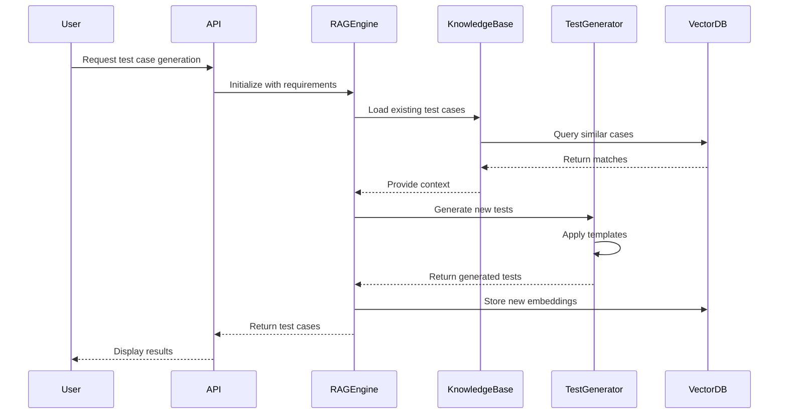
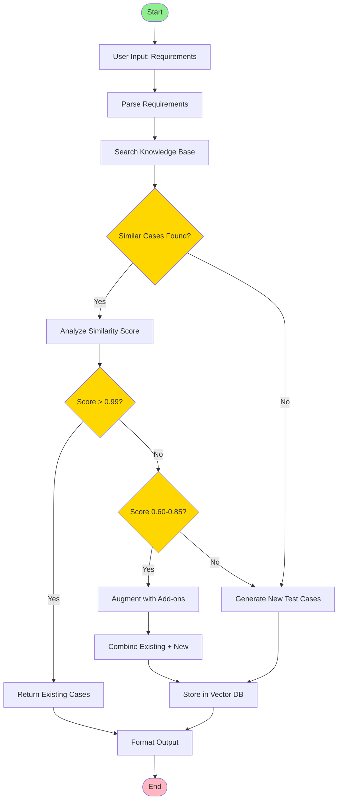

# Project Architecture & Flow Diagrams

*Generated on: Thu Apr  2 07:06:18 UTC 2026*

## Table of Contents

1. [System Architecture](#system-architecture)
2. [Module Dependencies](#module-dependencies)
3. [Class Diagram](#class-diagram)
4. [Sequence Diagram](#sequence-diagram)
5. [Process Flowchart](#process-flowchart)
6. [AI-Generated Architecture](#ai-generated-architecture)

## System Architecture

Overview of the system's high-level architecture:

```mermaid
flowchart TD
    Start([Start]) --> Input[User Input: Requirements]
    Input --> Parse[Parse Requirements]
    Parse --> Search[Search Knowledge Base]
    Search --> Decision{Similar Cases Found?}
    
    Decision -->|Yes| Analyze[Analyze Similarity Score]
    Decision -->|No| Generate[Generate New Test Cases]
    
    Analyze --> Score{Score > 0.99?}
    Score -->|Yes| Return[Return Existing Cases]
    Score -->|No| Enhance{Score 0.60-0.85?}
    
    Enhance -->|Yes| Augment[Augment with Add-ons]
    Enhance -->|No| Generate
    
    Augment --> Combine[Combine Existing + New]
    Generate --> Store[Store in Vector DB]
    Combine --> Store
    Return --> Format[Format Output]
    Store --> Format
    Format --> End([End])
    
    style Start fill:#90EE90
    style End fill:#FFB6C1
    style Decision fill:#FFD700
    style Score fill:#FFD700
    style Enhance fill:#FFD700
```

## Module Dependencies

Dependency graph showing relationships between modules:

```mermaid
graph TB
    M0[test_user_format_generation]
    M1[generate_diagrams]
    M2[create_regression_suite]
    M3[test_distribution]
    M4[generate_docs]
    subgraph engines_dir[engines]
        M5[context_engineering]
        M6[__init__]
        M7[test_case_generator]
        M8[rag_engine]
        M9[comparison_engine]
        M10[test_case_updater]
        M11[test_case_manager]
        M12[embeddings]
    end
    subgraph core_dir[core]
        M13[__init__]
        M14[utils]
        M15[knowledge_base]
        M16[models]
    end
    subgraph scripts_dir[scripts]
        M17[format_test_cases_for_excel]
        M18[__init__]
        M19[add_diverse_test_cases]
        M20[create_excel_template]
        M21[test_llm_apis]
    end
    subgraph config_dir[config]
        M22[__init__]
        M23[config]
    end
    subgraph tests_dir[tests]
        M24[__init__]
        M25[test_performance]
        M26[test_api]
        M27[test_description_validation]
        M28[test_numbering_fix]
        M29[test_type_positive_negative]
        M30[test_fixes]
        M31[test_end_to_end_numbering]
    end
    subgraph ui_dir[ui]
        M32[__init__]
        M33[api]
        M34[app]
    end
    subgraph examples_dir[examples]
        M35[__init__]
        M36[example_context_engineering]
        M37[example]
        M38[import_example]
    end
    M0 --> M29
    M0 --> M7
    M0 --> M14
    M0 --> M23
    M1 --> M29
    M3 --> M14
    M3 --> M23
    M4 --> M29
    M5 --> M29
    M5 --> M16
    M5 --> M23
    M6 --> M8
    M6 --> M12
    M6 --> M9
    M6 --> M7
    M6 --> M11
    M6 --> M5
    M7 --> M29
    M7 --> M23
    M7 --> M16
    M7 --> M14
    M7 --> M5
    M7 --> M2
    M7 --> M2
    M8 --> M29
    M8 --> M16
    M8 --> M12
    M8 --> M23
    M9 --> M29
    M9 --> M23
    M9 --> M16
    M9 --> M12
    M9 --> M5
    M9 --> M14
    M9 --> M2
    M11 --> M29
    M11 --> M16
    M11 --> M8
    M11 --> M7
    M11 --> M9
    M11 --> M15
    M11 --> M23
    M11 --> M14
    M11 --> M14
    M11 --> M14
    M12 --> M29
    M12 --> M23
    M13 --> M16
    M13 --> M14
    M13 --> M15
    M14 --> M2
    M14 --> M16
    M14 --> M23
    M14 --> M29
    M14 --> M16
    M15 --> M29
    M15 --> M16
    M15 --> M14
    M15 --> M23
    M15 --> M14
    M17 --> M29
    M17 --> M16
    M17 --> M15
    M19 --> M29
    M19 --> M14
    M21 --> M29
    M22 --> M22
    M23 --> M29
    M25 --> M11
    M25 --> M16
    M27 --> M29
    M27 --> M14
    M28 --> M29
    M28 --> M14
    M28 --> M16
    M29 --> M29
    M29 --> M14
    M29 --> M14
    M30 --> M7
    M30 --> M9
    M30 --> M16
    M30 --> M14
    M31 --> M29
    M31 --> M14
    M31 --> M8
    M31 --> M7
    M31 --> M16
    M33 --> M29
    M33 --> M16
    M33 --> M11
    M33 --> M23
    M33 --> M14
    M34 --> M29
    M34 --> M16
    M34 --> M11
    M34 --> M23
    M34 --> M14
    M34 --> M14
    M34 --> M14
    M34 --> M14
    M36 --> M29
    M36 --> M7
    M36 --> M8
    M36 --> M5
    M37 --> M29
    M37 --> M16
    M37 --> M11
    M37 --> M14
    M38 --> M29
    M38 --> M11
    M38 --> M16
    M38 --> M14
```

## Class Diagram

Main classes and their methods:

```mermaid
classDiagram
    class ContextEngineer {
        +__init__()
        +_load_examples()
        +_load_context_templates()
        +enhance_generation_prompt()
        +enhance_comparison_prompt()
    }
    class TestCaseGenerator {
        +__init__()
        +generate_from_user_story()
        +generate_from_text()
        +_generate_single_request()
        +_clean_json_content()
    }
    class RAGEngine {
        +__init__()
        +add_test_case()
        +add_test_cases_batch()
        +search_similar_test_cases()
        +get_test_case_by_id()
    }
    class ComparisonEngine {
        +__init__()
        +compare_test_cases()
        +_analyze_with_llm()
        +_calculate_llm_similarity()
        +_make_decision()
    }
    class TestCaseManager {
        +__init__()
        +_analyze_new_test_case()
        +_get_recommendation()
        +_reconstruct_test_case()
        +process_user_story()
    }
    class EmbeddingGenerator {
        +__init__()
        +generate_embedding()
        +generate_embeddings_batch()
        +calculate_similarity()
        +clear_cache()
    }
    class KnowledgeBase {
        +__init__()
        +_load_existing_suites()
        +create_test_suite()
        +get_test_suite()
        +add_test_case_to_suite()
    }
    class DecisionType {
        +to_text()
        +add_test_case()
        +get_test_case_by_id()
        +update_test_case()
    }
    class TestStep {
        +to_text()
        +add_test_case()
        +get_test_case_by_id()
        +update_test_case()
    }
    class TestCase {
        +to_text()
        +add_test_case()
        +get_test_case_by_id()
        +update_test_case()
    }
    class ComparisonResult {
        +to_text()
        +add_test_case()
        +get_test_case_by_id()
        +update_test_case()
    }
    class TestSuite {
        +to_text()
        +add_test_case()
        +get_test_case_by_id()
        +update_test_case()
    }
    class UserStory {
        +to_text()
        +add_test_case()
        +get_test_case_by_id()
        +update_test_case()
    }
    class Config {
        +validate()
        +create_directories()
    }
    class RequirementTextRequest {
    }
```

## Sequence Diagram

Typical workflow sequence:

```mermaid
sequenceDiagram
    participant User
    participant API
    participant RAGEngine
    participant KnowledgeBase
    participant TestGenerator
    participant VectorDB
    
    User->>API: Request test case generation
    API->>RAGEngine: Initialize with requirements
    RAGEngine->>KnowledgeBase: Load existing test cases
    KnowledgeBase->>VectorDB: Query similar cases
    VectorDB-->>KnowledgeBase: Return matches
    KnowledgeBase-->>RAGEngine: Provide context
    RAGEngine->>TestGenerator: Generate new tests
    TestGenerator->>TestGenerator: Apply templates
    TestGenerator-->>RAGEngine: Return generated tests
    RAGEngine->>VectorDB: Store new embeddings
    RAGEngine-->>API: Return test cases
    API-->>User: Display results
```

## Process Flowchart

Detailed process flow:

```mermaid
flowchart TD
    Start([Start]) --> Input[User Input: Requirements]
    Input --> Parse[Parse Requirements]
    Parse --> Search[Search Knowledge Base]
    Search --> Decision{Similar Cases Found?}
    
    Decision -->|Yes| Analyze[Analyze Similarity Score]
    Decision -->|No| Generate[Generate New Test Cases]
    
    Analyze --> Score{Score > 0.99?}
    Score -->|Yes| Return[Return Existing Cases]
    Score -->|No| Enhance{Score 0.60-0.85?}
    
    Enhance -->|Yes| Augment[Augment with Add-ons]
    Enhance -->|No| Generate
    
    Augment --> Combine[Combine Existing + New]
    Generate --> Store[Store in Vector DB]
    Combine --> Store
    Return --> Format[Format Output]
    Store --> Format
    Format --> End([End])
    
    style Start fill:#90EE90
    style End fill:#FFB6C1
    style Decision fill:#FFD700
    style Score fill:#FFD700
    style Enhance fill:#FFD700
```

## AI-Generated Architecture

AI-generated comprehensive architecture diagram:

```mermaid
flowchart TD
    %% System Architecture & Components
    subgraph User Interface Layer
        TUG[test_user_format_generation.py]
        GD[generate_diagrams.py]
        CRS[create_regression_suite.py]
        TD[test_distribution.py]
        GDocs[generate_docs.py]
    end

    subgraph Engines Layer
        CE[comparison_engine.py]
        RAG[rag_engine.py]
        TCG[test_case_generator.py]
        CEg[context_engineering.py]
    end

    %% Relationships - Module to Engines (Component Interactions)
    TUG -->|Uses| TCG
    GD -->|Uses| RAG
    GD -->|Uses| CE
    GD -->|Uses| CEg
    CRS -->|Uses| TCG
    CRS -->|Uses| CE
    CRS -->|Uses| RAG
    TD -->|Tests output of| CEg
    GD -->|Generates docs on| CEg
    GDocs -->|Documents Engines| Engines_Layer
    click CE "engines/comparison_engine.py"
    click RAG "engines/rag_engine.py"
    click TCG "engines/test_case_generator.py"
    click CEg "engines/context_engineering.py"

    %% Data flow
    TUG -- "Generates User Format" --> TCG
    TCG -- "Generates Test Cases" --> CE
    CE -- "Compares Data / Results" --> RAG
    RAG -- "Retrieves & Aggregates Data" --> CEg
    CEg -- "Context Engineering" --> GD
    GD -- "Diagram Output" --> User
    CRS -- "Creates Regression Suites" --> CE & RAG & TCG
    TD -- "Tests Distributions" --> CEg
    GDocs -- "Generates Documentation" --> User

    %% High-level boundaries
    classDef ui fill:#f9f,stroke:#333,stroke-width:1px;
    classDef engines fill:#bbf,stroke:#333,stroke-width:1px;
    class TUG,GD,CRS,TD,GDocs ui
    class CE,RAG,TCG,CEg engines

    %% Notes for completeness
    NoteEngines Engines Layer is the core logic processing unit, containing 4 main engines, each encapsulated in one class with multiple functions.
    NoteUI UI Layer scripts mostly function-driven entry points orchestrating engines and handling testing, documentation, and diagram generation.

```
This diagram defines three views:
1. System architecture: two layers - User Interface scripts and Engines (core logic).
2. Data flow: shows directional arrows for data and control flow.
3. Component interactions: labeled edges describe usage and testing relationships among modules.
## Module Summary

Total Modules: 39

| Module | Classes | Functions | Imports |
|--------|---------|-----------|----------|
| config/__init__.py | 0 | 0 | 1 |
| config/config.py | 1 | 2 | 3 |
| core/__init__.py | 0 | 0 | 3 |
| core/knowledge_base.py | 1 | 11 | 9 |
| core/models.py | 6 | 4 | 4 |
| core/utils.py | 0 | 21 | 11 |
| create_regression_suite.py | 0 | 2 | 3 |
| engines/__init__.py | 0 | 0 | 6 |
| engines/comparison_engine.py | 1 | 7 | 12 |
| engines/context_engineering.py | 1 | 9 | 7 |
| engines/embeddings.py | 1 | 5 | 8 |
| engines/rag_engine.py | 1 | 10 | 9 |
| engines/test_case_generator.py | 1 | 9 | 12 |
| engines/test_case_manager.py | 1 | 16 | 13 |
| engines/test_case_updater.py | 0 | 0 | 0 |
| examples/__init__.py | 0 | 0 | 0 |
| examples/example.py | 0 | 2 | 5 |
| examples/example_context_engineering.py | 0 | 3 | 6 |
| examples/import_example.py | 0 | 3 | 6 |
| generate_diagrams.py | 0 | 7 | 4 |
| generate_docs.py | 0 | 0 | 2 |
| scripts/__init__.py | 0 | 0 | 0 |
| scripts/add_diverse_test_cases.py | 0 | 1 | 6 |
| scripts/create_excel_template.py | 0 | 0 | 2 |
| scripts/format_test_cases_for_excel.py | 0 | 2 | 6 |
| scripts/test_llm_apis.py | 0 | 5 | 7 |
| test_distribution.py | 0 | 0 | 3 |
| test_user_format_generation.py | 0 | 0 | 5 |
| tests/__init__.py | 0 | 0 | 0 |
| tests/test_api.py | 0 | 7 | 2 |
| tests/test_description_validation.py | 0 | 3 | 6 |
| tests/test_end_to_end_numbering.py | 0 | 2 | 7 |
| tests/test_fixes.py | 0 | 5 | 5 |
| tests/test_numbering_fix.py | 0 | 6 | 4 |
| tests/test_performance.py | 0 | 1 | 3 |
| tests/test_type_positive_negative.py | 0 | 3 | 6 |
| ui/__init__.py | 0 | 0 | 0 |
| ui/api.py | 7 | 0 | 13 |
| ui/app.py | 0 | 2 | 14 |
