# Project Architecture & Flow Diagrams

*Generated on: Tue Feb 24 11:01:21 UTC 2026*

## Table of Contents

1. [System Architecture](#system-architecture)
2. [Module Dependencies](#module-dependencies)
3. [Class Diagram](#class-diagram)
4. [Sequence Diagram](#sequence-diagram)
5. [Process Flowchart](#process-flowchart)
6. [AI-Generated Architecture](#ai-generated-architecture)

## System Architecture

Overview of the system's high-level architecture:

## Module Dependencies

Dependency graph showing relationships between modules:

## Class Diagram

Main classes and their methods:

```mermaid
classDiagram
    class EmbeddingGenerator {
        +__init__()
        +generate_embedding()
        +generate_embeddings_batch()
        +calculate_similarity()
        +clear_cache()
    }
    class ContextEngineer {
        +__init__()
        +_load_examples()
        +_load_context_templates()
        +enhance_generation_prompt()
        +enhance_comparison_prompt()
    }
    class TestCaseGenerator {
        +__init__()
        +generate_from_user_story()
        +generate_from_text()
        +_generate_single_request()
        +_clean_json_content()
    }
    class TestCaseManager {
        +__init__()
        +_analyze_new_test_case()
        +_get_recommendation()
        +_reconstruct_test_case()
        +process_user_story()
    }
    class RAGEngine {
        +__init__()
        +add_test_case()
        +add_test_cases_batch()
        +search_similar_test_cases()
        +get_test_case_by_id()
    }
    class ComparisonEngine {
        +__init__()
        +compare_test_cases()
        +_analyze_with_llm()
        +_calculate_llm_similarity()
        +_make_decision()
    }
    class RequirementTextRequest {
    }
    class UserStoryRequest {
    }
    class ProcessingResult {
    }
    class ApplyDecisionRequest {
    }
    class ExportRequest {
    }
    class FilteredExportRequest {
    }
    class HealthResponse {
    }
    class DecisionType {
        +to_text()
        +add_test_case()
        +get_test_case_by_id()
        +update_test_case()
    }
    class TestStep {
        +to_text()
        +add_test_case()
        +get_test_case_by_id()
        +update_test_case()
    }
```

## Sequence Diagram

Typical workflow sequence:

## Process Flowchart

Detailed process flow:

## AI-Generated Architecture

AI-generated comprehensive architecture diagram:

## Module Summary

Total Modules: 39

| Module | Classes | Functions | Imports |
|--------|---------|-----------|----------|
| config/__init__.py | 0 | 0 | 1 |
| config/config.py | 1 | 2 | 3 |
| core/__init__.py | 0 | 0 | 3 |
| core/knowledge_base.py | 1 | 11 | 9 |
| core/models.py | 6 | 4 | 4 |
| core/utils.py | 0 | 21 | 11 |
| create_regression_suite.py | 0 | 2 | 3 |
| engines/__init__.py | 0 | 0 | 6 |
| engines/comparison_engine.py | 1 | 7 | 12 |
| engines/context_engineering.py | 1 | 9 | 7 |
| engines/embeddings.py | 1 | 5 | 8 |
| engines/rag_engine.py | 1 | 10 | 9 |
| engines/test_case_generator.py | 1 | 9 | 12 |
| engines/test_case_manager.py | 1 | 16 | 13 |
| engines/test_case_updater.py | 0 | 0 | 0 |
| examples/__init__.py | 0 | 0 | 0 |
| examples/example.py | 0 | 2 | 5 |
| examples/example_context_engineering.py | 0 | 3 | 6 |
| examples/import_example.py | 0 | 3 | 6 |
| generate_diagrams.py | 0 | 7 | 4 |
| generate_docs.py | 0 | 0 | 2 |
| scripts/__init__.py | 0 | 0 | 0 |
| scripts/add_diverse_test_cases.py | 0 | 1 | 6 |
| scripts/create_excel_template.py | 0 | 0 | 2 |
| scripts/format_test_cases_for_excel.py | 0 | 2 | 6 |
| scripts/test_llm_apis.py | 0 | 5 | 7 |
| test_distribution.py | 0 | 0 | 3 |
| test_user_format_generation.py | 0 | 0 | 5 |
| tests/__init__.py | 0 | 0 | 0 |
| tests/test_api.py | 0 | 7 | 2 |
| tests/test_description_validation.py | 0 | 3 | 6 |
| tests/test_end_to_end_numbering.py | 0 | 2 | 7 |
| tests/test_fixes.py | 0 | 5 | 5 |
| tests/test_numbering_fix.py | 0 | 6 | 4 |
| tests/test_performance.py | 0 | 1 | 3 |
| tests/test_type_positive_negative.py | 0 | 3 | 6 |
| ui/__init__.py | 0 | 0 | 0 |
| ui/api.py | 7 | 0 | 13 |
| ui/app.py | 0 | 2 | 14 |
