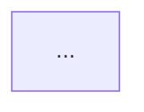

# Auto Generated Documentation

*Complete project documentation - Generated on: Tue Feb 17 05:42:46 UTC 2026*

## File: config/__init__.py
# Configuration Management Package

This package provides functionality related to configuration management within the application.

## Modules

### `config`

Contains the `Config` class used for handling configuration settings.

## Usage

Import the `Config` class from this package to manage application configurations.

```python
from your_package.configuration import Config

# Example usage
config = Config()
```

## Exports

The package explicitly exports the following:

- `Config` - main class for configuration management.

---

This module acts as a simple stub to expose the `Config` class from the submodule, simplifying imports for users of the package.

## File: config/config.py
# Configuration Management for RAG-based Test Case System

This module provides centralized configuration management for a Retrieval-Augmented Generation (RAG)-based test case generation system. It loads configuration values primarily from environment variables (using a `.env` file if available) and offers default values for all parameters.

---

## Module: `config.py`

### Overview

The `Config` class encapsulates configuration parameters required for:

- Azure OpenAI API connectivity and usage
- Vector database settings for semantic search
- Similarity scoring thresholds and weights
- RAG system behavior tuning
- Test case generation control (parallelization, batch size, timeouts)
- Test case quantity and type distribution
- File system paths for persistent data storage

---

### Usage

Import the `Config` class from the module to access configuration parameters, for example:

```python
from config import Config

api_key = Config.AZURE_OPENAI_API_KEY
persist_dir = Config.CHROMA_PERSIST_DIRECTORY
```

Call `Config.validate()` to verify critical settings are present, or rely on default fallbacks.

---

### Class: `Config`

A singleton-style configuration container class. All attributes are class variables loaded from environment variables or set to default values.

#### Configuration Attributes

| Attribute                          | Type   | Default                    | Description                                                                                     |
|----------------------------------|--------|----------------------------|-------------------------------------------------------------------------------------------------|
| **Azure OpenAI Settings**                                                                            |
| `AZURE_OPENAI_API_KEY`            | `str`  | `""`                       | API key to authenticate with Azure OpenAI services.                                             |
| `AZURE_OPENAI_ENDPOINT`           | `str`  | `""`                       | Endpoint URL for Azure OpenAI API.                                                              |
| `AZURE_OPENAI_DEPLOYMENT_NAME`   | `str`  | `"gpt-4.1-mini"`           | Deployment identifier for the GPT model to use.                                                 |
| `AZURE_OPENAI_EMBEDDING_DEPLOYMENT` | `str`  | `"text-embedding-ada-002"` | Deployment identifier for text embedding model.                                                 |
| `AZURE_OPENAI_API_VERSION`        | `str`  | `"2024-08-01-preview"`     | API version to use when calling Azure OpenAI endpoints.                                         |
| **Vector Database Configuration**                                                                     |
| `CHROMA_PERSIST_DIRECTORY`        | `str`  | `"./chroma_db"`            | Local filesystem directory path for persisting vector store data.                               |
| **Similarity Thresholds**                                                                            |
| `THRESHOLD_SAME`                  | `float`| `0.99`                     | Similarity score threshold for marking test cases as identical.                                |
| `THRESHOLD_ADDON_MIN`             | `float`| `0.60`                     | Minimum threshold for addon/related content similarity.                                        |
| `THRESHOLD_ADDON_MAX`             | `float`| `0.85`                     | Maximum threshold for addon/related content similarity.                                        |
| **Hybrid Scoring Weights**                                                                           |
| `SEMANTIC_WEIGHT`                 | `float`| `0.60`                     | Weight for embedding-based semantic similarity in hybrid scoring.                              |
| `LLM_WEIGHT`                     | `float` | `0.40`                     | Weight for LLM-based context similarity in hybrid scoring.                                    |
| **RAG System Settings**                                                                              |
| `RAG_TOP_K`                      | `int`   | `10`                       | Number of top retrieval results considered during RAG processing (note: comment suggests 5).   |
| **Test Case Generation**                                                                            |
| `USE_PARALLEL_GENERATION`         | `bool`  | `True`                     | Flag to enable parallel test case generation.                                                  |
| `PARALLEL_BATCH_SIZE`              | `int`   | `10`                       | Number of test cases to generate per parallel batch.                                           |
| `BATCH_TIMEOUT_SECONDS`            | `int`   | `45`                       | Timeout in seconds for each batch during generation.                                           |
| **Test Case Count Limits**                                                                          |
| `MIN_TEST_CASES`                  | `int`   | `8`                        | Minimum number of test cases to generate.                                                      |
| `MAX_TEST_CASES`                  | `int`   | `25`                       | Maximum number of test cases to generate.                                                      |
| `DEFAULT_TEST_CASES`               | `int`   | `12`                       | Default number of test cases to generate if unspecified.                                       |
| **Test Case Type Distribution (fractions, sum should ideally be ≤ 1.0)**                               |
| `POSITIVE_MIN_PERCENT`            | `float` | `0.50`                     | Minimum fraction of positive test cases.                                                      |
| `POSITIVE_MAX_PERCENT`            | `float` | `0.50`                     | Maximum fraction of positive test cases.                                                      |
| `NEGATIVE_MIN_PERCENT`            | `float` | `0.30`                     | Minimum fraction of negative test cases.                                                      |
| `NEGATIVE_MAX_PERCENT`            | `float` | `0.30`                     | Maximum fraction of negative test cases.                                                      |
| `UI_MIN_PERCENT`                  | `float` | `0.20`                     | Minimum fraction of UI test cases.                                                            |
| `UI_MAX_PERCENT`                  | `float` | `0.20`                     | Maximum fraction of UI test cases.                                                            |
| `SECURITY_MIN_PERCENT`            | `float` | `0.00`                     | Minimum fraction of security-related test cases.                                              |
| `SECURITY_MAX_PERCENT`            | `float` | `0.00`                     | Maximum fraction of security-related test cases.                                              |
| `EDGE_CASE_MIN_PERCENT`           | `float` | `0.00`                     | Minimum fraction of edge case test cases.                                                     |
| `EDGE_CASE_MAX_PERCENT`           | `float` | `0.00`                     | Maximum fraction of edge case test cases.                                                     |
| **File paths and storage locations**                                                                   |
| `KNOWLEDGE_BASE_PATH`             | `str`   | `"./knowledge_base"`       | Path to the directory containing knowledge base files.                                        |
| `TEST_SUITE_OUTPUT`               | `str`   | `"./output"`               | Path where generated test suite outputs are saved.                                            |
| **Collection Names**                                                                               |
| `CHROMA_COLLECTION_NAME`          | `str`   | `"test_cases"`             | Name of the collection used inside the vector store.                                          |

---

#### Methods

- `@classmethod validate() -> bool`
  
  Validates the essential configuration settings required for Azure OpenAI connectivity.
  
  Returns:
  - `True` if all required configurations are present (non-empty strings).
  - `False` otherwise.
  
- `@classmethod create_directories() -> None`
  
  Creates all necessary directories for persistent storage if they do not exist, including:
  
  - `CHROMA_PERSIST_DIRECTORY`
  - `KNOWLEDGE_BASE_PATH`
  - `TEST_SUITE_OUTPUT`
  
  This method is automatically called once when the module is imported to ensure environment readiness.
  
---

### Notes and Recommendations

- Make sure to define the required environment variables especially `AZURE_OPENAI_API_KEY` and `AZURE_OPENAI_ENDPOINT` to avoid runtime errors.
- You can override any configuration by setting the respective environment variable, e.g., `CHROMA_PERSIST_DIRECTORY` or `RAG_TOP_K`.
- The hybrid scoring weights `SEMANTIC_WEIGHT` and `LLM_WEIGHT` should sum approximately to 1. Adjust cautiously based on performance and accuracy trade-offs.
- Adjust test case percentages to control the variety of generated tests by type, ensuring the sum aligns with expected total cases.
- The code auto-creates necessary directories on import; this behavior can be customized if needed.

---

### Dependencies

- `python-dotenv` for loading `.env` files.
- Standard Python libraries: `os`, `typing`

---

### Example `.env` file snippet

```
AZURE_OPENAI_API_KEY=your_api_key_here
AZURE_OPENAI_ENDPOINT=https://your-resource.openai.azure.com/
RAG_TOP_K=5
USE_PARALLEL_GENERATION=true
MIN_TEST_CASES=10
MAX_TEST_CASES=20
```

---

This documentation should help engineers and operators understand and customize the configuration parameters driving the RAG-based test case generation system effectively.

## File: core/__init__.py
"""
Core Business Logic and Data Models Module
=========================================

This module encapsulates the central components of the application's business logic,
including the core data models and utility functions required for processing and 
persisting key entities. It serves as a unified interface for importing essential 
classes and functions from submodules, facilitating streamlined access and maintainability.

Exports
-------

Data Models:
- TestCase: Represents a test case entity with its properties and behaviors.
- UserStory: Encapsulates a user story entity used for requirement tracking and development.
- ComparisonResult: Defines the result object for comparisons between test cases or other entities.
- DecisionType: Enumerates the types of decisions used in logic branching and evaluations.

Utility Functions:
- generate_id: Generates unique identifiers suitable for test cases and other entities.
- load_json: Loads JSON data from a file, returning the corresponding Python object.
- save_json: Persists a Python object as JSON into a file.
- parse_test_case_json: Parses JSON data specifically formatted for test cases into TestCase objects.
- export_to_excel: Exports data into an Excel (.xlsx) file format for reporting or analysis.
- export_to_csv: Exports data into a CSV file format.

Knowledge Base:
- KnowledgeBase: Provides an abstraction for managing domain-specific knowledge, rules, or configurations.

Usage
-----

Import any of these components directly from this module for clean and concise access, e.g.:

```python
from core_business_logic import TestCase, generate_id, KnowledgeBase
```

Notes
-----

- This module does not implement functionality directly but re-exports components from inner modules.
- Ensure dependent submodules (`models`, `utils`, and `knowledge_base`) are properly maintained for full functionality.

"""

## File: core/knowledge_base.py
# KnowledgeBase Class Documentation

The `KnowledgeBase` class manages the storage, retrieval, and organization of test cases grouped into test suites. It supports persistence to disk, manipulation of test cases within suites, and exporting test suite data into multiple formats.

---

## Class: `KnowledgeBase`

### Overview
Manages test case storage and retrieval within named test suites. Each test suite groups related test cases and is stored in JSON files on disk. The class supports creating, retrieving, updating, and exporting test suites and their test cases.

### Initialization

```python
KnowledgeBase()
```

Initializes the knowledge base by loading existing test suites from the configured storage path.

- Reads JSON files from the directory specified by `Config.KNOWLEDGE_BASE_PATH`.
- Loads each test suite into memory, keyed by suite name.
- Creates the directory if it does not exist.

---

### Methods

#### `_load_existing_suites()`

Loads existing test suites from disk into memory.

- Creates the base path directory if it doesn't exist.
- Loads each JSON test suite file and deserializes it into `TestSuite` instances.
- Populates the `test_suites` dictionary with suite name as key.

#### `create_test_suite(name: str, description: str = "") -> TestSuite`

Creates a new test suite with the given name and optional description, saves it to disk, and adds it to the knowledge base.

**Arguments**:
- `name`: Name of the test suite.
- `description`: Optional description of the suite.

**Returns**:
- The created `TestSuite` instance.

#### `get_test_suite(name: str) -> Optional[TestSuite]`

Retrieves a test suite by its name.

**Arguments**:
- `name`: Name of the test suite to retrieve.

**Returns**:
- The corresponding `TestSuite` object if found; otherwise, `None`.

#### `add_test_case_to_suite(suite_name: str, test_case: TestCase)`

Adds a test case to the specified test suite. If the suite does not exist, it is created automatically.

**Arguments**:
- `suite_name`: Name of the suite to add the test case to.
- `test_case`: The `TestCase` object to add.

- Saves the updated test suite to disk.

#### `update_test_case_in_suite(suite_name: str, test_case: TestCase)`

Updates an existing test case within the specified test suite.

**Arguments**:
- `suite_name`: Name of the suite containing the test case.
- `test_case`: The updated `TestCase` object.

- If the suite exists, updates the test case and saves the suite to disk.

#### `get_test_case_from_suite(suite_name: str, test_case_id: str) -> Optional[TestCase]`

Retrieves a specific test case from a test suite by its unique ID.

**Arguments**:
- `suite_name`: Name of the suite to search.
- `test_case_id`: Identifier of the test case.

**Returns**:
- The matching `TestCase` object or `None` if not found.

#### `get_all_test_cases(suite_name: Optional[str] = None) -> List[TestCase]`

Retrieves all test cases from either a specific suite or all suites.

**Arguments**:
- `suite_name`: Optional name of the suite to filter by.

**Returns**:
- A list of `TestCase` instances. If `suite_name` is not specified, returns test cases from all suites.

#### `list_suites() -> List[str]`

Lists all test suite names currently managed by the knowledge base.

**Returns**:
- A list of suite names as strings.

#### `_save_suite(suite: TestSuite)`

Internal method to save a `TestSuite` instance to disk as a JSON file.

**Arguments**:
- `suite`: The `TestSuite` to save.

- Saves the suite JSON file using the suite name (spaces replaced by underscores) in the base path.

#### `export_suite(suite_name: str, output_path: str, format: str = "json")`

Exports a test suite to a file in the specified format.

**Arguments**:
- `suite_name`: Name of the suite to export.
- `output_path`: Destination file path.
- `format`: Data export format; supported values are `"json"`, `"excel"`, and `"csv"`.

**Raises**:
- `ValueError` if the suite does not exist or the format is unsupported.

**Notes**:
- `export_to_excel` and `export_to_csv` utilities from `core.utils` are used for Excel and CSV exports.
- JSON export saves the suite as serialized JSON.

---

### Dependencies

- `TestCase` and `TestSuite` models from `core.models`.
- Utility functions (`save_json`, `load_json`, `generate_id`, `export_to_excel`, `export_to_csv`) from `core.utils`.
- `Config.KNOWLEDGE_BASE_PATH` for configuration.
- Standard libraries: `os`, `sys`, `json`, `datetime`, `typing`.

---

### Usage Example

```python
kb = KnowledgeBase()
suite = kb.create_test_suite("LoginTests", "Test cases related to login functionality")
test_case = TestCase(id=generate_id(), name="Valid Login", steps=["Enter valid credentials", "Click login"], expected_result="Login successful")
kb.add_test_case_to_suite("LoginTests", test_case)
cases = kb.get_all_test_cases("LoginTests")
kb.export_suite("LoginTests", "login_tests.xlsx", format="excel")
```

---

This documentation should assist developers in understanding the capabilities and usage of the `KnowledgeBase` class for managing test suites and test cases effectively.

## File: core/models.py
# Module Documentation: Pydantic Models for Test Case Management System

This module defines data models used for managing test cases, test suites, test case comparison results, and related user stories in a structured and type-safe manner using Pydantic. The models facilitate standardized representation, serialization, and validation of test-related data in automated testing or quality assurance workflows.

---

## Enum Classes

### `DecisionType`
Enumeration representing the possible decisions made when comparing two test cases.

| Member  | Value    | Description                   |
|---------|----------|-------------------------------|
| SAME    | `"same"` | Test cases are considered equivalent |
| ADDON   | `"add-on"` | New test case is an add-on to existing |
| NEW     | `"new"`  | Completely new test case         |

---

## Data Models

### `TestStep`
Represents an individual step in a test case.

#### Fields:
- `step_number` (`int`): The sequence number of this step.
- `action` (`str`): The action to be performed in this step.
- `expected_result` (`str`): The expected outcome after performing the action.

---

### `TestCase`
Represents a structured test case with detailed attributes.

#### Fields:
- `id` (`str`): Unique identifier for the test case. Defaults to empty string.
- `title` (`str`): Descriptive title of the test case.
- `description` (`str`): Overview or detailed description of what the test case verifies.
- `business_rule` (`str`): Specifies the business rule or functional requirement tested. Defaults to `"Functional requirement validation"`.
- `preconditions` (`List[str]`): List of conditions that must be true before the test starts.
- `test_steps` (`List[TestStep]`): Ordered list of test steps to execute.
- `expected_outcome` (`str`): Expected result after executing all test steps.
- `postconditions` (`List[str]`): Conditions expected to hold true after test execution.
- `tags` (`List[str]`): Free-form tags for categorization or filtering.
- `priority` (`str`): Priority level of test (e.g., Medium). Default is `"Medium"`.
- `test_type` (`str`): Type of test such as Functional, Integration, API, UI, Regression, etc. Default is `"Functional"`.
- `is_regression` (`bool`): Whether the test case is a regression test. Defaults to `False`.
- `boundary_conditions` (`List[str]`): List of boundary or edge cases covered by this test.
- `side_effects` (`List[str]`): Side effects resulting from the test execution.
- `created_at` (`datetime`): Timestamp when the test case was created. Defaults to current time.
- `updated_at` (`datetime`): Timestamp when the test case was last updated. Defaults to current time.
- `version` (`int`): Version number of this test case. Defaults to 1.
- `source_document` (`Optional[str]`): Reference or link to the source document (e.g., requirement spec).

#### Methods:
- `to_text() -> str`: Returns a formatted string representation of the test case suitable for indexing or search. It includes title, description, business rule, preconditions, step-by-step instructions, expected outcome, postconditions, boundary conditions, side effects, and tags.

---

### `ComparisonResult`
Captures the results of comparing a newly created test case against existing test cases, typically used in test case deduplication or optimization.

#### Fields:
- `new_test_case_id` (`str`): ID of the newly created test case.
- `existing_test_case_id` (`Optional[str]`): ID of the existing test case it was compared against; optional.
- `similarity_score` (`float`): Numeric score denoting similarity between test cases (range typically 0.0 to 1.0).
- `decision` (`DecisionType`): Outcome decision from the comparison (`SAME`, `ADDON`, or `NEW`).
- `reasoning` (`str`): Explanation or rationale behind the comparison decision.
- `business_rule_match` (`bool`): Whether the business rules between the compared test cases match.
- `behavior_match` (`bool`): Whether the observed test behaviors are considered matching.
- `coverage_expansion` (`List[str]`): Items or areas where the new test case expands coverage beyond existing cases.
- `confidence_score` (`float`): Confidence level for the comparison decision.
- `timestamp` (`datetime`): Time when the comparison was performed. Defaults to current time.

---

### `TestSuite`
Represents a collection or group of test cases.

#### Fields:
- `name` (`str`): Name of the test suite.
- `description` (`str`): Textual description of the suite purpose or scope.
- `test_cases` (`List[TestCase]`): List of `TestCase` objects contained in the suite.
- `created_at` (`datetime`): Creation time of this test suite. Defaults to current time.
- `updated_at` (`datetime`): Last modification time of this test suite. Defaults to current time.
- `version` (`int`): Version number of the test suite. Defaults to 1.

#### Methods:
- `add_test_case(test_case: TestCase) -> None`: Adds a given test case to the suite and updates `updated_at`.
- `get_test_case_by_id(test_case_id: str) -> Optional[TestCase]`: Retrieves a `TestCase` by its unique ID if present within the suite.
- `update_test_case(test_case: TestCase) -> None`: Updates an existing test case in the suite (matched by `id`), increments its version, updates timestamps, and overwrites the old version.

---

### `UserStory`
Represents a user story or a requirement document typically associated with test cases.

#### Fields:
- `id` (`str`): Unique identifier of the user story or requirement.
- `title` (`str`): Title or summary of the user story.
- `description` (`str`): Detailed description of the user story.
- `acceptance_criteria` (`List[str]`): List of conditions that must be met for the story to be accepted.
- `business_rules` (`List[str]`): High-level business rules associated with this story.
- `context` (`Optional[str]`): Any additional context or background information.
- `created_at` (`datetime`): Timestamp when the user story was created. Defaults to current time.

---

# Usage Notes:
- All models use Pydantic for data validation and serialization.
- `datetime` fields default to the current time at model instantiation.
- `version` fields track incremental updates to test cases and test suites.
- The `TestCase.to_text()` method is useful for creating textual representations for full-text search engines or documentation generators.
- `ComparisonResult` is designed for automation in analyzing similarities and differences between test cases to reduce duplication and ensure coverage.

---

# Summary
This module provides comprehensive, strongly-typed data models to represent test cases, their execution steps, test suites grouping them, comparison outcomes, and related user stories, enabling traceable and maintainable test management workflows.

## File: core/utils.py
# Utility Functions for Test Case Management System

This module provides various utility functions to support management of test cases, including generation of unique IDs, validation and formatting of test steps, importing/exporting test cases from and to different file formats (JSON, Excel, CSV), and calculation of test distributions and text similarity.

---

## Functions

### `generate_id(text: str) -> str`

Generate a unique 12-character ID by hashing the input text using MD5.

- **Args:**
  - `text`: Input string to generate ID from.
  
- **Returns:**
  - A 12-character hexadecimal string ID.

---

### `calculate_test_distribution(num_test_cases: int) -> Dict[str, Any]`

Calculate test case distribution based on the total number of test cases and predefined minimum percentage configurations for various test types.

- **Args:**
  - `num_test_cases`: Total number of test cases to generate.
  
- **Returns:**
  - Dictionary with counts for each test type (`positive`, `negative`, `ui`, `security`, `edge_case`), total, and a formatted string describing the distribution.

---

### `validate_test_type(test_type: str) -> str`

Validate and normalize test type string.

- **Args:**
  - `test_type`: The test type string to validate.
  
- **Returns:**
  - Normalized test type string. Defaults to `"Functional"` if input is empty or blank.

Accepts common test types such as: Functional, Integration, E2E, API, Security, Performance, UI, Regression, Smoke, Unit, System, Acceptance.

---

### `has_existing_numbering(text: str) -> bool`

Check if a string starts with numbering patterns typically used in test steps.

Examples of recognized patterns:

- `"1."`, `"2)"`, `"3:"`
- `"Step 1:"`, `"Step 2."`
- `"1 -"`

- **Args:**
  - `text`: Input string to check.
  
- **Returns:**
  - `True` if numbering is detected at the start, else `False`.

---

### `remove_existing_numbering(text: str) -> str`

Remove numbering prefixes from test step text, including multiple hierarchical numbering levels (e.g., `"1. 2. Step text"`).

- **Args:**
  - `text`: Text possibly containing numbered prefixes.
  
- **Returns:**
  - Text without any numbering prefixes.

---

### `format_step_with_number(number: int, text: str, preserve_existing: bool = True) -> str`

Format a test step by prepending a step number.

- **Args:**
  - `number`: Step number to use.
  - `text`: Step description text.
  - `preserve_existing`: If `True` and existing numbering is detected, retains the original numbering; otherwise removes numbering and applies the standard `"{number}. {text}"` format.
  
- **Returns:**
  - Formatted step text string.

---

### `load_json(file_path: str) -> Dict[str, Any]`

Load a JSON file from either an absolute path or a relative path (relative to the config directory if given a filename only).

- **Args:**
  - `file_path`: Path or filename of JSON to load.
  
- **Returns:**
  - Parsed JSON data as a Python dictionary.

---

### `save_json(data: Any, file_path: str)`

Save Python data structures to a JSON file prettily formatted.

- **Args:**
  - `data`: Data to serialize.
  - `file_path`: Destination file path.

---

### `export_to_excel(test_cases: List[TestCase], output_path: str)`

Export a list of `TestCase` objects to an Excel file.

- **Args:**
  - `test_cases`: List of test case objects.
  - `output_path`: Path to save the Excel file.

The Excel sheet contains columns including ID, Title, Description, Business Rule, Preconditions, Test Steps (numbered and combined), Expected Outcome, Postconditions, Tags, Priority, Test Type, Boundary Conditions, Side Effects, Version, Created, and Updated timestamps.

---

### `export_results_to_excel_with_sheets(results: Dict[str, Any], output_path: str)`

Export test case results with classification into multiple sheets based on decision type.

- **Args:**
  - `results`: Dictionary containing test case results including decision data.
  - `output_path`: Excel file path to save.

Creates three sheets:
- `All Test Cases`: All test cases.
- `Modified`: Test cases that were `ADD-ON` (modified).
- `New`: Test cases marked as `NEW`.

Adds columns for decision, similarity, confidence, reasoning, and coverage expansion if available.

Adjusts column widths for readability.

---

### `export_test_cases_user_format(test_cases: List[TestCase], output_path: str)`

Export test cases to Excel using a user-friendly custom format.

- **Args:**
  - `test_cases`: List of test cases to export.
  - `output_path`: File path for the output Excel file.

Columns include: Test Case ID, Layer, Test Case Scenario, Test Case (title without suffix), Pre-Condition, Test Case Type (derived from title suffix or test_type), Test Steps, Expected Result, and Priority.

Supports multi-line numbered test steps and expected results with text wrapping enabled.

---

### `export_to_csv(test_cases: List[TestCase], output_path: str)`

Export test cases to a CSV file.

- **Args:**
  - `test_cases`: List of test cases.
  - `output_path`: Destination CSV file path.

Test steps and pre/postconditions are combined with pipe separators (`|`) for easier parsing.

---

### `parse_test_case_json(json_data: Dict[str, Any]) -> TestCase`

Parse a JSON object/dictionary into a `TestCase` model instance.

- **Args:**
  - `json_data`: JSON dictionary representing a test case.
  
- **Returns:**
  - A populated `TestCase` object.

Features include:
- Parsing test steps from dictionary or string format.
- Removing numbering from test step actions.
- Generating ID if missing using title+description hash.
- Inferring regression flag from priority.
- Validating and normalizing test type.
- Ensuring description never empty by defaulting appropriately.

---

### `calculate_text_similarity(text1: str, text2: str) -> float`

Compute simple text similarity between two strings using Jaccard similarity on unique word sets.

- **Args:**
  - `text1`, `text2`: Input text strings.
  
- **Returns:**
  - Similarity score as a float between 0.0 and 1.0.

---

### `format_timestamp(dt: datetime) -> str`

Format a datetime object to string in `"YYYY-MM-DD HH:MM:SS"` format for display.

- **Args:**
  - `dt`: Datetime object.
  
- **Returns:**
  - Formatted timestamp string.

---

### `import_from_excel(file_path: str) -> List[TestCase]`

Import test cases from an Excel workbook.

- **Args:**
  - `file_path`: Excel file path to read.
  
- **Returns:**
  - List of `TestCase` objects.

Supports multiple column naming conventions to cover both standard and user custom formats, with flexible parsing of test steps and expected results.

Automatically generates IDs if missing and infers regression flags.

Warnings are printed for rows that fail to parse.

---

### `import_from_json(file_path: str) -> List[TestCase]`

Import test cases from JSON file.

- **Args:**
  - `file_path`: JSON file path.
  
- **Returns:**
  - List of `TestCase` objects.

Supports either an array of test case objects or a dictionary with a `"test_cases"` or `"testCases"` array field.

Prints warnings on parse failures per test case.

---

## Notes

- This module depends on external models: `TestCase`, `TestStep`, and a configuration object `Config` for percentage settings.
- Excel exports rely on `pandas` and `openpyxl`.
- The numbering detection and removal logic uses regular expressions tolerant to common step numbering formats.
- Export functions take care of formatting for readability, including column widths and text wrapping.
- Import functions handle varying column names and data formats to maximize flexibility when reading Excel files.

---

# End of Documentation

## File: create_regression_suite.py
# Documentation: Regression Test Suite Creation Script

## Overview
This Python script automates the creation and export of a regression test suite by interacting with a locally running API server. The script should be run after the API server has been started. It performs the following key actions:

- Waits for the API server to become ready.
- Retrieves and reports statistics about existing test cases in the "default" test suite.
- Exports filtered regression test cases of high or critical priority to an Excel file.
- Exports all regression test cases regardless of priority to another Excel file.
- Summarizes the regression tests by priority and test type.
- Provides guidance for next steps after the exports.

---

## Requirements

- Python 3 environment
- `requests` library installed (`pip install requests`)
- API server running locally at `http://localhost:8000`

---

## Usage

Run the script from the command line after starting the API server:

```bash
python create_regression_suite.py
```

---

## Constants

| Name       | Description                          |
|------------|------------------------------------|
| `API_BASE` | Base URL for the API server endpoint. Default is `http://localhost:8000`. |

---

## Functions

### `wait_for_api() -> bool`

Waits for the API server to become responsive by making repeated GET requests to the `/health` endpoint.

- Attempts up to 30 times, waiting 1 second between attempts.
- Returns `True` if the API responds with HTTP 200 within the retry window.
- Returns `False` if the API does not respond successfully after all attempts.
- Prints status messages about waiting and readiness.

---

### `create_regression_suite()`

Main routine that performs the regression suite creation workflow.

Steps:

1. **API Availability Check**  
   Verifies that the API server is running using `wait_for_api()`.  
   - If the API is not ready, prints instructions to start the API and exits.

2. **Retrieve Existing Test Cases**  
   Fetches test cases from the API for suite `"default"` via `/test-cases` endpoint.  
   - Outputs the total number of test cases and how many are marked as regression tests.  
   - Provides tips if no regression tests exist yet.

3. **Export High-Priority Regression Tests**  
   Sends a POST request to `/export/filtered-test-suite` with a filter for:  
   - Suite: `"default"`  
   - Format: `"excel"`  
   - Priorities: `["High", "Critical"]`  
   - Regression tests only (`is_regression=True`)  
   Saves the resulting Excel file as `regression_suite_high_critical.xlsx` if successful.  
   Handles and logs errors or empty result sets.

4. **Export All Regression Tests (Any Priority)**  
   Sends a POST request to export all regression test cases without priority filtering.  
   Saves as `regression_suite_all.xlsx`.  
   Logs success or error messages.

5. **Summary Report**  
   Retrieves all regression test cases via GET `/test-cases/filtered` with parameter `is_regression=True`.  
   - Prints total regression test count.  
   - Breaks down counts by priority (`Critical`, `High`, `Medium`, `Low`).  
   - Breaks down counts by test type.  
   - When no regression tests are found, provides steps to create them.

6. **Completion and Next Steps**  
   Prints completion messages and recommendations for further actions:  
   - Review exported Excel files.  
   - Import them into test management tools.  
   - Integrate into the CI/CD pipeline.  
   - Reference to external documentation file `HOW_TO_CREATE_REGRESSION_SUITE.md`.

---

## API Endpoints Used

| HTTP Method | Endpoint                    | Purpose                                  |
|-------------|-----------------------------|------------------------------------------|
| GET         | `/health`                   | Check API server health/status           |
| GET         | `/test-cases?suite_name=default` | Retrieve all test cases in default suite |
| POST        | `/export/filtered-test-suite` | Export filtered test cases in specified format |
| GET         | `/test-cases/filtered?is_regression=True` | Retrieve all regression test cases       |

---

## Script Execution

The script runs `create_regression_suite()` if executed as the main module:

```python
if __name__ == "__main__":
    create_regression_suite()
```

---

## Logging and Output

- Uses `print()` statements extensively for user feedback.
- Emoji icons provide visual status indicators (e.g., ⏳ for waiting, ✅ for success, ❌ for errors).
- Summaries and step headers are clearly formatted with separators.
- Detailed error information is printed on failures, including HTTP status codes and partial response bodies.

---

## Error Handling

- Catches and logs exceptions around HTTP requests without crashing.
- Handles HTTP errors by inspecting status codes and displaying messages.
- Provides specific tips to users if expected data is missing or when no regression tests are found.

---

## Notes and Recommendations

- Ensure the API server is running on `localhost:8000` before running the script.
- The script saves exported regression suites in the current working directory.
- Customize API base URL by modifying the `API_BASE` constant if needed.
- Review the `HOW_TO_CREATE_REGRESSION_SUITE.md` file for detailed instructions and further customization tips.

---

# Summary

This script automates the essential operations to collect, filter, and export regression test cases from an API-powered test management backend. It streamlines regression suite maintenance and helps integrate regression testing into continuous integration workflows.

## File: engines/__init__.py
# AI Engines Package

This package provides a collection of AI engine components designed for various tasks including Retrieval-Augmented Generation (RAG), embeddings generation, comparison operations, test case generation, test case management, and context engineering. The components are modular and can be utilized individually or combined depending on the application requirements.

## Modules and Classes

### RAGEngine
- Module: `rag_engine`
- Description: Implements Retrieval-Augmented Generation functionality, which enhances language models by retrieving relevant information from external sources to generate more accurate and context-aware responses.

### EmbeddingGenerator
- Module: `embeddings`
- Description: Responsible for generating vector embeddings from input data, typically for use in similarity searches, clustering, or as inputs to machine learning models.

### ComparisonEngine
- Module: `comparison_engine`
- Description: Provides functionality to compare different data elements, embeddings, or model outputs to evaluate similarity, differences, or other metrics.

### TestCaseGenerator
- Module: `test_case_generator`
- Description: Automates the creation of test cases, enabling systematic and scalable testing of AI models or software components.

### TestCaseManager
- Module: `test_case_manager`
- Description: Manages lifecycle, execution, and tracking of test cases generated or maintained for model evaluation or software quality assurance.

### ContextEngineer
- Module: `context_engineering`
- Description: Handles context manipulation and engineering to improve model input quality and relevance, often enhancing the performance of AI systems in complex scenarios.

## Usage

Import the desired components from the package:

```python
from ai_engines import RAGEngine, EmbeddingGenerator, ComparisonEngine, TestCaseGenerator, TestCaseManager, ContextEngineer

rag = RAGEngine()
embedding_gen = EmbeddingGenerator()
comparison = ComparisonEngine()
test_case_gen = TestCaseGenerator()
test_case_mgr = TestCaseManager()
context_eng = ContextEngineer()
```

## Package Export

The package explicitly exports the following components for public use:

- `RAGEngine`
- `EmbeddingGenerator`
- `ComparisonEngine`
- `TestCaseGenerator`
- `TestCaseManager`
- `ContextEngineer`

This ensures a clean and focused API surface for users.

---

This documentation provides an overview of the AI engines package and its components to help developers understand the purpose and functionality offered by each module.

## File: engines/comparison_engine.py
# ComparisonEngine Documentation

## Overview

`ComparisonEngine` is a sophisticated class designed to compare software test cases to determine their relationships and similarities using a combination of semantic embedding techniques and advanced large language model (LLM) contextual analysis (Context Engineering). It integrates cutting-edge AI models to provide decisions about whether test cases are the same, add-ons, or new, supplementing similarity metrics with human-readable reasoning and confidence scores.

---

## Class: `ComparisonEngine`

### Description
The `ComparisonEngine` compares two `TestCase` objects to evaluate their similarity and relationship using a hybrid approach combining:

- **Semantic Similarity:** Fast embedding-based vector comparison for quantifiable closeness.
- **LLM Contextual Analysis:** Deep semantic understanding and business-rule reasoning via OpenAI-powered language models.
- **Hybrid Scoring:** Weighted combination of semantic and LLM similarity scores, yielding robust decision-making.

It optionally uses *Context Engineering* techniques for better prompt design to enhance LLM responses.

---

### Initialization

```python
ComparisonEngine(use_context_engineering: bool = True)
```

#### Parameters:
- **use_context_engineering** (`bool`, default `True`):  
  Enables context engineering methods when communicating with the LLM to improve analysis depth.

#### Behavior:
- Loads OpenAI Azure client using configuration.
- Instantiates an `EmbeddingGenerator` for semantic embeddings.
- Loads prompt templates from `prompts.json`.
- If enabled, initializes a `ContextEngineer` object for prompt enhancements.

---

### Public Methods

#### `compare_test_cases`

```python
compare_test_cases(
    new_test_case: TestCase, 
    existing_test_case: TestCase,
    historical_decisions: Optional[List[Dict]] = None
) -> ComparisonResult
```

Compare two test cases and determine their relationship with an analysis report.

##### Parameters:
- `new_test_case` (`TestCase`): The new test case object to analyze.
- `existing_test_case` (`TestCase`): The existing test case object from knowledge base to compare against.
- `historical_decisions` (`Optional[List[Dict]]`): Optional list of previous comparison outcomes to provide historical context.

##### Returns:
- `ComparisonResult`: 
  Contains IDs of compared test cases, similarity scores, final decision (`DecisionType`), reasoning explanation, flags such as business rule and behavior match, coverage expansion details, and confidence score.

##### Workflow:
1. Generate semantic embeddings for both test cases.
2. Calculate semantic similarity score.
3. Use LLM (optionally enhanced by context engineering) for deep analysis.
4. Derive LLM similarity score from analysis.
5. Compute hybrid similarity score as a weighted sum:
   - Semantic similarity: 60%
   - LLM similarity: 40%
6. Decide final comparison outcome (`SAME`, `ADDON`, or `NEW`) based on scores and analysis.
7. Generate human-readable explanation of the decision.
8. Calculate a confidence score reflecting the certainty of the decision.

---

### Internal Methods (Summary)

Note: These methods are intended for internal use by the `compare_test_cases` method.

#### `_analyze_with_llm`

```python
_analyze_with_llm(
    new_test_case: TestCase, 
    existing_test_case: TestCase,
    historical_decisions: Optional[List[Dict]] = None
) -> Dict[str, Any]
```

Uses the LLM for deep semantic analysis of the two test cases, optionally applying context-engineered prompt enhancements.

Returns an analysis dictionary containing:

- `business_rule_match` (`bool`): Whether business rules match.
- `behavior_match` (`bool`): Whether test behaviors match.
- `coverage_expansion` (`List[str]`): List of coverage areas covered additionally.
- `relationship` (`str`): One of `"identical"`, `"expanded"`, `"similar"`, `"related"`, `"different"`.
- `reasoning` (`str`): Text explanation from the LLM.

Includes robust handling for possible JSON parsing errors in LLM output.

---

#### `_calculate_llm_similarity`

```python
_calculate_llm_similarity(analysis: Dict[str, Any]) -> float
```

Computes a similarity score between `0.0` and `1.0` from the LLM analysis by:

- Assigning base scores to different relationship types.
- Applying boosts for business rule and behavior matches.

---

#### `_make_decision`

```python
_make_decision(
    hybrid_similarity: float,
    semantic_similarity: float,
    analysis: Dict[str, Any]
) -> DecisionType
```

Determines the relationship decision type (`SAME`, `ADDON`, or `NEW`) based on:

- Hybrid similarity score thresholds (configured globally).
- Presence of business rule and behavior matches.
- Relationship categorization and coverage expansions.

---

#### `_generate_reasoning`

```python
_generate_reasoning(
    decision: DecisionType, 
    hybrid_similarity: float,
    semantic_similarity: float,
    llm_similarity: float,
    analysis: Dict[str, Any]
) -> str
```

Generates a human-readable explanation string describing why a particular decision was reached, by:

- Formatting a prompt with all relevant info.
- Querying the LLM with lower randomness (temperature) for consistency.
- Falling back gracefully to a simple explanation if LLM call fails.

---

#### `_calculate_confidence`

```python
_calculate_confidence(
    hybrid_similarity: float,
    semantic_similarity: float,
    llm_similarity: float,
    analysis: Dict[str, Any]
) -> float
```

Calculates a confidence score in `[0, 1]`, reflecting:

- High confidence when semantic and LLM scores agree closely.
- Boosts for positive business rule and behavior matches.
- Capped at 1.0.

---

## Dependencies

- **AzureOpenAI**: Azure OpenAI client wrapper for LLM completions.
- **Config**: Contains configuration constants including API keys, thresholds, and weights.
- **TestCase**: Model representing a software test case.
- **ComparisonResult**: Result model encapsulating comparison output.
- **DecisionType**: Enum for possible decision outcomes.
- **EmbeddingGenerator**: Generates and compares semantic embeddings.
- **ContextEngineer**: Adds domain/context-awareness to prompt engineering.
- **prompts.json**: Template prompt file containing system/user prompts.

---

## Configuration Constants (from `Config`)

- `AZURE_OPENAI_API_KEY`
- `AZURE_OPENAI_API_VERSION`
- `AZURE_OPENAI_ENDPOINT`
- `AZURE_OPENAI_DEPLOYMENT_NAME`
- `SEMANTIC_WEIGHT` (default `0.6`)
- `LLM_WEIGHT` (default `0.4`)
- `THRESHOLD_SAME` (e.g., similarity cutoff for "same" test case)
- `THRESHOLD_ADDON_MIN` (minimum similarity for "add-on")

---

## Example Usage

```python
engine = ComparisonEngine(use_context_engineering=True)
result = engine.compare_test_cases(new_test_case, existing_test_case)
print(f"Decision: {result.decision}, Similarity: {result.similarity_score:.2f}")
print(f"Reasoning: {result.reasoning}")
print(f"Confidence Score: {result.confidence_score:.2f}")
```

---

## Summary

`ComparisonEngine` provides a scalable and intelligent way to compare test cases by:

- Leveraging hybrid semantic and contextual AI-driven analysis.
- Supporting extensible context engineering.
- Producing explainable decisions with confidence scoring.

It is a key component for test management systems aiming to deduplicate, enrich, or extend their test suites automatically and reliably.

## File: engines/context_engineering.py
# Context Engineering Module for Enhanced RAG Performance

This module provides advanced context engineering capabilities designed to improve Retrieval-Augmented Generation (RAG) performance for test case generation and analysis. It implements state-of-the-art prompting strategies such as few-shot learning, chain-of-thought prompting, dynamic example selection, and role-based prompting to facilitate high-quality, comprehensive test case creation and intelligent test case management.

---

## Module Overview

- Leverages domain and technical context to enrich prompts.
- Dynamically selects and incorporates few-shot examples based on input requirement.
- Constructs multi-step prompting templates for generation, comparison, and merging of test cases.
- Extracts domain-specific focus areas and context from existing test cases.
- Ensures strict adherence to test case schema and quality standards in generated outputs.

---

## Main Class: `ContextEngineer`

### Description
The `ContextEngineer` class encapsulates methods for enhancing prompts within a test case generation framework that employs RAG approaches. Its methods aid in generating better test cases, comparing test cases intelligently for duplication or coverage expansion, and merging test cases with optimized parameterization.

### Features
- **Few-shot Prompting**: Provides example test cases keyed to the requirement type.
- **Chain-of-Thought Prompting**: Guides language models through stepwise reasoning.
- **Context Augmentation**: Injects domain and technical context into prompts.
- **Dynamic Example Selection**: Maps requirements to relevant example categories.
- **Role-based Prompting**: Frames prompts from the perspective of expert QA/test architects.

---

## Initialization

```python
ContextEngineer()
```

Initializes the context engineer by loading predefined few-shot examples and context templates used to augment prompts.

---

## Methods

### 1. `_load_examples() -> Dict[str, Dict[str, Any]]`

Loads a predefined set of few-shot test case examples for various common scenarios:
- Simple CRUD operations
- API integration scenarios
- Complex workflows such as checkout procedures

These examples include detailed test case attributes such as preconditions, steps, boundary conditions, and side effects.

---

### 2. `_load_context_templates() -> Dict[str, str]`

Loads string-based templates that describe different context dimensions:
- Domain context (industry info, compliance, user roles)
- Technical context (stack, architecture, security)
- Quality context (test coverage, risk areas, performance)

These templates are used to enrich prompts dynamically with relevant background.

---

### 3. `enhance_generation_prompt(...) -> Dict[str, str]`

Constructs an enhanced generation prompt for producing multiple structured test cases from a given requirement.

#### Parameters:
- `requirement` (str): The textual user or system requirement to generate tests for.
- `requirement_type` (str, default "user_story"): The type/category of the requirement.
- `domain_context` (Optional[Dict[str, Any]]): Domain-specific contextual data to include.
- `similar_examples` (Optional[List[TestCase]]): Up to two similar test cases retrieved to provide few-shot learning.
- `focus_areas` (Optional[List[str]]): Specific test focus areas to emphasize (e.g., security, performance).
- `num_test_cases` (int, default 12): Total number of test cases to generate.
- `test_distribution` (str, default ""): Instructions for how to distribute test case types.

#### Returns:
- Dict with keys `system` and `user` containing the respective prompt messages as strings.

#### Summary:
- Provides detailed instructions and schema rules for test case structure.
- Integrates chain-of-thought reasoning steps to guide the model.
- Includes example test cases matched to the requirement type.
- Emphasizes strict title suffixes and categorization.
- Requests output as JSON array only (no markdown).

---

### 4. `enhance_comparison_prompt(...) -> Dict[str, str]`

Generates a prompt to compare two test cases to assess similarity, coverage overlap, and merger potential.

#### Parameters:
- `new_test_case` (TestCase): The new test case to evaluate.
- `existing_test_case` (TestCase): The existing test case to compare against.
- `similarity_score` (float): Semantic similarity score between test case embeddings.
- `historical_decisions` (Optional[List[Dict]]): List of previous comparison decisions for reference.

#### Returns:
- Dict with `system` and `user` prompts guiding through a multi-step chain-of-thought analysis.

#### Summary:
- Breaks down reasoning by business rules, expected behavior, coverage analysis.
- Instructs to classify relationship as "identical", "expanded", or "different".
- Requests a JSON response with detailed matching and reasoning.

---

### 5. `enhance_merge_prompt(...) -> Dict[str, str]`

Produces a prompt to merge two similar test cases into one optimized test case preserving and expanding coverage.

#### Parameters:
- `existing_test_case` (TestCase): The base test case.
- `new_test_case` (TestCase): The test case to merge.
- `coverage_expansion` (List[str]): Areas of coverage unique to the new test case.

#### Returns:
- Dict with `system` and `user` prompts containing instructions and data to guide merging.

#### Summary:
- Guides identification of core business rules to unify.
- Prompts consolidation of unique preconditions and merging of test steps.
- Emphasizes parameterization and maintainability.
- Details metadata adjustment (version, tagging, priority).
- Requests JSON output strictly matching the test case schema.

---

### 6. `_match_requirement_to_example(requirement: str) -> str`

Heuristically maps the input requirement text to one of the predefined example categories:

- `"api_integration"`: If requirement hints at API or REST endpoints.
- `"complex_workflow"`: If requirement involves workflow, payment, cart, order.
- `"simple_crud"`: Default fallback for common CRUD-type requirements.

---

### 7. `extract_domain_context(existing_test_cases: List[TestCase]) -> Dict[str, Any]`

Analyzes a set of existing test cases to infer domain-level context for use in prompt augmentation.

#### Args:
- `existing_test_cases`: List of `TestCase` objects representing KBase contents.

#### Returns:
- Summary dictionary including:
  - Most frequent tags
  - Primary test types
  - Total number of test cases
  - Average number of steps per test case
  - Count of high-priority tests

---

### 8. `get_focus_areas(requirement: str) -> List[str]`

Extracts a list of key focus areas for testing based on keyword analysis of the input requirement.

#### Args:
- `requirement`: Input requirement string.

#### Returns:
- List of focus area strings (e.g., Security testing, Performance testing). Defaults to comprehensive functional testing if no keywords matched.

---

## Data Dependencies

- Relies on external `TestCase` and `UserStory` models from `core.models`.
- Uses project config via `config.config.Config` (not shown in detail).

---

## Usage Example

```python
engineer = ContextEngineer()

domain_context = engineer.extract_domain_context(existing_test_cases)
focus_areas = engineer.get_focus_areas(requirement_text)
similar_examples = retrieve_similar_test_cases(requirement_text)  # Hypothetical retrieval

prompts = engineer.enhance_generation_prompt(
    requirement=requirement_text,
    domain_context=domain_context,
    similar_examples=similar_examples,
    focus_areas=focus_areas,
    num_test_cases=10,
    test_distribution="- 5 Positive\n- 3 Negative\n- 1 Security\n- 1 Edge Case"
)

system_message = prompts["system"]
user_message = prompts["user"]
# Pass these to the LLM interface for generation
```

---

## Summary

The `ContextEngineer` module is a comprehensive utility to systematically improve the quality of AI-driven test case generation and management. By leveraging carefully-crafted prompt engineering strategies grounded in domain and technical knowledge, few-shot examples, and chain-of-thought reasoning, it helps produce well-structured, maintainable, and coverage-complete test suites in a Retrieval-Augmented Generation pipeline.

## File: engines/embeddings.py
# EmbeddingGenerator Class Documentation

## Overview
The `EmbeddingGenerator` class provides functionality to generate vector embeddings for text inputs using Azure OpenAI's embedding models. It supports single and batch embedding generation with an in-memory caching mechanism to optimize repeated requests. Additionally, it provides a method to compute cosine similarity between two embeddings.

---

## Dependencies

- `AzureOpenAI` client from the `openai` module, configured with Azure OpenAI credentials.
- Configuration parameters from `config.config.Config` such as API key, endpoint, API version, and deployment name.
- `numpy` for vector calculations.
- Python standard libraries: `os`, `sys`, `hashlib`, `typing`.

---

## Initialization

### `__init__(self)`

Initializes the Azure OpenAI client using credentials and settings defined in the `Config` module. Sets up an empty cache dictionary to store generated embeddings keyed by hashed input text.

**Caching:**  
Embeddings are cached in-memory keyed by the MD5 hash of the input text to reduce redundant API calls.

---

## Methods

### `generate_embedding(self, text: str) -> List[float]`

Generates an embedding vector for a single input string.

- **Arguments:**
  - `text` (str): The input text to embed. Text longer than 8000 characters is truncated to avoid exceeding token limits.

- **Returns:**
  - `List[float]`: Vector embedding representing the input text.

- **Details:**
  - Uses MD5 hash of the input text to check the cache.
  - If embedding is cached, returns cached vector.
  - Otherwise, sends a request to Azure OpenAI embeddings API.
  - Caches the new embedding before returning.
  - Raises exceptions on API errors.

---

### `generate_embeddings_batch(self, texts: List[str]) -> List[List[float]]`

Generates embeddings for multiple input texts in batches.

- **Arguments:**
  - `texts` (List[str]): List of texts to embed.

- **Returns:**
  - `List[List[float]]`: List of embedding vectors corresponding to each input text.

- **Details:**
  - Processes input texts in batches of size 16 to manage rate limits.
  - For each batch:
    - Checks which texts are not cached.
    - Sends batch requests for uncached texts only.
    - Caches new embeddings.
    - Retrieves embeddings from cache for all texts.
  - Raises exceptions on API errors during batch calls.

---

### `calculate_similarity(self, embedding1: List[float], embedding2: List[float]) -> float`

Computes the cosine similarity between two embedding vectors.

- **Arguments:**
  - `embedding1` (List[float]): First embedding vector.
  - `embedding2` (List[float]): Second embedding vector.

- **Returns:**
  - `float`: Similarity score scaled between 0 and 1.

- **Details:**
  - Calculates cosine similarity using the dot product of vectors divided by their norms.
  - Returns 0 if either vector has zero magnitude.
  - The raw cosine similarity ranges from -1 to 1; this is normalized to 0 to 1 for ease of use.

---

### `clear_cache(self)`

Clears the in-memory embedding cache.

- **Details:**
  - Removes all cached embeddings.
  - Useful when embeddings need to be regenerated or memory needs to be freed.

---

## Usage Example

```python
generator = EmbeddingGenerator()

# Generate embedding for a single text
embedding = generator.generate_embedding("Example test case")

# Generate embeddings for a batch of texts
batch_embeddings = generator.generate_embeddings_batch([
    "Test case one",
    "Another example case",
    "More tests"
])

# Calculate similarity between two embeddings
similarity = generator.calculate_similarity(batch_embeddings[0], batch_embeddings[1])
print(f"Similarity: {similarity}")

# Clear cached embeddings if necessary
generator.clear_cache()
```

---

## Notes

- The class assumes the environment is correctly set up with Azure OpenAI credentials provided via the `Config` class.
- Long texts are truncated to 8000 characters before embedding to avoid API token limit errors.
- The caching mechanism uses simple MD5 hashing for single-text embeddings but directly caches batch strings as keys, which works assuming batch texts are unique strings.
- The batch embedding method may raise an exception if any item in the batch causes API failure; error handling should be managed accordingly when using this class.

---

This class is suitable for applications needing efficient and reusable embedding generation with Azure OpenAI services, particularly when dealing with text-based test cases or similar inputs.

## File: engines/rag_engine.py
# RAGEngine Documentation

## Overview

The `RAGEngine` class provides functionality to store, retrieve, update, delete, and search test cases using a retrieval-augmented generation (RAG) approach. It leverages [ChromaDB](https://github.com/chroma-core/chroma) for vector storage and search, combined with text embeddings generated from test case data. This engine is primarily designed for managing a knowledge base of test cases for rapid similarity searches and metadata querying.

---

## Class: `RAGEngine`

### Description:
A vector-based knowledge engine for test case storage and retrieval utilizing ChromaDB with persistent storage and an embedding generator.

---

### Initialization

```python
RAGEngine()
```

Initializes the RAG engine by:
- Creating an embedding generator instance.
- Initializing a persistent ChromaDB client using directory and collection name configured in `Config`.
- Retrieving or creating the collection to hold the test case embeddings and metadata.

---

### Methods

#### `add_test_case(test_case: TestCase) -> None`

Add a single test case to the knowledge base.

- **Parameters:**
  - `test_case` (`TestCase`): The test case object to add.

- **Behavior:**
  - Converts the `TestCase` to a text representation.
  - Generates an embedding vector for the text.
  - Collects metadata including id, title, business rule, priority, test type, tags, version, creation and update timestamps.
  - Inserts the vector, text, and metadata into the ChromaDB collection.

---

#### `add_test_cases_batch(test_cases: List[TestCase]) -> None`

Add multiple test cases in batch to the knowledge base.

- **Parameters:**
  - `test_cases` (`List[TestCase]`): A list of `TestCase` objects to add.

- **Behavior:**
  - Returns immediately if the input list is empty.
  - Converts each test case to text.
  - Generates embeddings for all texts in batch for efficiency.
  - Prepares corresponding metadata dictionaries.
  - Inserts all vectors, texts, and metadata into the collection in a single batch operation.

---

#### `search_similar_test_cases(test_case: TestCase, top_k: Optional[int] = None) -> List[Dict[str, Any]]`

Search for test cases similar to the given query test case.

- **Parameters:**
  - `test_case` (`TestCase`): The test case for which to find similar cases.
  - `top_k` (`Optional[int]`): Maximum number of results to return. Defaults to `Config.RAG_TOP_K`.

- **Returns:**
  - `List[Dict[str, Any]]`: A list of dictionaries each containing:
    - `"id"`: ID of the similar test case.
    - `"document"`: Text representation of the similar test case.
    - `"metadata"`: Metadata dictionary for the similar test case.
    - `"similarity"`: Similarity score between 0 and 1 (1 being identical).

- **Details:**
  - Embeds the input test case.
  - Queries the ChromaDB collection for nearest vectors.
  - Returns results sorted by similarity (converted from distance).

---

#### `get_test_case_by_id(test_case_id: str) -> Optional[Dict[str, Any]]`

Retrieve a specific test case from the knowledge base by its ID.

- **Parameters:**
  - `test_case_id` (`str`): The unique identifier of the test case.

- **Returns:**
  - `Dict[str, Any]` or `None`: Contains the `"id"`, `"document"`, and `"metadata"` of the test case if found; otherwise `None`.

- **Notes:**
  - Returns `None` if the test case does not exist or on error.

---

#### `update_test_case(test_case: TestCase) -> None`

Update an existing test case with new information.

- **Parameters:**
  - `test_case` (`TestCase`): The updated test case object.

- **Behavior:**
  - Attempts to delete the existing entry with the same ID.
  - Adds the new version of the test case to the collection.

---

#### `delete_test_case(test_case_id: str) -> None`

Delete a test case from the knowledge base by ID.

- **Parameters:**
  - `test_case_id` (`str`): ID of the test case to delete.

- **Behavior:**
  - Removes the entry associated with the given ID from the ChromaDB collection.

---

#### `get_all_test_cases() -> List[Dict[str, Any]]`

Retrieve all test cases stored in the knowledge base.

- **Returns:**
  - `List[Dict[str, Any]]`: List of dictionaries, each containing:
    - `"id"`: Test case ID.
    - `"document"`: Text representation.
    - `"metadata"`: Metadata dictionary.

---

#### `count() -> int`

Get the total number of test cases in the knowledge base.

- **Returns:**
  - `int`: Number of test case entries.

---

#### `reset() -> None`

Reset the entire knowledge base by deleting all stored test cases.

- **Behavior:**
  - Deletes the existing ChromaDB collection.
  - Recreates the collection fresh for new entries.

---

## Dependencies

- `chromadb`: For persistent vector storage and similarity search.
- `core.models.TestCase`: Sample domain model representing a test case.
- `engines.embeddings.EmbeddingGenerator`: Used to generate vector embeddings from textual data.
- `config.config.Config`: Provides config values such as:
  - `CHROMA_PERSIST_DIRECTORY`: Folder path to store the ChromaDB persistence.
  - `CHROMA_COLLECTION_NAME`: Name of the ChromaDB collection.
  - `RAG_TOP_K`: Default number of similar items to retrieve.

---

## Usage Example

```python
from core.models import TestCase

# Initialize engine
engine = RAGEngine()

# Add a test case
test_case = TestCase(...)  # Assuming constructor or factory method
engine.add_test_case(test_case)

# Search for similar cases
results = engine.search_similar_test_cases(test_case, top_k=5)

# Update a test case
updated_test_case = TestCase(...)
engine.update_test_case(updated_test_case)

# Delete a test case
engine.delete_test_case(test_case.id)

# Get all test cases
all_cases = engine.get_all_test_cases()

# Count test cases
total = engine.count()

# Reset knowledge base
engine.reset()
```

---

This documentation captures the key information and usage related to the `RAGEngine` for efficient test case retrieval using vector search with ChromaDB.

## File: engines/test_case_generator.py
# TestCaseGenerator Python Class Documentation

## Overview
`TestCaseGenerator` is a Python class designed to generate software test cases from user stories or textual requirements. It leverages Azure OpenAI large language models (LLMs) enhanced with advanced context engineering techniques to produce high-quality, diverse, and focused test cases. The class supports parallel batch generation, JSON cleanup, error recovery, and various utility functions such as business rule extraction and test case merging.

---

## Module Dependencies

- **Python Standard Library:** `os`, `sys`, `json`, `re`, `concurrent.futures` (ThreadPoolExecutor), `typing`
- **Third-Party Classes and Modules:**
  - `AzureOpenAI` from `openai` module: Azure OpenAI client wrapper.
  - `Config` from `config.config`: Configuration constants (API keys, timeouts, thresholds).
  - `TestCase`, `UserStory` from `core.models`: Data models representing test cases and user stories.
  - Utility functions from `core.utils`: `load_json`, `parse_test_case_json`, `generate_id`, `calculate_test_distribution`.
  - `ContextEngineer` from `engines.context_engineering`: Advanced prompt/context engineering utilities.

---

## Class: TestCaseGenerator

### Description
Generates test cases from user stories or arbitrary requirement texts using Azure OpenAI's chat completions endpoint. Supports:

- Context engineering for focused and relevant prompts.
- Parallel batch processing to improve reliability and coverage.
- Dynamic test distribution across multiple scenario types (positive, negative, UI, security, edge cases).
- Robust JSON extraction, cleanup, and error handling from LLM output.
- Business rule extraction from generated test cases.
- Merging of two test cases into a parameterized test case.

### Initialization

```python
__init__(self, use_context_engineering: bool = True)
```

- **Args:**
  - `use_context_engineering` (bool, optional): Enables advanced context engineering techniques to improve prompt quality and generated output. Defaults to `True`.
  
- **Behavior:**
  - Initializes Azure OpenAI client with credentials and deployment names from the global `Config`.
  - Loads static prompt templates from `prompts.json`.
  - Initializes the `ContextEngineer` if context engineering is enabled.

---

### Public Methods

#### 1. `generate_from_user_story`

```python
generate_from_user_story(user_story: UserStory, num_test_cases: Optional[int] = None) -> List[TestCase]
```

- **Description:**  
  Generates a list of test cases based on a `UserStory` object, including title, description, acceptance criteria, business rules, and optional context.

- **Args:**  
  - `user_story` (`UserStory`): User story from which tests are generated.  
  - `num_test_cases` (int, optional): Number of test cases to generate; uses default if not specified.

- **Returns:**  
  List of generated `TestCase` objects.

- **Notes:**  
  Internally converts the user story fields into a formatted requirement string, then delegates to `generate_from_text`.

---

#### 2. `generate_from_text`

```python
generate_from_text(
    requirement_text: str,
    source_document: Optional[str] = None,
    similar_examples: Optional[List[TestCase]] = None,
    domain_context: Optional[Dict[str, Any]] = None,
    num_test_cases: Optional[int] = None
) -> List[TestCase]
```

- **Description:**  
  Generates test cases from the given raw requirement text, optionally with contextual information and examples from a knowledge base.

- **Args:**  
  - `requirement_text` (str): Detailed description of the requirement.  
  - `source_document` (str, optional): Identifier for the source document of the requirement.  
  - `similar_examples` (List[TestCase], optional): Existing similar test cases to assist generation (Retrieval-Augmented Generation - RAG).  
  - `domain_context` (Dict[str, Any], optional): Domain-specific contextual information for prompt enrichment.  
  - `num_test_cases` (int, optional): Number of test cases desired.

- **Returns:**  
  List of generated `TestCase` objects.

- **Behavior:**  
  - Clamps `num_test_cases` to configured min/max bounds.
  - Prefers parallel batch generation if enabled and falls back to single request on error.
  - Incorporates context engineering if enabled.
  
---

#### 3. `extract_business_rule`

```python
extract_business_rule(test_case: TestCase) -> str
```

- **Description:**  
  Extracts the relevant business rule associated with a single test case by prompting the LLM for concise business logic extraction.

- **Args:**  
  - `test_case` (`TestCase`): Test case object from which business rules are extracted.

- **Returns:**  
  Extracted business rule as a string, or empty string on failure.

---

#### 4. `merge_test_cases`

```python
merge_test_cases(existing_test_case: TestCase, new_test_case: TestCase) -> TestCase
```

- **Description:**  
  Merges two test cases into a single parameterized test case using the LLM to combine scenarios logically.

- **Args:**  
  - `existing_test_case` (`TestCase`): The original test case.  
  - `new_test_case` (`TestCase`): The new test case to merge.

- **Returns:**  
  A merged `TestCase` object with preserved `id` from the existing test case and an incremented version number.

- **Behavior:**  
  On failure to merge, returns the original existing test case as fallback.

---

### Internal / Protected Methods

(The following underscore-prefixed methods constitute internal processing steps not typically invoked directly by users.)

#### `_generate_single_request`

```python
_generate_single_request(
    requirement_text: str,
    source_document: Optional[str],
    similar_examples: Optional[List[TestCase]],
    domain_context: Optional[Dict[str, Any]],
    num_test_cases: Optional[int]
) -> List[TestCase]
```

- Generates test cases via a single Azure OpenAI API request.

- Builds prompts, optionally enhanced via context engineering.

- Parses, cleans, and robustly loads JSON output into `TestCase` instances.

- Handles token limits, response truncation, and errors gracefully.

---

#### `_generate_with_parallel_batches`

```python
_generate_with_parallel_batches(
    requirement_text: str,
    source_document: Optional[str],
    similar_examples: Optional[List[TestCase]],
    domain_context: Optional[Dict[str, Any]],
    num_test_cases: Optional[int]
) -> List[TestCase]
```

- Produces test cases by splitting the total number requested into focused scenario batches:

  - Positive/happy path  
  - Negative/error handling  
  - UI/user interface  
  - Security  
  - Edge/boundary cases

- Executes each batch generation concurrently using thread pools.

- Collects and aggregates results, reporting success/failure per batch.

- Raises if all batches fail, causing fallback to single-request generation.

---

#### `_generate_single_batch`

```python
_generate_single_batch(
    requirement_text: str,
    focus: str,
    count: str,
    description: str,
    source_document: Optional[str],
    similar_examples: Optional[List[TestCase]],
    domain_context: Optional[Dict[str, Any]]
) -> List[TestCase]
```

- Generates a focused batch of test cases concentrating on a specific scenario area (e.g., security or UI).

- Enforces strict requirements on each test case's title field for clarity and consistency.

- Cleans and parses JSON responses, fixing titles for untitled test cases.

- Returns list of test cases or empty list on failure.

---

#### `_clean_json_content`

```python
_clean_json_content(content: str) -> str
```

- Processes raw JSON text generated by the LLM and applies a series of regex and string fixes to:

  - Remove comments, trailing commas, and unbalanced brackets
  - Fix missing commas between objects and array elements
  - Convert single quotes to double quotes
  - Normalize boolean and null literals to JSON standard
  - Remove markdown or non-JSON text wrappers
  - Remove non-printable characters
  - Mitigate common LLM output formatting errors

- Returns a cleaned JSON string ready for parsing.

---

## Configuration Constants (from `Config`)

- `AZURE_OPENAI_API_KEY`: Azure OpenAI API key.
- `AZURE_OPENAI_API_VERSION`: API version string.
- `AZURE_OPENAI_ENDPOINT`: Azure OpenAI API endpoint URL.
- `AZURE_OPENAI_DEPLOYMENT_NAME`: Deployment/model name.
- `DEFAULT_TEST_CASES`: Default number of test cases to generate.
- `MIN_TEST_CASES` / `MAX_TEST_CASES`: Allowed bounds for test case quantity.
- `USE_PARALLEL_GENERATION`: Boolean to enable parallel batching.
- `PARALLEL_BATCH_SIZE`: Max number of parallel batches/threads.
- `BATCH_TIMEOUT_SECONDS`: Timeout for batch thread calls.

---

## Summary

The `TestCaseGenerator` class automates intensive test case generation by programmatically leveraging state-of-the-art LLM capabilities through Azure OpenAI. The combined use of context engineering, prompt enrichment, test distribution logic, parallel batch processing, and resilient JSON parsing helps ensure scalable generation of high-quality, relevant, and diverse test cases from natural language requirements.

This class suits integration into larger test automation frameworks, agile story refinement workflows, and continuous testing environments where accurate and rapid test design is critical.

---

## Example Usage

```python
from core.models import UserStory
from test_case_generator import TestCaseGenerator

user_story = UserStory(
    id="US123",
    title="As a user, I want to reset my password",
    description="The user must be able to reset their password via email confirmation.",
    acceptance_criteria=[
        "User receives email with reset link",
        "Reset link expires after 24 hours"
    ],
    business_rules=[
        "Password must be at least 8 characters",
        "Cannot reuse previous 5 passwords"
    ],
    context="User is logged out and on password reset page"
)

generator = TestCaseGenerator(use_context_engineering=True)
test_cases = generator.generate_from_user_story(user_story, num_test_cases=10)

for tc in test_cases:
    print(tc.title)
    print(tc.description)
    print("----")
```

---

If integration issues or errors occur, the class logs relevant debug information and saves problematic JSON snippets for further inspection.

For advanced customization, `prompts.json` and `ContextEngineer` can be adjusted to tailor the generation behavior to specific domains or team standards.

## File: engines/test_case_manager.py
# TestCaseManager Class Documentation

The `TestCaseManager` class is the central orchestrator for managing test cases in the system. It integrates test case generation, semantic search with a retrieval augmented generation (RAG) engine, detailed comparison, knowledge base management, and export/import functionalities.

---

## Initialization

```python
TestCaseManager()
```

Initializes an instance with all required components:

- `RAGEngine`: For semantic search and similarity retrieval of test cases.
- `TestCaseGenerator`: For generating test cases from user stories or requirement text.
- `ComparisonEngine`: For detailed comparison between test cases.
- `KnowledgeBase`: For storage and management of test cases organized into suites.

---

## Public Methods

### process_user_story

```python
process_user_story(
    user_story: UserStory,
    suite_name: str = "default",
    auto_apply: bool = False,
    num_test_cases: Optional[int] = None
) -> Dict[str, Any]
```

Processes a user story by generating test cases and analyzing them against existing test cases.

- **Args:**
  - `user_story`: The input user story object.
  - `suite_name`: The name of the test suite to which changes may be applied.
  - `auto_apply`: If `True`, automatically apply decisions (create/merge/skip) without manual review.
  - `num_test_cases`: Optional limit on how many test cases to generate.

- **Returns:**
  - A dictionary containing:
    - The input user story.
    - Generated test cases.
    - Results of analysis including comparison decisions and recommendations.
    - Actions taken if `auto_apply` is enabled.
    - A summary of decision statistics (counts and percentages of SAME, ADDON, NEW cases).

- **Behavior:**
  - Generates test cases using the `TestCaseGenerator`.
  - Analyzes each generated test case in parallel, comparing to existing cases via semantic similarity and detailed comparison.
  - Provides recommendations for each test case.
  - Optionally applies the recommended decision directly to the knowledge base and RAG engine.

---

### process_requirement_text

```python
process_requirement_text(
    requirement_text: str,
    suite_name: str = "default",
    auto_apply: bool = False,
    num_test_cases: Optional[int] = None
) -> Dict[str, Any]
```

Processes raw requirement text similar to user stories, generating and analyzing test cases.

- **Args:**
  - `requirement_text`: Raw requirement or specification text to process.
  - Other arguments are the same as `process_user_story`.

- **Returns:**
  - Similar dictionary structure as `process_user_story`.

- **Behavior:**
  - Uses the test case generator to produce test cases from free-form text.
  - Analyzes, recommends, and optionally applies decisions identically to `process_user_story`.

---

### apply_decision

```python
apply_decision(
    test_case: TestCase,
    comparison: ComparisonResult,
    suite_name: str = "default",
    user_approved: bool = True
) -> str
```

Applies the decision for a given test case based on the comparison result.

- **Args:**
  - `test_case`: The test case for which the decision applies.
  - `comparison`: The `ComparisonResult` object with decision details.
  - `suite_name`: Name of the test suite.
  - `user_approved`: Whether the user has approved this action (currently no side effect).

- **Returns:**
  - A string summary of the action taken.

- **Behavior:**
  - Internally calls `_apply_decision` to perform the update on the knowledge base and RAG engine.

---

### get_test_suite

```python
get_test_suite(suite_name: str = "default") -> List[TestCase]
```

Retrieves all test cases in the given test suite.

- **Args:**
  - `suite_name`: Test suite name.

- **Returns:**
  - List of `TestCase` objects belonging to the suite.

---

### get_filtered_test_cases

```python
get_filtered_test_cases(
    suite_name: str = "default",
    priorities: Optional[List[str]] = None,
    test_types: Optional[List[str]] = None,
    tags: Optional[List[str]] = None,
    is_regression: Optional[bool] = None
) -> List[TestCase]
```

Filters test cases from a test suite by specified criteria.

- **Args:**
  - `suite_name`: Name of the test suite.
  - `priorities`: Optional list of priority levels to include.
  - `test_types`: Optional list of test types to include.
  - `tags`: Optional list of tags — test cases must have at least one.
  - `is_regression`: If specified, filter based on regression testing flag.

- **Returns:**
  - List of filtered `TestCase` objects matching the criteria.

---

### export_test_suite

```python
export_test_suite(
    suite_name: str,
    output_path: str,
    format: str = "excel",
    priorities: Optional[List[str]] = None,
    test_types: Optional[List[str]] = None,
    tags: Optional[List[str]] = None,
    is_regression: Optional[bool] = None
)
```

Exports test cases from a suite to an external file, optionally filtered.

- **Args:**
  - `suite_name`: Name of the test suite.
  - `output_path`: File path where the export will be saved.
  - `format`: Export file format; supports `"excel"`, `"csv"`, and `"json"`.
  - Filtering parameters (same as `get_filtered_test_cases`).

- **Behavior:**
  - If filters are applied, exports only filtered test cases.
  - Otherwise, exports entire suite leveraging `KnowledgeBase`'s export methods.
  - Raises `ValueError` for unsupported formats.

---

### get_statistics

```python
get_statistics() -> Dict[str, Any]
```

Returns overall system statistics.

- **Returns:**
  - Dictionary containing:
    - Total test cases indexed in the RAG engine.
    - List of available test suites in the knowledge base.

---

### import_existing_test_cases

```python
import_existing_test_cases(
    file_path: str,
    suite_name: str = "imported",
    file_format: str = "auto"
) -> Dict[str, Any]
```

Imports existing test cases from a file into the knowledge base and RAG engine.

- **Args:**
  - `file_path`: Path of the file containing test cases.
  - `suite_name`: Target test suite to import into.
  - `file_format`: Format of the input file (`"excel"`, `"json"`, or `"auto"` to detect by extension).

- **Returns:**
  - Dictionary with import result details:
    - `success`: Boolean indicating overall success.
    - `imported_count`: Number of test cases successfully imported.
    - `failed_count`: Number of failed imports.
    - `errors`: List of error messages encountered.
    - `test_cases`: List of all test cases extracted from the file.

- **Behavior:**
  - Automatically detects format if `"auto"`.
  - Reads test cases via utility functions.
  - Adds test cases to the knowledge base and RAG engine (batch insert).
  - Provides detailed error capturing and reporting.
  
---

## Internal Methods (Non-Public)

### _analyze_new_test_case

```python
_analyze_new_test_case(
    new_test_case: TestCase, 
    top_k: Optional[int] = None
) -> ComparisonResult
```

Analyzes a new test case against the existing knowledge base to decide whether it is new, an addon, or the same as an existing one.

- Uses the RAG engine to find similar test cases.
- If none found or similarity below threshold, classifies as new.
- Else performs a detailed comparison.
- Returns a `ComparisonResult` object with decision and reasoning.

---

### _get_recommendation

```python
_get_recommendation(comparison_result: ComparisonResult) -> str
```

Generates a human-readable recommendation message based on the comparison result.

- Maps decisions (`SAME`, `ADDON`, `NEW`) to action texts including references to test case IDs and coverage notes.

---

### _reconstruct_test_case

```python
_reconstruct_test_case(similar_case_data: dict) -> TestCase
```

Rebuilds a `TestCase` object from semantic data retrieved from ChromaDB or similar stores.

- Parses metadata and document text to construct a minimal `TestCase`.

---

### _apply_decision

```python
_apply_decision(
    test_case: TestCase,
    comparison: ComparisonResult,
    suite_name: str
) -> str
```

Applies the decision locally without user interaction.

- For `SAME`: Keeps the existing test case, no changes.
- For `ADDON`: Merges new test case with existing and updates the knowledge base and RAG engine.
- For `NEW`: Adds the new test case directly.

Returns a descriptive action string.

---

### _generate_summary

```python
_generate_summary(results: List[Dict[str, Any]]) -> Dict[str, Any]
```

Generates a summary of decisions from a list of results.

- Counts and calculates percentages of `SAME`, `ADDON`, and `NEW` decisions.

---

# Summary

The `TestCaseManager` provides a comprehensive management framework that:

- Converts user stories or plain requirements into test cases.
- Finds relevant existing test cases using semantic search.
- Compares new and existing test cases with detailed logic.
- Generates recommendations and optionally applies them.
- Supports querying, filtering, exporting, and importing test cases.
- Maintains synchronization between the knowledge base and RAG engine for efficient retrieval.

This class encapsulates the entire test case lifecycle in a scalable, parallelized workflow designed for complex and rich software testing environments.

## File: engines/test_case_updater.py
Certainly! Please provide the code you'd like me to generate documentation for.

## File: examples/__init__.py
# Example Scripts Demonstrating System Usage

This module contains example scripts that showcase how to use the system's features and functionalities. These examples serve as a practical guide to help users understand the system's capabilities and integration points.

## Contents

- Sample code snippets illustrating common usage patterns
- Demonstrations of key system components in action
- Usage scenarios to facilitate learning and quick start

## Purpose

The primary goal of these example scripts is to provide users with hands-on demonstrations that clarify the system's operation and promote effective usage in real-world applications.

## Usage

1. Review the example scripts to understand specific system functionalities.
2. Modify and adapt the examples to fit your project requirements.
3. Use the examples as a starting point to build more complex integrations.

## Notes

- Ensure that the system dependencies are properly installed before running the scripts.
- Scripts are designed for educational purposes and may require adjustments for production use.

---

If you need documentation for specific example scripts or additional details, please provide the relevant code snippets.

## File: examples/example.py
# RAG Test Case Management System - Example Usage Documentation

This module demonstrates example usage scenarios for the **RAG Test Case Management System**, a tool for generating, managing, and applying test cases based on user stories or requirement texts. It illustrates how to initialize the system, process inputs, review outputs, apply decisions, export test suites, and retrieve management statistics.

---

## Contents

- [Module Overview](#module-overview)  
- [Functions](#functions)  
  - [`example_user_story()`](#example_user_story)  
  - [`example_requirement_text()`](#example_requirement_text)  
- [Running the Examples](#running-the-examples)  
- [Dependencies](#dependencies)  

---

## Module Overview

This example module provides two primary workflows that utilize the core capabilities of the RAG Test Case Management System:

1. **User Story Processing:**  
   Converts a structured user story object into actionable test cases, analyzes existing cases, makes decisions on addition or modification, applies decisions manually, exports the suite, and outputs statistics.

2. **Requirement Text Processing:**  
   Parses textual requirements directly, generates test cases with auto-application of decisions, and summarizes results and actions taken.

Both workflows showcase interaction with the system's API for managing test cases and suites effectively within a development or QA environment.

---

## Functions

### `example_user_story()`

```python
def example_user_story():
    """Example: Process a user story"""
```

**Description:**  
Demonstrates the full lifecycle of processing a user story into test cases using the `TestCaseManager`:

- Creates a `UserStory` instance with:
  - Unique identifier
  - Title and description
  - Acceptance criteria list
  - Business rules list
  - Context notes
- Initializes the `TestCaseManager`.
- Processes the user story by invoking `process_user_story()`.
- Prints a detailed summary of generated test cases, categorized by decision types:
  - Same: Test cases already existing without changes.
  - Add-on: Test cases extending current coverage.
  - New: Completely new test cases created.
- Displays detailed decision information for each test case including similarity, confidence, reasoning, and recommendations.
- Applies decisions manually with user approval for changes to the test suite.
- Exports the processed test suite to an Excel file.
- Retrieves and prints statistics about the knowledge base and test suites managed.

**Parameters:**  
None

**Usage Notes:**  
- `auto_apply` parameter is set to `False` during processing, requiring manual approval to apply changes.
- Output is printed to console for user review.

---

### `example_requirement_text()`

```python
def example_requirement_text():
    """Example: Process requirement text"""
```

**Description:**  
Demonstrates processing of raw textual requirements to generate and apply test cases automatically:

- Contains a multi-line string with a feature description, functional requirements, and business rules.
- Initializes `TestCaseManager`.
- Processes the requirement text using `process_requirement_text()`.
- Auto-applies test case decisions (`auto_apply=True`).
- Prints a summary of generated test cases by category.
- Lists all actions taken immediately after processing.

**Parameters:**  
None

**Usage Notes:**  
- Suitable for quick ingestion of informal or documented requirements without explicit structuring.
- Results and actions are printed directly to the console.

---

## Running the Examples

The script can be executed directly to select and run one of the example workflows:

```bash
python example_usage.py
```

On execution, the user is prompted to choose:

```
Select example:
1. User Story Example
2. Requirement Text Example
Enter choice (1 or 2):
```

- Entering `1` runs the `example_user_story()` workflow.
- Entering `2` runs the `example_requirement_text()` workflow.
- Any other input defaults to running the user story example.

The output to the console will guide the user through initialization, test case generation details, decision applications, export completion, and statistical summaries.

---

## Dependencies

- **Core Modules:**
  - `core.models.UserStory` — data model representing user stories.
  - `core.utils.generate_id` — utility to generate unique IDs.
- **Engines:**
  - `engines.test_case_manager.TestCaseManager` — main manager for processing and handling test cases.
- **Standard Python Libraries:**
  - `os`, `sys` — for path manipulations to ensure imports work correctly relative to the source directory.

Ensure these modules are installed and accessible in the Python environment where this example script is run.

---

# Summary

This example module offers practical demonstrations of how to integrate user stories and requirement texts into a test case management system using the RAG platform. It highlights manual and automatic flows, extensible processing capabilities, and detailed output for effective test suite maintenance and expansion.

## File: examples/example_context_engineering.py
# Module Documentation: Context Engineering in Test Case Generation Examples

This module provides example scripts demonstrating the usage and benefits of **Context Engineering** in test case generation within a Retrieval-Augmented Generation (RAG)-based Test Case Management System.

The examples illustrate the practical differences between basic test case generation and advanced context-engineered generation, automatic focus area detection, and the usage of domain and technical context templates.

---

## Overview

- **Basic vs Advanced Test Case Generation:** Showcases how incorporating domain context and similar examples can improve the quality and coverage of generated test cases.
- **Automatic Focus Area Detection:** Demonstrates how focus areas are identified automatically from test requirements using context engineering.
- **Context Templates:** Presents domain and technical context templates used to enrich test case generation.

---

## Imports and Dependencies

```python
import os
import sys
import json

sys.path.insert(0, os.path.dirname(os.path.dirname(os.path.abspath(__file__))))
from engines.test_case_generator import TestCaseGenerator
from engines.rag_engine import RAGEngine
from engines.context_engineering import ContextEngineer
```

- The script dynamically adjusts the Python path to import internal modules.
- `TestCaseGenerator` is the primary interface for generating test cases.
- `RAGEngine` (commented out here) is typically used for retrieval of similar cases.
- `ContextEngineer` provides utilities for context detection and template handling.

---

## Functions

### `example_basic_vs_advanced()`

**Purpose:**  
Compare the output of basic test case generation (without context engineering) to advanced generation (with context engineering enabled) based on a sample requirement.

**Behavior:**

1. Defines a user login requirement.
2. Generates test cases without context engineering:
   - Displays basic stats: total number of test cases, average steps per test case, boundary conditions, and tags.
3. Generates test cases with context engineering:
   - Simulates domain context and similar examples (empty for demo).
   - Displays similar stats as above.
4. Compares statistics side-by-side and prints improvements.
5. Prints key insights on the impact of context engineering.

**Example Output:**

- Number of test cases generated increases.
- Average steps and boundary conditions per case improve.
- Insight summary highlights coverage and domain-awareness gains.

---

### `example_auto_focus_detection()`

**Purpose:**  
Showcase how the `ContextEngineer` can automatically identify key focus areas for a list of sample requirements.

**Behavior:**

- Iterates over a list of diverse requirements.
- For each requirement, prints the auto-detected focus areas (e.g., "authentication", "performance", "security").
- Helpful for highlighting which aspects of the requirement need special attention.

---

### `example_context_templates()`

**Purpose:**  
Demonstrate predefined context templates used in test case generation.

**Behavior:**

- Creates an instance of `ContextEngineer`.
- Defines sample domain and technical context dictionaries.
- Applies these dictionaries to format and print the corresponding context templates:
  - Domain context: e.g., industry, user roles, compliance standards.
  - Technical context: e.g., tech stack, architecture, APIs, security.

These templates help enrich test generation with structured contextual information.

---

## Script Execution (`if __name__ == "__main__"`)

- Prints introductory banner describing the script purpose.
- Runs the three example functions in sequence:
  1. Basic vs Advanced generation comparison
  2. Automatic focus area detection
  3. Context templates demonstration
- Handles exceptions gracefully by printing error message and reminding about Azure OpenAI credential configuration.

---

## Usage

Run this script directly to see demonstration outputs:

```bash
python context_engineering_examples.py
```

Ensure environment variables or `.env` file are correctly configured for Azure OpenAI access if integration is enabled in `TestCaseGenerator`.

---

## Summary of Key Concepts

- **Context Engineering:** Technique of enriching test case generation by integrating project/domain specific context and examples to improve relevance and coverage.
- **Basic Generation:** Uses only raw requirement text without additional context.
- **Advanced Generation:** Leverages domain knowledge, similar past examples, and technical templates.
- **Automatic Focus Detection:** Identifies critical topics or concerns implicit in the requirements, guiding more thorough test case crafting.
- **Templates:** Structured context data that can be injected into prompts or generation workflows for consistency and professionalism.

---

This module serves as a hands-on guide to understand and adopt context-aware test case generation mechanisms in modern software testing workflows.

## File: examples/import_example.py
# Module: Import Existing Test Cases into the Knowledge Base

This module provides example scripts that demonstrate how to import existing test cases into a Knowledge Base (KB) using the `TestCaseManager` engine. It supports importing test cases from Excel and JSON files, as well as processing new user stories in conjunction with imported test cases.

---

## Overview

- **Import from Excel**: Loads test cases from an Excel file and integrates them into a specified test suite.
- **Import from JSON**: Loads test cases from a JSON file into a test suite.
- **Test with Imported Cases**: Shows how to import existing test cases and then process a new user story by comparing it against the imported cases.

Each example provides detailed console output including import results, statistics, and summaries, helping users understand the success or failure of import operations and how test cases map to user stories.

---

## Dependencies

- `os`, `sys`, `pathlib.Path`: Standard Python libraries for file system operations.
- `engines.test_case_manager.TestCaseManager`: Core manager class responsible for handling test case imports and processing.
- `models.UserStory`: Represents a user story to be processed.
- `utils.generate_id`: Utility function to generate unique IDs for user stories.

Make sure the package/module structure is correct and dependencies are installed and importable.

---

## Functions

### import_from_excel_example()

```python
import_from_excel_example()
```

**Description:**  
Imports existing test cases from an Excel file located at `./examples/existing_test_cases.xlsx` into a test suite named `"existing_tests"`. If the file does not exist, it prompts the user to create a file with the necessary columns.

**Behavior:**

- Checks for file existence before import.
- Required Excel columns:
  - `Title`, `Description`, `Test Steps`, `Expected Outcome`
- Optional Excel columns:
  - `Business Rule`, `Preconditions`, `Postconditions`, `Tags`, `Priority`, `Test Type`, `Boundary Conditions`, `Side Effects`, `ID`
- Prints detailed import results:
  - Number of successfully imported test cases.
  - Errors for failed imports.
  - Knowledge base statistics: total test cases, test suites.
  - Samples of up to 3 imported test cases with selected fields.

---

### import_from_json_example()

```python
import_from_json_example()
```

**Description:**  
Imports existing test cases from a JSON file located at `./examples/existing_test_cases.json` into a test suite named `"json_imported_tests"`.

**Behavior:**

- Verifies JSON file existence before import.
- Prints summary of import success or failure.
- On success, lists up to three imported test case titles.

---

### test_with_imported_cases()

```python
test_with_imported_cases()
```

**Description:**  
Demonstrates a workflow where:

1. Test cases are imported from an Excel file (from `"./examples/existing_test_cases.xlsx"`) into the `"authentication"` test suite.
2. A new `UserStory` instance is created and processed against imported test cases.
3. Outputs a comparison summary including counts and percentages of:
   - Test cases determined to be the same.
   - Additional (add-on) test cases.
   - New test cases generated.
4. Displays detailed decision information for up to 3 test cases with title, decision type, similarity, and confidence scores.

**Workflow Details:**

- User story includes:
  - ID generated via `generate_id`.
  - Title, description, acceptance criteria, and business rules.
- The manager performs comparison without auto-applying test cases (`auto_apply=False`).
- Helps to understand the impact and relation of new user stories against the existing KB.

---

## Command-Line Interface

When the module is executed as the main script, it offers an interactive CLI:

```
RAG TEST CASE MANAGEMENT - IMPORT EXAMPLES

Select example:
1. Import from Excel
2. Import from JSON
3. Test with imported cases
4. Run all examples
```

- User inputs `1`, `2`, `3`, or `4` to run the respective example(s).
- Invalid inputs default to running the Excel import example.

---

## Usage Notes

- Ensure the example files (`existing_test_cases.xlsx` and `existing_test_cases.json`) exist at the specified locations and contain correctly formatted test cases.
- The example module is intended for demonstration and testing purposes—adapt paths and suite names as needed.
- For production use, integrate the `TestCaseManager` functionality directly into your test management workflows.

---

## Summary

This module guides users through practical examples of importing test cases from common formats and processing them within a knowledge base framework. It highlights best practices for file structure, error handling, and reporting, forming a foundation for scalable test case management in software projects.

## File: generate_diagrams.py
# Project Architecture Analysis and Diagram Generation

This module provides functionalities to analyze a Python project's source code structure and generate detailed architecture diagrams using Mermaid syntax. It also leverages Azure OpenAI services to create AI-assisted comprehensive architectural diagrams.

---

## Overview

- **Analyze Project Structure**: Recursively analyze Python files in the current directory to extract module dependencies, class definitions, and function definitions.
- **Generate Mermaid Diagrams**: Create multiple types of Mermaid diagrams including:
  - Architecture graph of module dependencies
  - Class diagrams for key classes
  - Sequence diagrams describing typical workflows
  - Detailed process flowcharts
- **AI-Generated Architecture Diagrams**: Use Azure OpenAI's GPT model to generate enhanced comprehensive Mermaid diagrams based on the extracted project structure.
- **Output**: Generate a Markdown file (`docs/architecture-diagrams.md`) consolidating all diagrams and summaries.

---

## Dependencies

- Python Standard Library:
  - `os` — File and directory operations
  - `ast` — Parsing Python source code
  - `typing` — Type hinting
- External:
  - `openai` AzureOpenAI client — For AI-based diagram generation (Azure OpenAI service)
  
**Required Environment Variables:**

- `AZURE_OPENAI_API_KEY` — API key for Azure OpenAI
- `AZURE_OPENAI_API_VERSION` — Azure OpenAI API version (default: `2025-01-01-preview`)
- `AZURE_OPENAI_ENDPOINT` — Azure OpenAI service endpoint
- `AZURE_OPENAI_DEPLOYMENT` — Deployment/model name (default `"gpt-4.1-mini"`)

---

## Module-Level Client Initialization

```python
client = AzureOpenAI(
    api_key=os.getenv("AZURE_OPENAI_API_KEY", ""),
    api_version=os.getenv("AZURE_OPENAI_API_VERSION", "2025-01-01-preview"),
    azure_endpoint=os.getenv("AZURE_OPENAI_ENDPOINT", "")
)
```

Instantiates the AzureOpenAI client used for generating AI-assisted diagrams.

---

## Functions

### `analyze_project_structure() -> Dict`

Scans the current directory recursively for Python files (`*.py`) and analyzes:

- Module imports (both `import` and `from ... import ...` statements)
- Classes defined in each file
- Functions defined in each file

Ignores hidden directories and common non-source code directories such as `__pycache__`, `node_modules`, `venv`, etc.

**Returns:**

A dictionary with structure:

```python
{
  'modules': {
    'relative/path/to/module.py': {
      'imports': [list of import module strings],
      'classes': [list of class names],
      'functions': [list of function names]
    },
    ...
  },
  'dependencies': {},  # unused currently
  'classes': {},       # unused currently
  'functions': {}      # unused currently
}
```

Prints errors if a file cannot be parsed.

---

### `generate_mermaid_architecture_diagram(structure: Dict) -> str`

Generates a Mermaid graph diagram showing the dependency relationships between Python modules based on the imports identified.

- Groups modules by directory with subgraphs
- Creates nodes for modules
- Draws arrows representing import dependencies between modules (limited to internal imports)

**Returns:**

A Mermaid code block string representing the architecture graph.

---

### `generate_mermaid_class_diagram(structure: Dict) -> str`

Generates a Mermaid class diagram including:

- Up to 15 classes found across modules
- For each class, displays up to 5 functions/methods as public (`+`)

Class methods are extracted from the module's top-level functions (no separate parsing for class methods).

**Returns:**

A Mermaid code block string representing the class diagram.

---

### `generate_mermaid_sequence_diagram() -> str`

Returns a fixed Mermaid sequence diagram describing a typical user request workflow involving components:

- User, API, RAGEngine, KnowledgeBase, TestGenerator, VectorDB

**Returns:**

A Mermaid sequence diagram code block string.

---

### `generate_mermaid_flowchart() -> str`

Returns a fixed Mermaid flowchart diagram illustrating the main testing process from user input to result display, including decision points and actions.

**Returns:**

A Mermaid flowchart code block string.

---

### `generate_ai_diagrams(structure: Dict) -> str`

Uses the Azure OpenAI client to generate a comprehensive Mermaid diagram by providing a summary of the project structure as a prompt.

- Constructs a prompt describing the number of modules, main modules, their class and function counts.
- Sends a chat completion request with system and user messages.
- Returns the AI-generated Mermaid diagram as a string.

Handles and logs errors in case of API failure.

---

### `main()`

Coordinates the full processing flow:

1. Analyzes the project structure.
2. Prints number of modules found.
3. Generates all diagrams:
   - System Architecture (flowchart)
   - Module Dependencies (architecture diagram)
   - Class Diagram
   - Sequence Diagram
   - Process Flowchart (same as system architecture)
   - AI-Generated Architecture Diagram
4. Constructs a Markdown document combining all diagrams and summaries, including a module summary table.
5. Saves the output to `docs/architecture-diagrams.md`.
6. Prints status messages and file location.

---

## Usage

Run this script from the root of a Python project directory:

```bash
python script_name.py
```

Ensure environment variables for Azure OpenAI are set correctly.

---

## Example Output Snippet (Markdown)

```markdown
# Project Architecture & Flow Diagrams

*Generated on: Thu Jun 08 12:00:00 2024*

## Table of Contents

1. [System Architecture](#system-architecture)
2. [Module Dependencies](#module-dependencies)
3. [Class Diagram](#class-diagram)
4. [Sequence Diagram](#sequence-diagram)
5. [Process Flowchart](#process-flowchart)
6. [AI-Generated Architecture](#ai-generated-architecture)

## System Architecture

Overview of the system's high-level architecture:



...

## Module Summary

Total Modules: 10

| Module | Classes | Functions | Imports |
|--------|---------|-----------|---------|
| module1.py | 2 | 5 | 3 |
| module2.py | 1 | 2 | 0 |
...
```

---

## Notes

- The analysis is static and limited to top-level imports, classes, and functions.
- Class methods are approximated from top-level definitions (may miss actual methods inside classes).
- AI-generated diagrams depend on the quality of project summary and OpenAI service availability.
- Hidden and common virtual environment directories are skipped to improve performance and relevance.

---

If you need further customization or integration guidance, let me know!

## File: generate_docs.py
# Auto Documentation Generation Script

This Python script automates the process of generating documentation for source code files using the Azure OpenAI API. It supports both full project documentation generation and incremental updates based on a list of changed files.

---

## Overview

- Reads a list of files that have changed from `changed_files.txt`.
- Determines whether to generate full documentation or just for changed files by checking the existence of the main documentation file (`docs/auto-doc.md`).
- Uses Azure OpenAI's GPT model to generate documentation for each supported code file (`.java`, `.py`, `.js`).
- Aggregates the generated documentation into a markdown file (`docs/auto-doc.md`).
- Handles errors gracefully and notes them in the documentation output.

---

## Prerequisites

- Python 3.x
- `openai` library with Azure OpenAI support installed.
- Azure OpenAI resource configured and environment variables set:
  - `AZURE_OPENAI_API_KEY` - Your Azure OpenAI API key.
  - `AZURE_OPENAI_API_VERSION` - The API version (default: `"2025-01-01-preview"`).
  - `AZURE_OPENAI_ENDPOINT` - The base URL endpoint for your Azure OpenAI resource.
  - `AZURE_OPENAI_DEPLOYMENT` - The deployment/model name to use (default: `"gpt-4.1-mini"`).
- A text file `changed_files.txt` listing the file paths to be processed.

---

## Environment Variables

| Variable                   | Description                            | Default                      |
|----------------------------|------------------------------------|------------------------------|
| `AZURE_OPENAI_API_KEY`      | Azure OpenAI API key                 | *(must be set)*              |
| `AZURE_OPENAI_API_VERSION`  | API Version to use                   | `"2025-01-01-preview"`       |
| `AZURE_OPENAI_ENDPOINT`     | Azure OpenAI Endpoint URL            | *(must be set)*              |
| `AZURE_OPENAI_DEPLOYMENT`   | Deployment/model name for completion| `"gpt-4.1-mini"`             |

---

## How It Works

1. **Initialize OpenAI client:**
   - The script reads relevant Azure OpenAI configuration values from environment variables.
   - Creates an `AzureOpenAI` client instance.

2. **Input changed files list:**
   - Reads `changed_files.txt` which should contain file paths (one per line).

3. **Determine documentation mode:**
   - If `docs/auto-doc.md` does not exist, a full documentation file is generated with header noting complete project documentation and timestamp.
   - Otherwise, an incremental update is created with last updated timestamp.

4. **File processing:**
   - For each file in the list, if the file extension is `.java`, `.py`, or `.js`, the script:
     - Reads the file content.
     - Sends a request to the Azure OpenAI chat completion API with a system prompt impersonating a senior software architect.
     - Asks the model to generate documentation for the given code snippet.
     - Appends formatted output to the documentation content.
   - Logs errors and adds error notes in the output file if a file cannot be processed.

5. **Save output:**
   - Ensures the `docs` directory exists.
   - Writes the aggregated documentation Markdown to `docs/auto-doc.md`.

---

## Usage

1. Prepare a file `changed_files.txt` with a list of source code files to document.
2. Ensure all required environment variables are set and valid.
3. Run the script:

```bash
python generate_documentation.py
```

4. Check the generated documentation in `docs/auto-doc.md`.

---

## Code Structure Breakdown

### Imports

```python
import os
from openai import AzureOpenAI
```

- `os`: For environment variable access, file handling and directory creation.
- `AzureOpenAI`: The client library to interact with Azure OpenAI services.

### OpenAI Client Initialization

```python
client = AzureOpenAI(
    api_key=os.getenv("AZURE_OPENAI_API_KEY", ""),
    api_version=os.getenv("AZURE_OPENAI_API_VERSION", "2025-01-01-preview"),
    azure_endpoint=os.getenv("AZURE_OPENAI_ENDPOINT", "")
)
```

- Initializes the AzureOpenAI client using environment-provided credentials and configuration.

### Reading Changed Files List

```python
with open("changed_files.txt", "r") as f:
    files = f.read().splitlines()
```

- Loads file names from a file, each line representing a changed source file.

### Determine Full vs Incremental Documentation

```python
doc_file_path = "docs/auto-doc.md"
is_full_documentation = not os.path.exists(doc_file_path)
```

- Flags whether the output markdown already exists—if not, treat as full documentation generation.

### Initial Documentation Header

```python
if is_full_documentation:
    doc_content = "# Auto Generated Documentation\n\n"
    doc_content += f"*Complete project documentation - Generated on: {os.popen('date').read().strip()}*\n\n"
else:
    doc_content = "# Auto Generated Documentation\n\n"
    doc_content += f"*Last updated: {os.popen('date').read().strip()}*\n\n"
```

- Prepends documentation with a header and timestamp.

### Generating Documentation Per File

```python
for file in files:
    if file.endswith(".java") or file.endswith(".py") or file.endswith(".js"):
        try:
            with open(file, "r", encoding="utf-8") as code_file:
                code = code_file.read()

            response = client.chat.completions.create(
                model=os.getenv("AZURE_OPENAI_DEPLOYMENT", "gpt-4.1-mini"),
                messages=[
                    {"role": "system", "content": "You are a senior software architect."},
                    {"role": "user", "content": f"Generate documentation for this code:\n{code}"}
                ],
            )
            doc_content += f"## File: {file}\n"
            doc_content += response.choices[0].message.content or ""
            doc_content += "\n\n"
        except Exception as e:
            doc_content += f"## File: {file}\n"
            doc_content += f"*Error generating documentation: {str(e)}*\n\n"
```

- Reads each file, requests documentation from OpenAI, and appends the results.
- Skips files without supported extensions.
- Handles exceptions per file and logs error messages in the output.

### Write Output Documentation

```python
os.makedirs("docs", exist_ok=True)

with open("docs/auto-doc.md", "w", encoding="utf-8") as f:
    f.write(doc_content)
```

- Ensures the documentation directory exists.
- Writes the full Markdown documentation to disk.

---

## Notes and Recommendations

- The script currently only supports `.java`, `.py`, and `.js` file extensions.
- The use of `os.popen('date')` may not be portable across operating systems; consider using Python's `datetime` module for timestamping.
- Proper error handling and logging have been integrated for robustness.
- Consider adding pagination or batch processing for very large projects to mitigate payload and API rate limits.
- Securely manage API keys and avoid storing them in code or public repositories.
- This script can be extended with additional features such as multi-language support, custom prompts, or integration into CI/CD pipelines.

---

If you have any questions or require enhancements for this script, feel free to ask!

## File: scripts/__init__.py
# Utility Scripts for Setup, Diagnosis, and Maintenance

This module provides a collection of utility scripts designed to assist with system setup, diagnose issues, and perform routine maintenance tasks. These utilities aim to streamline automated workflows, facilitate troubleshooting, and ensure smooth operation and upkeep of the environment.

## Overview

- **Setup Utilities**: Scripts and functions to initialize configurations, prepare environments, and install necessary dependencies.
- **Diagnostic Tools**: Scripts to monitor system health, identify errors, and gather relevant logs or metrics.
- **Maintenance Routines**: Automated tasks for cleaning, updating, and optimizing system resources.

## Usage

Each utility is designed to be script-friendly, runnable independently or combined into larger workflows. Detailed usage instructions and parameters for individual scripts are documented within their respective files or function docstrings.

## Contributions

Contributions to enhance the setup, diagnosis, or maintenance capabilities are welcome. Please ensure any additions follow the existing code style and include appropriate tests and documentation.

---

*Note: This module acts as a collection point for various utility scripts rather than a single executable script or library.*

## File: scripts/add_diverse_test_cases.py
"""
Module: add_diverse_test_cases.py

Description:
------------
This script augments an existing knowledge base of test cases with a diverse set of examples
covering multiple test case types including Negative, UI, Security, Edge Case, and Positive tests.
The enriched knowledge base supports a Retrieval-Augmented Generation (RAG) system by
improving its ability to retrieve varied and comprehensive test case examples.

Key Functionalities:
--------------------
- Defines a comprehensive collection of diverse test case examples. Each test case includes
  detailed metadata such as title, description, business rules, test steps, expected outcomes,
  tags, priority, test type, regression flag, boundary conditions, side effects, creation and
  update timestamps, version, and source document reference.

- Adds these examples into an existing JSON-based knowledge base file, ensuring the file is
  properly structured and updating it without data loss.

- Provides a clear console output summarizing the addition operation, enumerating counts
  by test case categories, and confirming successful completion.

Usage:
-------
Run the script as a standalone program to add the diverse test case examples into the
knowledge base located at "knowledge_base/default.json":

    python add_diverse_test_cases.py

If the knowledge base file does not exist or has an unexpected format, the script will
notify and exit gracefully.

Dependencies:
--------------
- Requires Python 3.x
- Imports core.utils.generate_id function for unique test case ID generation.
- The knowledge base JSON is expected at "knowledge_base/default.json"

Main Components:
-----------------
1. diverse_test_cases: List[dict]
   A collection of detailed test cases representing multiple types:
    - Negative test cases (e.g., empty username validation, invalid credentials)
    - UI test cases (e.g., OTP field visibility animation, password visibility toggle)
    - Security test cases (e.g., account lockout after failed logins, secure session creation)
    - Edge Case test cases (e.g., expired OTP rejection, browser back button after login)
    - Positive test cases (e.g., successful login with valid OTP)

2. add_diverse_test_cases() -> None
   Primary function that:
    - Loads the existing knowledge base JSON.
    - Validates its structure.
    - Appends the diverse test cases.
    - Saves the updated knowledge base back to disk.
    - Prints detailed progress and summary information to the console.

Execution:
-----------
When run as a script, the `add_diverse_test_cases` function is invoked to perform the update.

Note:
------
The script assumes the knowledge base JSON structure includes a "test_cases" key with a list
of test cases or is itself a list of test cases. It normalizes the data structure before merging.

Example test case structure (simplified):
{
    "id": "unique_id_generated",
    "title": "Test Case Title",
    "description": "Detailed description",
    "business_rule": "Associated business rules or validations",
    "preconditions": ["List of preconditions"],
    "test_steps": [
        {"step_number": 1, "action": "description", "expected_result": "description"},
        ...
    ],
    "expected_outcome": "Expected overall outcome of test",
    "postconditions": ["List of postconditions"],
    "tags": ["tag1", "tag2"],
    "priority": "High",
    "test_type": "Negative/UI/Security/Edge_Case/Positive",
    "is_regression": True/False,
    "boundary_conditions": ["List of boundary conditions"],
    "side_effects": ["List of side effects"],
    "created_at": "ISO8601 timestamp",
    "updated_at": "ISO8601 timestamp",
    "version": 1,
    "source_document": "diverse_examples"
}
"""

## File: scripts/create_excel_template.py
# Script: Create Sample Excel Template for Importing Test Cases

## Overview
This script generates a sample Excel template designed to facilitate the import of test cases into a test management system or other relevant tools. It creates a collection of predefined test cases, organizes them into a structured tabular format, and exports this data to an Excel file.

## Dependencies
- `pandas`: Used for data manipulation and Excel file generation.
- `pathlib`: Used for safe and convenient filesystem path operations.
- `openpyxl`: Excel writer engine used by `pandas` (should be installed to save `.xlsx` files).

## Features
- Generates 5 illustrative test cases covering typical functional and security scenarios.
- Includes detailed fields such as test ID, description, business rule, preconditions, steps, expected outcome, and more.
- Automatically creates an output directory `examples` if it doesn't exist.
- Exports the test cases as an `.xlsx` file ready for use as an import template or example.

## Data Structure
Each test case contains the following attributes/columns:
- `ID`: Unique identifier of the test case.
- `Title`: Concise name describing the test scenario.
- `Description`: Detailed explanation of what the test validates.
- `Business Rule`: Underlying business logic or rule being tested.
- `Preconditions`: Conditions required before test execution.
- `Test Steps`: Step-by-step instructions to perform the test.
- `Expected Outcome`: The expected result if the test passes.
- `Postconditions`: State of the system after test execution.
- `Tags`: Comma-separated keywords facilitating categorization.
- `Priority`: Importance level of the test case (e.g., High, Medium).
- `Test Type`: Nature of the test (e.g., Functional, Security).
- `Boundary Conditions`: Any edge conditions relevant to the test.
- `Side Effects`: Any side effects or considerations resulting from the test.

## Execution Flow
1. Define a list of dictionaries, each representing a test case with its attributes.
2. Convert the list into a `pandas.DataFrame`.
3. Ensure the target output directory `examples` exists or create it.
4. Write the DataFrame to an Excel file named `existing_test_cases.xlsx` in the `examples` directory.
5. Output a success message including the path, number of test cases, and column headers.

## Output
- File: `examples/existing_test_cases.xlsx`
- Contains: 5 sample test cases with comprehensive data fields.

## Usage
Run the script in a Python environment with required dependencies installed. The resulting Excel file can be opened with Microsoft Excel or any compatible spreadsheet application and used as a template for importing new test cases into your test management workflow.

---

### Example Output Messages
```
✓ Created Excel template: examples/existing_test_cases.xlsx
  - 5 sample test cases
  - Columns: ID, Title, Description, Business Rule, Preconditions, Test Steps, Expected Outcome, Postconditions, Tags, Priority, Test Type, Boundary Conditions, Side Effects
```

---

## Notes
- The script requires `openpyxl` for Excel writing support: install via `pip install openpyxl` if not already installed.
- Modify or extend the `data` list to add more test cases or change the sample contents.
- Customize the output path or filename as needed to integrate with your specific workflows.

## File: scripts/format_test_cases_for_excel.py
# Module: Excel Test Case Export Formatter

This module provides functionality to format software test cases into a user-preferred layout for Excel export. It consolidates all information related to a test case into a single row per test case, formatting test steps, expected results, and other fields appropriately for better readability and analysis within Excel.

---

## Overview

- **Single-row format:** Each test case is represented as a single row in the Excel sheet.
- **Test steps formatting:** Test steps are numbered and combined into one multi-line string within a single cell.
- **Expected results formatting:** Expected results corresponding to each test step are combined into a multi-line string in a separate cell.
- **Preconditions:** Multiple preconditions are concatenated into a single text field.
- **Dynamic test case type detection:** Infers test case type from title suffix or `test_type` attribute.
- **Excel output:** Uses `pandas` and `xlsxwriter` for writing the formatted test cases into an Excel file with appropriate styles, column widths, and row heights.

---

## Functions

### `format_test_case_for_excel(tc: TestCase) -> dict`

Formats a single `TestCase` object into a dictionary compatible with Excel export.

**Parameters:**

- `tc` (`TestCase`): The test case instance to format.

**Returns:**

- `dict`: A dictionary containing formatted test case data fields:
  
  - `"Test Case ID"`: The unique identifier of the test case.
  - `"Layer"`: The business rule or application layer related to the test case.
  - `"Test Case Scenario"`: The description of the test scenario.
  - `"Test Case"`: The test case title without suffixes like " - Positive", etc.
  - `"Pre-Condition"`: Concatenated string of all preconditions, separated by spaces.
  - `"Test Case Type"`: Detected test case type (e.g., Positive, Negative, UI).
  - `"Test Steps"`: Numbered, line-broken string of test steps (actions).
  - `"Expected Result"`: Line-broken string of expected results per test step.
  - `"Priority"`: The priority level of the test case.

**Details:**

- Removes common suffixes (" - Positive", " - Negative", " - UI", " - Security", " - Edge Case") from the title for clarity.
- Infers the test case type by checking both the title suffixes and the `test_type` attribute for consistency.

---

### `export_to_excel_format(test_cases: List[TestCase], output_path: str)`

Exports a list of test cases to an Excel file formatted according to the user's preferred style.

**Parameters:**

- `test_cases` (`List[TestCase]`): A list of test case objects to export.
- `output_path` (`str`): File path where the Excel file will be saved.

**Behavior:**

- Formats each test case using `format_test_case_for_excel`.
- Generates a pandas DataFrame representing all test cases.
- Writes the DataFrame to an Excel file using the `xlsxwriter` engine.
- Applies custom formatting:
  - Header row: bold, centered, with background color.
  - Data cells: bordered, left-aligned, top-aligned, wrap text enabled.
- Sets column widths optimized for content readability.
- Sets row heights higher than default to accommodate multiline cells.
- Prints progress and completion messages to the console.

---

## Usage Example (from `__main__`):

```python
if __name__ == "__main__":
    # Initialize knowledge base
    kb = KnowledgeBase()
    suite_name = "default"
    
    # Retrieve test cases
    test_cases = kb.get_all_test_cases(suite_name)
    if not test_cases:
        print(" No test cases found in knowledge base!")
        sys.exit(1)
    
    # Define output path and ensure directory exists
    output_path = "output/test_cases_formatted.xlsx"
    os.makedirs("output", exist_ok=True)
    
    # Export test cases to Excel
    export_to_excel_format(test_cases, output_path)
    
    print(f"\n Successfully exported {len(test_cases)} test cases!")
    print(f" File saved to: {output_path}")
```

---

## Dependencies

- `pandas`
- `xlsxwriter` (used as `pandas` Excel writer engine)
- Custom modules:
  - `core.models` (provides `TestCase` and its structure)
  - `core.knowledge_base` (provides the `KnowledgeBase` class to fetch test cases)

---

## Notes

- The formatting focuses on user preferences such as having all test steps numbered in one cell and preserving line breaks for readability.
- The module assumes `TestCase` objects have attributes like `id`, `business_rule`, `description`, `title`, `test_type`, `priority`, and `test_steps` (which themselves contain `step_number`, `action`, and `expected_result`).
- Output Excel file has a fixed layout tailored for test management and review.

---

This documentation should provide a clear understanding of the code's purpose, functionality, and usage for developers and testers working with test case exports.

## File: scripts/test_llm_apis.py
# API Diagnostic Test Script Documentation

## Overview
This Python script performs diagnostic tests to verify the connectivity and operational status of key components used in a Retrieval-Augmented Generation (RAG) test case generation system. Specifically, it tests:

- Direct API connections to Anthropic Claude and OpenAI GPT APIs (the primary and fallback LLM providers, respectively).
- Embedding generation capability using the `sentence-transformers` library.
- Basic internet connectivity to critical endpoints.

The purpose of these tests is to ensure that the environment is correctly configured with valid API keys, the network connection is functional, and the embedding service is properly installed before running the RAG system.

---

## Prerequisites
- Python 3.7+
- `.env` file in the project root containing:
  - `ANTHROPIC_API_KEY` (for Anthropic API access)
  - `OPENAI_API_KEY` (for OpenAI API access)
- Required Python packages installed:
  - `anthropic` (Anthropic API client)
  - `openai` or the proper OpenAI client library
  - `python-dotenv` (for loading environment variables)
  - `sentence-transformers` (for embedding service)
  - `torch` (dependency of sentence-transformers, usually required)
  
Install missing dependencies using pip, e.g.:
```bash
pip install anthropic openai python-dotenv sentence-transformers torch
```

---

## Script Components

### Environment Setup

- Loads API keys from environment variables via `.env` file using `load_dotenv()`.
- Imports required libraries.

---

### Test Functions

#### 1. `test_anthropic()`

Tests the Anthropic Claude API connection by sending a test prompt to the `claude-3-sonnet-20240229` model.

- Creates an Anthropic client initialized with the API key.
- Sends a message asking Claude to say "Anthropic connection successful!".
- Handles possible exceptions:
  - `AuthenticationError`: Suggests checking the API key.
  - `RateLimitError`: Suggests waiting and checking usage.
  - Generic exceptions print the error type and message.
- Reports success/failure along with some details such as model name and token usage.

#### 2. `test_openai()`

Tests the OpenAI GPT API connection by sending a test chat completion request to the model `gpt-4o-mini`.

- Creates an OpenAI client with the provided API key.
- Sends a prompt requesting the model to say "OpenAI connection successful!".
- Extracts and prints the response, usage, and model details.
- On failure, inspects the error message to provide tailored troubleshooting guidance:
  - 401 errors indicate authentication problems.
  - 429 indicates rate limits.
  - 404 indicates model access issues.
  - Other errors print the generic message.

#### 3. `test_embedding_service()`

Tests the embedding generation capability needed for RAG.

- Imports `SentenceTransformer` from `sentence_transformers`.
- Loads the `all-MiniLM-L6-v2` transformer embedding model.
- Encodes a sample sentence `"Test sentence for embedding"`.
- Reports success, model name, and embedding vector dimensions.
- On failure, suggests installing `sentence-transformers` and related dependencies.

#### 4. `test_internet_connectivity()`

Checks network connectivity to several key endpoints using TCP socket connection:

- `api.anthropic.com:443` (Anthropic API endpoint)
- `api.openai.com:443` (OpenAI API endpoint)
- `huggingface.co:443` (for embedding model fetching)
- `8.8.8.8:53` (Google's public DNS as an internet connectivity test)

Reports success or failure for each endpoint and any encountered errors.

---

### Main Function: `main()`

Runs all four tests sequentially and aggregates results.

1. Prints introductory summary.
2. Runs:
   - Internet connectivity test.
   - Anthropic API test.
   - OpenAI API test.
   - Embedding service test.
3. Prints diagnostic summary showing pass/fail status for each test.
4. Provides recommendations based on failing tests:
   - Critical failure if no internet connectivity.
   - Critical failure if both LLM APIs fail.
   - Warnings if one LLM API fails (fallback mechanisms explained).
   - Warnings if embedding service fails.
   - Confirms all systems go if all tests pass.
5. Returns exit status (`True` if all tests pass, `False` otherwise).

---

## Usage

Run the script as a standalone program:

```bash
python path/to/this_script.py
```

The script's exit code will be `0` on success or `1` on failure, allowing integration in CI pipelines or deployment scripts.

---

## Summary

| Test                    | Description                                   | Expected Outcome                       |
|-------------------------|-----------------------------------------------|--------------------------------------|
| `test_anthropic()`      | Validates Anthropic Claude API connection      | Message response confirming connection |
| `test_openai()`         | Validates OpenAI GPT API connection             | Message response confirming connection |
| `test_embedding_service()` | Validates embedding model loading & encoding | Embedding vector generated            |
| `test_internet_connectivity()` | Checks TCP reachability to key endpoints         | All endpoints reachable               |

---

## Troubleshooting Notes

- **Authentication Failures:** Verify the API keys in your `.env` file.
- **Rate Limits:** May require waiting or upgrading plan.
- **Model Access Issues:** Ensure model availability and access rights.
- **Embedding Service Failures:** Make sure `sentence-transformers` and dependencies are installed.
- **Internet Connectivity Issues:** Check firewall, proxy, or local network configuration.

---

## Extending the Script

- Add additional APIs or services to test.
- Improve error categorization, e.g., catching specific HTTP errors.
- Add logging instead of or in addition to printing.
- Support configuration of models and endpoints via command-line arguments or config files.

---

## License & Attribution

This script is designed as a reference diagnostic tool and should be modified to suit your environment and API client library versions. API keys must be kept confidential and should never be hardcoded in source files.

---

# End of Documentation

## File: test_distribution.py
"""
Test Script: Verify Test Case Distribution
==========================================

This script verifies the correctness of test case distribution calculations 
based on predefined configuration parameters. It uses the `calculate_test_distribution`
utility function to compute how test cases are allocated across different 
categories such as positive, negative, UI, security, and edge cases.

Modules:
--------
- sys: Standard library module for system-specific parameters and functions.
- core.utils: Contains `calculate_test_distribution` function which calculates 
  the allocation of test cases.
- config.config: Contains the `Config` class with configuration constants 
  influencing test case distribution.

Functionality:
--------------
1. Display configuration constants related to test case counts.
2. Calculate the distribution of a default number of test cases using the utility function.
3. Display the counts for each test case category.
4. Compute and display the total number of test cases distributed.
5. Output a formatted distribution string intended for consumption by language models (LLM).
6. Calculate and display the percentage breakdown of each test case category relative to the total.

Usage:
------
Run this script directly to see detailed output verifying the distribution of test cases based on 
the default configuration.

Example Output:
---------------
============================================================
TEST CASE DISTRIBUTION VERIFICATION
============================================================

1. Configuration Check:
   DEFAULT_TEST_CASES: 100
   MIN_TEST_CASES: 50
   MAX_TEST_CASES: 200

2. Distribution Calculation for 100 test cases:
   Positive: 40
   Negative: 20
   UI: 15
   Security: 15
   Edge Case: 10
   ---
   Total: 100

3. Distribution String that will be sent to LLM:
positive=40,negative=20,ui=15,security=15,edge_case=10

4. Percentages:
   Positive: 40.0%
   Negative: 20.0%
   UI: 15.0%
   Security: 15.0%
   Edge Case: 10.0%

============================================================
"""

## File: test_user_format_generation.py
# Script Documentation: generate_test_cases.py

## Overview

This script automates the generation of test cases based on a provided user story, formats the generated test cases according to user preferences, and exports them to an Excel spreadsheet. It is designed to assist Quality Assurance (QA) teams and software testers by providing diverse, structured test cases that cover functional, negative, edge, UI, and security aspects of a specified feature or user story.

---

## Description

- **User Story Definition:**  
  Defines a scenario from a Financial Advisor's perspective about bulk asset upload via Excel. It includes detailed acceptance criteria and business rules guiding proper validation, error handling, and compliance.

- **Test Case Generation:**  
  Leverages the `TestCaseGenerator` engine, which takes the user story text as input and generates a predefined number of test cases (12 in this script). These test cases aim to cover multiple aspects of the requirements, including validation rules (e.g., mandatory PAN), file format constraints, and batch operation atomicity.

- **Test Case Categorization:**  
  After generation, the script categorizes test cases by type (Positive, Negative, UI, Security, Edge Case, Other) based on titles, providing a summary count for distribution analysis.

- **Sample Display:**  
  Prints details of the first three test cases, including title, business layer, type, priority, scenario description, some preconditions, and test steps, offering insight into the generated content.

- **Excel Export:**  
  Exports all generated test cases to an Excel file (`output/generated_user_format.xlsx`) formatted to user specifications. The output directory is created if not present.

- **Next Steps:**  
  Provides instructions for reviewing and using the exported test cases and encourages further interaction via a Streamlit app UI for additional test case generation.

---

## Modules and Imports

- **Standard Library:**  
  - `sys`, `os` — manipulate the Python path and handle filesystem operations.

- **Project-specific imports:**  
  - `TestCaseGenerator` from `engines.test_case_generator`: Core test case generation engine based on text prompts.  
  - `export_test_cases_user_format` from `core.utils`: Utility function to export test cases to Excel in the desired format.  
  - `Config` from `config.config`: Configuration settings (imported but not directly used here).

---

## Main Components

### User Story

Defines the scope and requirements for the test case generation:

- **Actor:** Financial Advisor  
- **Feature:** Bulk upload of asset details via Excel  
- **Acceptance Criteria:** Validation rules, file format restrictions, error handling, mandatory fields  
- **Business Rules:** Compliance mandates, backend validation, atomic batch operations, error log requirements

---

### Execution Steps

1. **Initialization:**  
   - Inserts the parent directory into `sys.path` for correct module import resolution.  
   - Instantiates `TestCaseGenerator`.

2. **Generate Test Cases:**  
   - Calls `generate_from_text` on the user story with parameter `num_test_cases=12`.

3. **Categorization:**  
   - Iterates over generated test cases, analyzing titles for keywords to classify test case types.  
   - Sums up counts per category.

4. **Output to Console:**  
   - Displays summary counts of test case types.  
   - Shows details of first 3 test cases including summary of preconditions and steps.

5. **Export to Excel:**  
   - Ensures `output` directory exists.  
   - Writes output Excel file formatted with columns:  
     1. Test Case ID  
     2. Layer  
     3. Test Case Scenario  
     4. Test Case  
     5. Pre-Condition  
     6. Test Case Type  
     7. Test Steps  
     8. Expected Result  
     9. Priority

6. **Next Steps and Instructions:**  
   Provides actionable recommendations for users to review, upload test cases to test management systems, and generate more test cases via a UI app.

---

## Expected Input & Output

### Input:

- Hardcoded user story describing the bulk asset upload feature.

- No external input required during execution.

### Output:

- Console verbose logs including user story, generation progress, statistics, and sample cases.

- Excel file `output/generated_user_format.xlsx` containing the generated test cases in user preferred format.

---

## Usage Instructions

Run the script from the command line:

```bash
python generate_test_cases.py
```

Expected workflow:

- The script prints the input user story for reference.

- Generates 12 test cases with diverse scenarios.

- Displays a summary of test case types and briefs on sample cases.

- Exports results to an Excel file.

- Prompts next steps for review and integration.

To generate more test cases through a UI:

```bash
streamlit run ui/app.py
```

---

## Dependencies

- Python 3.x environment  
- Installed project modules (`engines.test_case_generator`, `core.utils`, `config.config`)  
- Streamlit (optional, for UI app)  
- Excel writing dependencies (e.g., `openpyxl` or `xlsxwriter`) - expected to be handled by `export_test_cases_user_format`.

---

## Notes

- The script is designed to be extendable with different user stories or use cases by changing the `user_story` variable.

- Test case categorization depends on naming conventions within generated test case titles.

- The solution assumes availability and correct functionality of imported project modules; these must be implemented separately.

---

## Example Output Snippet (Console)

```
================================================================================
GENERATING TEST CASES IN USER'S FORMAT
================================================================================

User Story:
As a Financial Advisor,
I want to upload asset details in bulk using an Excel file,
...

--------------------------------------------------------------------------------

🔄 Generating 12 test cases with diverse coverage...

✅ Generated 12 test cases!

Test Case Summary:
--------------------------------------------------------------------------------
  Negative        : 4 test cases
  Other           : 1 test cases
  Positive        : 5 test cases
  Security        : 1 test cases
  UI              : 1 test cases

--------------------------------------------------------------------------------

Sample Test Cases:
================================================================================

[1] Upload Excel with missing PAN - Negative
    Layer: Backend Validation
    Type: Negative
    Priority: High
    Scenario: Test when the PAN column is blank for multiple records...
    Preconditions (3):
      1. Upload file ready with missing PAN values...
      2. User logged in as Financial Advisor...
      3. System validation rules active...
    Steps: 5
      1. Select upload file...
      2. Submit upload request...
      3. Monitor error log generation...
--------------------------------------------------------------------------------

...

📤 Exporting to Excel in user's format...

✅ SUCCESS! Test cases exported to: output/generated_user_format.xlsx

📋 Excel columns:
   1. Test Case ID
   2. Layer
   3. Test Case Scenario
   4. Test Case
   5. Pre-Condition
   6. Test Case Type
   7. Test Steps
   8. Expected Result
   9. Priority

================================================================================
NEXT STEPS:
================================================================================
1. Open the Excel file: output/generated_user_format.xlsx
2. Review the test cases
3. Upload to your test management system
4. Run the Streamlit app to generate more test cases

Command to start app: streamlit run ui/app.py
================================================================================
```

---

This documentation should support developers and testers in understanding, executing, and extending the test case generation script effectively.

## File: tests/__init__.py
# Test Files

This module contains test files designed to verify different aspects of the software, including:

- **API Testing**: Ensuring the application programming interface behaves as expected, validating input/output correctness, response codes, and error handling.
- **Performance Testing**: Measuring the responsiveness, stability, scalability, and speed of the system under various load conditions.
- **Bug Fix Verification**: Confirming that previously identified issues have been resolved and do not recur.

These tests help maintain code quality and reliability throughout development and deployment.

## File: tests/test_api.py
# Test Script for FastAPI Endpoints

This Python script provides a set of test functions to verify the behavior of various endpoints exposed by a FastAPI application running locally at `http://localhost:8000`.

---

## Overview

The script uses the `requests` library to make HTTP requests to the API and prints the results, including status codes and formatted JSON responses. It covers health checks, processing of requirements and user stories, retrieving test cases, suites, statistics, and configuration thresholds.

---

## Setup

- Ensure the FastAPI server is running locally before executing this script.
  ```bash
  python api.py
  ```
  or
  ```bash
  uvicorn api:app --reload
  ```

- Optional: Installing dependencies
  ```bash
  pip install requests
  ```

---

## Constants

- `BASE_URL`  
  Base URL for the API endpoints: `http://localhost:8000`.

---

## Functions

### 1. `test_health()`
Tests the health-check endpoint.

- **Endpoint:** `GET /health`
- **Description:** Checks if the API is alive and responding.
- **Output:** Prints HTTP status code and JSON response.

### 2. `test_process_requirement()`
Tests processing a textual requirement to generate test cases.

- **Endpoint:** `POST /process/requirement`
- **Payload Example:**
  ```json
  {
    "requirement_text": "<multiline string describing a user login feature>",
    "suite_name": "authentication",
    "auto_apply": false
  }
  ```
- **Description:** Sends a feature requirement text and additional metadata; expects a summary of generated test cases.
- **Output:** Prints HTTP status; on success, displays success flag and counts of total, same, add-on, and new test cases.
- **Note:** Requires Azure OpenAI credentials (commented out in main execution).

### 3. `test_process_user_story()`
Tests processing a user story to generate test cases.

- **Endpoint:** `POST /process/user-story`
- **Payload Example:**
  ```json
  {
    "title": "<user story title>",
    "description": "<user story description>",
    "acceptance_criteria": [ "...list..." ],
    "business_rules": [ "...list..." ],
    "context": "<usage context>",
    "suite_name": "checkout",
    "auto_apply": true
  }
  ```
- **Description:** Sends a detailed user story and expects a summary plus detailed actions taken during processing.
- **Output:** Prints HTTP status; on success, displays success flag, total test cases generated, and list of performed actions.
- **Note:** Requires Azure OpenAI credentials (commented out in main execution).

### 4. `test_get_test_cases()`
Retrieves test cases for a specific test suite.

- **Endpoint:** `GET /test-cases?suite_name=authentication`
- **Description:** Fetches test cases filtered by suite name.
- **Output:** Prints HTTP status; on success, displays number of test cases found and lists first 3 test case titles with IDs.

### 5. `test_get_suites()`
Lists all available test suites.

- **Endpoint:** `GET /suites`
- **Description:** Retrieves the list of all test suites in the system.
- **Output:** Prints HTTP status; on success, lists the suite names.

### 6. `test_get_statistics()`
Retrieves overall statistics from the system.

- **Endpoint:** `GET /statistics`
- **Description:** Provides statistical data like total number of test cases.
- **Output:** Prints HTTP status; on success, displays the total test cases count.

### 7. `test_get_thresholds()`
Retrieves configuration thresholds used by the application.

- **Endpoint:** `GET /config/thresholds`
- **Description:** Fetches threshold values defining similarity and addon ranges for test case processing.
- **Output:** Prints HTTP status; on success, shows the "same" threshold and the range for "add-on" threshold.

---

## Script Execution

When run directly, the script will:

1. Print a header with instructions.
2. Attempt to connect and run the following tests in order:
   - `test_health()`
   - `test_get_thresholds()`
   - `test_get_suites()`
   - `test_get_statistics()`
3. The tests related to processing requirements, user stories, and retrieving test cases are commented out because they require Azure OpenAI credentials.
4. Catch connection errors and notify the user if the API server is unavailable.
5. Catch and display any other unexpected exceptions.

---

## Notes

- Make sure the API server is accessible and running on the configured `BASE_URL`.
- The processing tests (`test_process_requirement` and `test_process_user_story`) interact with potentially secured functionality requiring Azure OpenAI integration.
- Output is printed to the console for easy verification during development or CI debugging.

---

## Example Usage

To run all basic connectivity and info tests:

```bash
python test_fastapi_endpoints.py
```

To include processing tests, uncomment corresponding function calls at the bottom of the script and ensure all necessary credentials are configured.

---

# End of Documentation

## File: tests/test_description_validation.py
# Module Documentation: Description Validation Tests for Test Case Imports

This module contains a suite of tests designed to verify that descriptions for test cases are never left blank when imported or parsed from various data sources (JSON objects, Excel files, and JSON files). Ensuring non-blank descriptions improves the quality and clarity of test case documentation.

---

## Overview

The primary goal of these tests is to validate that when test cases are ingested into the system via different import methods or parsed directly, their descriptions:

- Are not empty strings.
- Are not missing (i.e., the key itself is absent).
- Are not composed solely of whitespace.
- Are not "nan" values (as string).
- When description is blank or missing, a meaningful default derived from the title or a generic phrase is provided.

These checks help maintain consistent and informative descriptions in the test management system.

---

## Dependencies

- **Python Standard Library**
  - `sys`, `os`: For path adjustments and file handling.
  - `tempfile`: To create temporary files for testing.
- **Third-party Libraries**
  - `pandas`: For handling Excel files.
- **Project Modules**
  - `core.utils` containing:
    - `parse_test_case_json()`: Parses a single test case JSON object.
    - `import_from_excel()`: Imports test cases from an Excel file.
    - `import_from_json()`: Imports test cases from a JSON file.

---

## Functions

### 1. `test_parse_test_case_with_blank_description()`

**Purpose:**  
Tests the function `parse_test_case_json` directly with various JSON-like dictionaries containing test case data, focusing on different blank description scenarios.

**Test Cases:**

| Scenario                   | Description Field                             | Expected Outcome in Description                       |
|----------------------------|----------------------------------------------|-------------------------------------------------------|
| Blank description with title| `''`                                         | Description uses the provided `title`                 |
| Missing description key    | Key `description` is absent                   | Description uses the provided `title`                 |
| Whitespace description     | Contains only whitespace characters           | Description uses the provided `title`                 |
| Both title and description blank | Both are empty strings                   | Description uses a generic fallback phrase            |
| Valid description (control)| Properly filled descriptive string            | Description remains unchanged                          |

**Behavior:**  
- Calls `parse_test_case_json` on each test case data input.
- Prints test outcomes, including titles and resolved descriptions.
- Returns `True` if all test cases generate non-blank and meaningful descriptions, else `False`.

---

### 2. `test_excel_import_with_blank_descriptions()`

**Purpose:**  
Validates that importing test cases from an Excel file via `import_from_excel()` results in test cases with non-blank descriptions, regardless of the input data's description blanks.

**Setup:**

- Creates an in-memory Excel file with columns:
  - Title
  - Description
  - Test Steps
  - Expected Outcome
  - Priority
  - Test Type
- Some rows have blank or whitespace-only descriptions.

**Behavior:**

- Saves this Excel data to a temporary file.
- Imports the test cases with `import_from_excel`.
- Checks that each test case has a non-blank, meaningful description.
- Prints the title and resolved description for each case along with pass/fail marks.
- Cleans up the temporary file.
- Returns `True` if all descriptions are valid, else `False`.

---

### 3. `test_json_import_with_blank_descriptions()`

**Purpose:**  
Ensures that importing test cases from a JSON file via `import_from_json()` does not yield any test cases with blank descriptions.

**Setup:**

- Creates an in-memory JSON list with sample test case dictionaries simulating blank, missing, or whitespace-only descriptions.
- Writes this JSON data to a temporary file.

**Behavior:**

- Imports test cases using `import_from_json`.
- Validates that each imported test case has a meaningful, non-blank description.
- Prints test results with details and pass/fail icons.
- Cleans up the temporary JSON file.
- Returns `True` if all descriptions are valid, else `False`.

---

## Command-Line Execution

When this script is executed directly, it performs all three test groups sequentially, printing comprehensive status and a final summary of results:

- Parsing individual JSON test case dictionaries.
- Importing from an Excel file.
- Importing from a JSON file.

If all tests pass, it confirms that descriptions are reliably non-blank across multiple import mechanisms. Otherwise, it reports failures for further investigation.

---

## Usage Notes

- **Test Environment:**  
  These tests assume the existence and correctness of utility functions in the `core.utils` package for parsing and importing test cases.

- **Temporary Files:**  
  Excel and JSON import tests create and tear down temporary files dynamically, leaving no residue after execution.

- **Output:**  
  The tests provide console output with clear visual indicators (✅ for pass, ❌ for fail) alongside test case details for manual review.

---

## Summary

This module serves as a robust guard against incomplete test case descriptions during data ingestion and parsing, enhancing test documentation quality in testing and QA workflows. It helps detect and automatically rectify missing or blank descriptions by fallback logic embedded in import/parsing utilities.

---

# End of Documentation

## File: tests/test_end_to_end_numbering.py
# Module: End-to-End Test for Importing Test Cases and Verifying Step Numbering

This module provides end-to-end testing of the test case import process, including parsing test cases with varying step numbering formats and verifying the absence of double numbering in the stored and output representations. It also includes edge case tests to ensure robustness in handling unusual or malformed input data.

---

## Overview

The main goals of this test module are to:

1. Import test cases with steps that have different numbering schemes (e.g., `"1."`, `"Step 1:"`, `"4)"`, unnumbered steps).
2. Parse these test cases into internal models.
3. Verify that no double numbering occurs in the parsed step actions.
4. Test the `to_text()` method on parsed test case objects to ensure clean step formatting.
5. (Optional/skipped) Test storage of test cases in a Retrieval-Augmented Generation (RAG) engine using ChromaDB.
6. Run additional tests on edge cases and unusual step formats to validate parser robustness.

---

## Import Dependencies

- Modifies Python path to include parent directories for importing local modules.
- Imports:
  - `parse_test_case_json` from `core.utils` — parses raw JSON/dict into `TestCase` object model.
  - `RAGEngine` from `engines.rag_engine` — interface for storing and retrieving test cases (ChromaDB).
  - `TestCaseGenerator` from `engines.test_case_generator` — (imported but not explicitly used here).
  - `TestCase` from `core.models` — data model representing a test case.

---

## Functions

### `test_import_and_rag_search()`

Performs a full import and parsing test for multiple test cases with different numbering formats, and verifies no double numbering occurs.

#### Workflow:

1. **Define Imported Test Cases**  
   Three sample test cases are hardcoded, demonstrating diverse numbering styles in their steps:
   - Standard numbering with `"1."`, `"2."`, etc.
   - Steps starting with `"Step X:"`
   - Mixed or no numbering styles (e.g., `"4)"`, `"5 - "`, unnumbered steps).

2. **Parsing Test Cases**  
   Each test case dictionary is parsed through `parse_test_case_json()` returning a `TestCase` object.  
   Prints the number of steps for each case.

3. **Check Double Numbering**  
   For each step, examine if the step action starts with numeric prefixes such as `"1."` or `"1)"`.  
   This signals possible double numbering (e.g., "Step 1: 1. Navigate") which is undesirable.  
   Prints warnings if double numbering found; otherwise flags steps as clean.

4. **Testing `to_text()` Output**  
   Converts each parsed test case back to text form and checks for patterns like `"Step 1: 1."` to detect double numbering in the output string representation.

5. **Testing RAG Storage (Skipped)**  
   Placeholder for storing test cases into a RAG engine backed by ChromaDB.  
   To avoid modifying the user’s database, the actual storage calls are commented out and skipped.

6. **Summary**  
   Prints a summary confirming successful parsing and formatting validation.

---

### `test_edge_cases()`

Tests parsing of various edge scenarios involving step formats:

- Empty step list.
- All steps unnumbered.
- Mixed formats where steps are strings or dictionaries (with `action` and `expected_result`).
- Steps containing special characters like quotes or colons.

This function creates and parses these edge cases, printing results or errors encountered during parsing.

---

## Execution Behavior

When run as a script, the module executes both `test_import_and_rag_search()` and `test_edge_cases()` to perform the full suite of validations.

---

## Notes

- The parsing of steps assumes `parse_test_case_json` creates a `TestCase` instance where each step has an `action` string and a numeric `step_number`.
- Double numbering detection is designed around step action prefixes; this helps keep step descriptions clean and user-friendly.
- The RAG Engine functionality is not enabled by default to avoid side effects. This should be tested in a controlled environment.
- Edge case testing is essential to guarantee that the test case parser gracefully handles unexpected input formats.

---

# Summary

This test module is crucial for ensuring quality and consistency in the ingestion pipeline of test cases, especially focusing on the correct handling of step numbering within test steps across multiple input styles. It helps maintain data integrity before test cases are consumed or stored in downstream systems such as the RAG engine.

## File: tests/test_fixes.py
# Test Script Documentation

## Overview
This script is designed to verify the correctness and robustness of JSON parsing and business rule handling within a test case generation and comparison system. It validates:

- The generation of test cases from plain requirements, both with and without explicit business rules.
- The parsing and comparison functions for test case JSON representations.
- Handling of JSON input that omits certain optional fields (e.g., `business_rule`).

Each test outputs detailed status messages and summary results to the console.

---

## Dependencies
- **`test_case_generator`**: Provides `TestCaseGenerator` for generating test cases from textual requirements.
- **`comparison_engine`**: Provides `ComparisonEngine` for comparing two test cases and producing comparison results.
- **`models`**: Provides data models `TestCase` and `TestStep`.
- **`utils`**: Provides helper function `parse_test_case_json` for constructing a `TestCase` from JSON data.

---

## Functions

### 1. `test_generate_without_business_rules() -> bool`
- **Purpose**: Tests generating test cases from a textual requirement **without** specifying explicit business rules.
- **Process**:
  - Uses `TestCaseGenerator` to generate test cases from a simple user profile viewing requirement.
  - Prints the resulting test cases, displaying their title, business rule (which may be empty or default), and description.
- **Returns**: `True` if generation succeeded; `False` otherwise.
- **Notes**: This verifies the system behaves correctly when business rules are not provided explicitly.

---

### 2. `test_generate_with_business_rules() -> bool`
- **Purpose**: Tests generating test cases from a textual requirement **with** explicit business rules and acceptance criteria.
- **Process**:
  - Uses `TestCaseGenerator` to generate test cases from a user login scenario that contains detailed business rules.
  - Prints the resulting test cases, focusing on title, business rule, and priority.
- **Returns**: `True` if generation succeeded; `False` otherwise.
- **Notes**: Validates correct handling and extraction of business rules from input.

---

### 3. `test_comparison_json_parsing() -> bool`
- **Purpose**: Validates the comparison engine's ability to parse and compare JSON-represented test cases.
- **Process**:
  - Creates two `TestCase` instances programmatically, simulating slightly different login scenarios.
  - Invokes `ComparisonEngine.compare_test_cases()` to compare these test cases.
  - Prints comparison outcome details including decision, similarity score, business rule match, behavior match, and reasoning.
- **Returns**: `True` if comparison executes without error; `False` otherwise.
- **Notes**: Ensures that test case comparison logic correctly interprets the test case data structures.

---

### 4. `test_parse_json_without_business_rule() -> bool`
- **Purpose**: Tests parsing a test case JSON object that lacks the `business_rule` field.
- **Process**:
  - Defines a JSON dictionary representing a test case without a `business_rule`.
  - Parses this JSON using `parse_test_case_json`.
  - Prints parsed test case details including title, business rule (expected to be empty or None), and description.
- **Returns**: `True` if JSON parsing succeeds; `False` otherwise.
- **Notes**: Verifies robustness against missing optional fields during JSON deserialization.

---

### 5. `main() -> bool`
- **Purpose**: Main entry point to run **all** the above tests sequentially.
- **Process**:
  - Prints a header.
  - Executes each test function, collects individual pass/fail results.
  - Prints a test summary, showing individual test status and overall pass/fail.
- **Returns**: `True` if all test suites pass; `False` otherwise.
- **Notes**: Outputs detailed test progress and summary to the console for user review.

---

## Script Execution
- When run as a standalone program (`if __name__ == "__main__":`), the script executes `main()` and exits with status code:
  - `0` on success (all tests passed).
  - `1` on failure (one or more tests failed).

---

## Usage
Run the script in an environment where all dependencies (`test_case_generator`, `comparison_engine`, `models`, `utils`) are accessible and properly configured.

```bash
python test_json_parsing_and_business_rules.py
```

The console will show progress logs, detailed information for each test case, and a final summary with pass/fail outcomes.

---

## Summary
This test script is a developer tool to ensure that:
- Test case generation from text correctly interprets business rules.
- The comparison engine works with realistic test case data.
- JSON parsing gracefully handles missing optional fields.
- Overall integration between components remains stable after fixes in the JSON handling and business rules logic.

## File: tests/test_numbering_fix.py
# Documentation: Smart Numbering Fix Tests

This module contains a suite of tests designed to verify and demonstrate the functionality of smart numbering fixes applied to test case steps. The key objective is to ensure that test steps do not contain **double numbering** (i.e., redundant or duplicated numbering) and that numbering is handled consistently and cleanly.

---

## Overview

The tests focus on utility functions and parsing logic related to numbering in test steps:

- **Detection** of existing numbering prefixes in step descriptions.
- **Removal** of such numbering when necessary.
- **Formatting** steps with numbers in a way that respects or normalizes existing numbering.
- **Parsing** test cases from JSON representations where test steps may be provided as either strings or dictionaries, potentially with inconsistent numbering.
- Handling scenarios with *mixed* numbering formats within the same test case.

The utilities under test are imported from `core.utils`, and test case data structures (e.g., `TestCase`) are imported from `core.models`.

---

## Detailed Test Descriptions

### 1. `test_has_existing_numbering()`

#### Purpose

Verifies the function `has_existing_numbering(text)` correctly identifies whether a given step text already starts with numbered formatting.

#### Highlights

- Inputs include various numbering styles:
  - `1. Step...`
  - `1) Step...`
  - `Step 1: ...`
  - `1 - ...`
- Non-numbered examples included to assert no false positives.
- Prints test pass/fail per case with expected and actual outcomes.

---

### 2. `test_remove_existing_numbering()`

#### Purpose

Ensures `remove_existing_numbering(text)` properly strips any existing numbering prefix from a step description.

#### Highlights

- Tests the removal across diverse numbering patterns aligned with those in `has_existing_numbering`.
- Verifies that non-numbered strings remain unchanged.
- Prints each original and cleaned string along with pass/fail status.

---

### 3. `test_format_step_with_number()`

#### Purpose

Tests `format_step_with_number(number, text, preserve_existing=True)` which formats a test step with the given step number, smartly handling existing numbering depending on the `preserve_existing` flag.

#### Highlights

- Two modes tested:
  - **Preserve Existing (`True`)**: Existing numbering on the step text is kept as-is.
  - **Normalize (`False`)**: Existing numbering is removed and replaced with the current number.
- Covers examples where existing numbering is present or absent.
- Outputs are checked for correct formatting and absence of redundant numbering.

---

### 4. `test_parse_test_case_with_numbered_steps()`

#### Purpose

Validates `parse_test_case_json(json_data)` function when parsing test cases defined as JSON with steps represented as **numbered strings**.

#### Highlights

- Test JSON includes `test_steps` as list of strings, some numbered.
- After parsing into a `TestCase` object, each step's action is checked to ensure no **double numbering** remains (e.g., "Step 1: 1. Navigate..." would be an error).
- The `to_text()` method on the parsed test case is also tested to ensure clean output without double numbering.

---

### 5. `test_parse_test_case_with_dict_steps()`

#### Purpose

Tests parsing when test steps are provided as dictionaries including step number, action, and expected results, including some actions with embedded numbering.

#### Highlights

- Parses JSON where each step is a dict.
- Verifies that returned `TestCase` steps have numbering removed from `action` fields.
- Uses `has_existing_numbering()` to confirm proper cleaning.
- Prints validation results for all steps.

---

### 6. `test_mixed_numbering()`

#### Purpose

Tests parsing of test cases where the `test_steps` list contains a mix of numbered and unnumbered entries in varying formats.

#### Highlights

- Steps include numbered strings (e.g., "1. ..."), unnumbered strings, and other numbering styles.
- After parsing, the `action` for each step should be clean, without any numbering prefix.
- Compares actual parsed step actions against expected clean strings.
- Prints pass/fail per step for clarity.

---

## Execution

Running the module as a script (`python <script_name>.py`) executes all the above tests sequentially and outputs results to the console with detailed status and errors if any.

---

## Summary

This test module provides a comprehensive validation of the handling of test step numbering to:

- Detect existing numbering reliably.
- Remove redundant numbering as needed.
- Format steps with numbering cleanly.
- Parse and normalize steps from multiple input formats.
- Support mixed numbering styles gracefully.

It ensures that test steps in test cases are numbered consistently without duplication, enhancing clarity and maintainability of test documentation.

---

## Dependencies

- `core.utils`: Contains the utility functions for numbering detection, removal, formatting, and test case parsing.
- `core.models`: Defines the `TestCase` model structure used for parsed test cases.

---

## Usage Notes

- Useful for QA teams or developers processing test cases that may come from various sources with inconsistent numbering formats.
- Ensures automated parsing and reformatting tools do not introduce duplicated numbering.
- Helps maintain consistent test step formatting in large test repositories.

---

# End of Documentation

## File: tests/test_performance.py
# Performance Testing Script Documentation

## Overview
This script is designed to test the performance of optimizations applied in a test case generation system, specifically using the `TestCaseManager` to process user stories into test cases. The script measures initialization time, test case generation time, and estimates performance improvements compared to a baseline sequential processing duration.

---

## Module Imports
- `time`: Used to measure elapsed time during different stages of the test.
- `TestCaseManager` (from `test_case_manager`): Core class responsible for processing user stories into test cases.
- `UserStory` (from `models`): Data model representing a user story input for generating test cases.

---

## Function: `test_performance()`
Runs the complete performance test, including initialization, processing, timing, and result summarization.

### Description
- Initializes a `TestCaseManager` instance and measures the time taken.
- Creates a sample `UserStory` with detailed acceptance criteria and business rules.
- Processes the user story through the `TestCaseManager` to generate test cases, measuring the time required.
- Prints detailed statistics and timing metrics:
  - Number and average generation time of test cases.
  - Breakdown of the test case summary (same, add-on, new).
  - Initialization and total processing time.
  - Estimated performance improvement over a hypothetical sequential baseline (10 seconds per test case).

### Steps Performed
1. **Initialization**:
   - Starts timer.
   - Instantiates `TestCaseManager`.
   - Stops timer and prints the initialization duration.

2. **User Story Setup**:
   - Defines a test user story with an identifier, title, description, acceptance criteria, and business rules.

3. **Test Case Generation**:
   - Starts timer.
   - Calls `process_user_story` on the manager with the user story, specifying a suite name (`performance_test`) and disabling auto-application of results.
   - Stops timer and prints the number of generated test cases, total generation time, and average time per test case.

4. **Summary Output**:
   - Extracts summary data from results.
   - Prints total test cases and distributions by test case types:
     - Same
     - Add-on
     - New

5. **Performance Metrics**:
   - Displays initialization time, generation time, and total elapsed time.

6. **Estimated Improvement**:
   - Computes a baseline sequential processing time assuming 10 seconds per test case.
   - Calculates percentage improvement by comparing sequential estimate with actual generation time.
   - Prints sequential estimate, actual parallel processing time, and improvement percentage.

### Output Format
The script outputs a structured report directly to the console, clearly segmented into:

- Header and footer separators.
- Step-wise progress with checkmarks on completion.
- Detailed statistics and performance metrics.

---

## Execution
- The script runs the `test_performance()` function only when executed as the main program.

```bash
python performance_test.py
```

---

## Example Output (partial)
```
============================================================
PERFORMANCE TEST - RAG Test Case Manager
============================================================

1. Initializing Test Case Manager...
   ✓ Initialization completed in 0.45s

2. Generating test cases from user story...
   ✓ Generated 15 test cases in 12.34s
   ✓ Average time per test case: 0.82s

3. Results Summary:
   - Total Test Cases: 15
   - Same: 5 (33.3%)
   - Add-on: 7 (46.7%)
   - New: 3 (20.0%)

4. Performance Metrics:
   - Total Processing Time: 12.34s
   - Initialization Time: 0.45s
   - Total Time: 12.79s

5. Estimated Performance Improvement:
   - Sequential Processing (estimated): 150.00s
   - Parallel Processing (actual): 12.34s
   - Improvement: 91.8% faster

============================================================
PERFORMANCE TEST COMPLETED
============================================================
```

---

## Notes
- The test user story is hardcoded; adapt or extend as needed for other scenarios.
- The sequential processing estimate (10 seconds per test case) is a fixed heuristic and may need adjustment based on actual baseline measurements.
- The `auto_apply=False` flag disables automatic application of test cases, focusing the test strictly on generation performance.
- This script is intended for manual or automated performance verification of the `TestCaseManager` optimizations.

---

For further information on `TestCaseManager` or `UserStory`, please refer to their respective module documentation.

## File: tests/test_type_positive_negative.py
# Documentation for test_validation.py

## Overview
This script contains automated tests verifying that the test type values used within a testing framework are restricted strictly to **"Positive"** or **"Negative"**. Any other input for test types is normalized or defaulted to **"Positive"**.

The validation of test types is critical in ensuring consistent categorization of test cases (such as unit, integration, functional, etc.) and prevents misuse or typos in test metadata. The script tests the validation of input strings from multiple data sources (function input, parsed JSON, and Excel import).

---

## Modules Imported
- `sys`, `os`: System path manipulations to include parent directories to Python's module search path.
- `pandas as pd`: For data frame creation and Excel operations.
- `tempfile`: For creating temporary files for test purposes.
- Functions from `core.utils`:
  - `validate_test_type`: Normalizes and validates input strings to "Positive" or "Negative".
  - `parse_test_case_json`: Parses a dict representing a test case, including validation of test type.
  - `import_from_excel`: Imports test case data from an Excel file and parses the test types accordingly.

---

## Functions

### 1. `test_validate_function()`
**Purpose:**  
Tests the behavior of `validate_test_type()` function to ensure it normalizes various inputs correctly.

**What it tests:**  
- Case insensitivity (e.g., "Positive", "positive", "POSITIVE" all become "Positive").
- Trimming of whitespace.
- Defaults any invalid or unrelated test type string to "Positive".  
- Valid inputs: "Positive", "Negative"  
- Invalid inputs include other possible test types like "Functional", "Integration", empty strings, or random words.

**Output:**  
Prints the test case input, the result, the expected output and a pass/fail icon.  
Returns: `True` if all validations pass, else `False`.

---

### 2. `test_parse_json()`
**Purpose:**  
Validates the `parse_test_case_json()` function's ability to process JSON-formatted test case data with varying `test_type` values.

**What it tests:**  
- Whether the `test_type` field in the JSON input respects validation rules.
- Same normalization and defaulting behavior as `validate_test_type()`.

**Tested inputs:**  
- Valid test types ("Positive", "Negative" with varying case)  
- Invalid types ("Functional", empty string) that should default to "Positive".

**Output:**  
Prints each input test type, the parsed test case object's `test_type`, the expected test type, and a pass/fail indicator.  
Returns: `True` if all parsed test types are as expected, else `False`.

---

### 3. `test_excel_import()`
**Purpose:**  
Tests importing test case data from an Excel file using `import_from_excel()`, verifying that `Test Type` column values are validated properly.

**Process:**  
- Creates a pandas DataFrame mimicking an Excel sheet with multiple test case entries.
- Includes representative `Test Type` values: valid, invalid, and varying case.
- Saves this DataFrame to a temporary Excel file.
- Calls `import_from_excel()` to load and parse the test cases.
- Checks each imported test case's `.test_type` against the expected normalized value.

**Expected behavior:**  
- Valid types remain unchanged (with proper capitalization).  
- Invalid or missing types default to "Positive".

**Output:**  
For each row, prints input value, output test type, expected type, and pass/fail icon.  
Returns: `True` if all rows validate correctly, else `False`.

---

## Main Execution Block
When run as a script (`__main__`), it performs all three tests sequentially and consolidates the results:

- Prints summary header emphasizing the business rule.
- Prints individual test pass/fail statuses.
- If all pass, confirms success and reiterates the validation rule.
- Otherwise, indicates failure.

---

## Summary of Rules Enforced
- Only **"Positive"** or **"Negative"** are valid test types.
- Inputs are case-insensitive and trimmed.
- Any invalid or missing test type defaults to **"Positive"**.

---

## Usage
Run this script as a standalone module to verify that `validate_test_type()`, `parse_test_case_json()`, and `import_from_excel()` correctly handle test case test types. This script is intended for developers and testers maintaining the test case metadata validation logic.

---

## Example Output
```
======================================================================
TEST 1: validate_test_type() Function
======================================================================
✅ 'Positive'                 -> Positive  (expected: Positive)
✅ 'positive'                 -> Positive  (expected: Positive)
...
❌ 'Functional'               -> Negative  (expected: Positive)
...

======================================================================
TEST 2: parse_test_case_json() Function
======================================================================
✅ Input: 'Positive'           -> Result: Positive  (expected: Positive)
...

======================================================================
TEST 3: Excel Import with Test Type Validation
======================================================================
✅ Row 1: Input='Positive', Result='Positive', Expected='Positive'
...

======================================================================
FINAL RESULTS
======================================================================
validate_test_type():  ✅ PASS
parse_test_case_json(): ✅ PASS
Excel Import:           ✅ PASS
======================================================================

🎉 ALL TESTS PASSED!
✅ Test types are strictly limited to: Positive or Negative
✅ All invalid types default to: Positive
```

---

## Notes
- This test file does not include the implementation of the utility functions (`validate_test_type`, etc.) but depends on their presence in `core.utils`.
- Temporary files created during Excel import tests are cleaned up after use.  
- The design promotes consistent test type validation upfront to avoid downstream inconsistencies.

---

End of Documentation.

## File: ui/__init__.py
# UI Components - Streamlit App and API

This module contains the user interface components implemented using Streamlit for building a web application, along with the API endpoints that serve the application’s data and interactions.

## Overview

- **Streamlit App:** Provides the frontend UI for users to interact with the application. It leverages Streamlit's reactive framework to display widgets, charts, forms, and other interactive components.
- **API:** Defines backend endpoints that process requests from the UI, perform business logic, interact with data sources, and return results.

## Components

### Streamlit App

- **Purpose:** Presents the user interface with input controls and visualizations.
- **Usage:** Import and run the Streamlit script to launch the web app.
- **Features:**  
  - Dynamic forms and input widgets  
  - Data display and visualization  
  - Real-time updates and interactivity  

### API

- **Purpose:** Serve the backend logic and data to the Streamlit frontend.
- **Usage:** The API runs as a web service, typically using FastAPI or Flask.
- **Features:**  
  - RESTful endpoints for data retrieval and submission  
  - Data validation and error handling  
  - Integration with databases or other services  

## How to Run

1. Start the API server:  
   ```bash
   uvicorn api:app --reload
   ```
2. Launch the Streamlit application:  
   ```bash
   streamlit run ui_app.py
   ```

## Dependencies

- Streamlit  
- FastAPI or Flask (for API)  
- Other data processing or visualization libraries as required  

## Notes

- Ensure the API is running before starting the Streamlit app to enable full functionality.
- Configuration for endpoints and environment variables should be set appropriately for deployment.

---

*This documentation provides a high-level overview; please refer to inline comments and docstrings for detailed implementation specifics.*

## File: ui/api.py
# RAG Test Case Manager API Documentation

This document provides an overview and detailed description of the RAG-based Test Case Management System REST API implemented using FastAPI. The API offers intelligent test case management leveraging Retrieval-Augmented Generation (RAG) methods.

---

## Overview

- **API Title:** RAG Test Case Manager API
- **Version:** 1.0.0
- **Description:** Intelligent test case management using Retrieval-Augmented Generation
- **Documentation URLs:**
  - Swagger UI: `/docs`
  - ReDoc: `/redoc`
- **Base URL:** (depends on deployment, e.g., `http://localhost:8000`)

---

## Middleware

- **CORS Middleware:** Allows cross-origin requests from all origins (`*`).  
  > In production, configure allowed origins explicitly for security.

---

## Data Models

### 1. `RequirementTextRequest`

Request schema for processing a requirement text to generate test cases.

| Field           | Type     | Required | Default   | Description                                    | Constraints   |
|-----------------|----------|----------|-----------|------------------------------------------------|---------------|
| `requirement_text` | `str`   | Yes      | -         | The requirement text to process                 | -             |
| `suite_name`    | `str`    | No       | `"default"` | The test suite name                              | -             |
| `auto_apply`    | `bool`   | No       | `False`   | Automatically apply decisions                    | -             |
| `num_test_cases`| `int`    | No       | -         | Number of test cases to generate                 | Between 5-30  |

---

### 2. `UserStoryRequest`

Request schema for processing a user story to generate test cases.

| Field                | Type          | Required | Default     | Description                                | Constraints   |
|----------------------|---------------|----------|-------------|--------------------------------------------|---------------|
| `title`              | `str`         | Yes      | -           | Title of the user story                     | -             |
| `description`        | `str`         | Yes      | -           | Description of the user story               | -             |
| `acceptance_criteria`| `List[str]`   | No       | `[]`        | List of acceptance criteria                 | -             |
| `business_rules`     | `List[str]`   | No       | `[]`        | List of business rules                      | -             |
| `context`            | `Optional[str]`| No       | `None`      | Additional context information              | -             |
| `suite_name`         | `str`         | No       | `"default"` | The test suite name                          | -             |
| `auto_apply`         | `bool`        | No       | `False`     | Automatically apply decisions                | -             |
| `num_test_cases`     | `Optional[int]`| No       | -           | Number of test cases to generate             | Between 5-30  |

---

### 3. `ProcessingResult`

Response model representing the result after processing requirements or user stories.

| Field                | Type                  | Description                                |
|----------------------|-----------------------|--------------------------------------------|
| `success`            | `bool`                | Indicates if processing was successful     |
| `message`            | `str`                 | Informative message about processing       |
| `generated_test_cases` | `List[TestCase]`     | List of test cases generated                |
| `results`            | `List[Dict[str, Any]]`| Detailed processing results                 |
| `actions_taken`      | `List[str]`           | List of actions applied automatically      |
| `summary`            | `Dict[str, Any]`      | Summary metrics/statistics                  |

---

### 4. `ApplyDecisionRequest`

Request model to apply a decision on a test case based on a comparison.

| Field          | Type               | Description                         |
|----------------|--------------------|-----------------------------------|
| `test_case`    | `TestCase`         | The test case to apply decision on |
| `comparison`   | `ComparisonResult`  | The comparison result guiding the decision |
| `suite_name`   | `str` (default=`default`) | The test suite name              |
| `user_approved`| `bool` (default=`True`) | Whether the decision was user-approved |

---

### 5. `ExportRequest`

Request model to export test suites.

| Field       | Type    | Default  | Description                                       |
|-------------|---------|----------|-------------------------------------------------|
| `suite_name`| `str`   | `"default"` | Name of the test suite to export                  |
| `format`    | `str`   | `"excel"` | Export file format: `excel`, `csv`, or `json`    |

---

### 6. `FilteredExportRequest`

Request model for exporting filtered test cases from a test suite.

| Field         | Type           | Default    | Description                                                      |
|---------------|----------------|------------|------------------------------------------------------------------|
| `suite_name`  | `str`          | `"default"`| Test suite name                                                  |
| `format`      | `str`          | `"excel"`  | Export format (excel, csv, json)                                |
| `priorities`  | Optional[List[str]] | None       | Filter by priorities (e.g., `["High", "Critical"]`)              |
| `test_types`  | Optional[List[str]] | None       | Filter by test types (e.g., `["Functional", "Integration"]`)     |
| `tags`        | Optional[List[str]] | None       | Filter by test tags                                              |
| `is_regression` | Optional[bool]  | None       | Filter regression tests: `true` for only regression, `false` for only non-regression |

---

### 7. `HealthResponse`

Response model for health checking endpoint.

| Field            | Type       | Description                            |
|------------------|------------|--------------------------------------|
| `status`         | `str`      | API health status (usually "healthy")|
| `timestamp`      | `datetime` | Timestamp of health check             |
| `config_valid`   | `bool`     | Indicates if configuration is valid  |
| `total_test_cases`| `int`      | Total number of test cases in system  |

---

## API Endpoints

### General

#### `GET /`

Returns a welcome message and general info about the API.

**Response:**

```json
{
  "message": "RAG Test Case Manager API",
  "version": "1.0.0",
  "docs": "/docs",
  "health": "/health"
}
```

---

#### `GET /health`

Performs a health check of the system and returns current status information.

**Response Example:**

```json
{
  "status": "healthy",
  "timestamp": "2024-06-06T12:34:56.789Z",
  "config_valid": true,
  "total_test_cases": 123
}
```

---

### Processing

#### `POST /process/requirement`

Process a requirement text to generate and manage test cases.

**Request Body:**

```json
{
  "requirement_text": "The system shall support user login...",
  "suite_name": "default",
  "auto_apply": false,
  "num_test_cases": 10
}
```

**Notes:**

- `num_test_cases` (5-30) controls number of test cases generated; if omitted, default configured value is used.
- `auto_apply` controls if decisions are applied automatically.

**Response:**

Returns a detailed processing result with generated test cases and summary.

---

#### `POST /process/user-story`

Process a user story to generate and manage test cases.

**Request Body:**

```json
{
  "title": "User login feature",
  "description": "As a user, I want to login using email and password",
  "acceptance_criteria": ["Must accept valid credentials", "Lock after 5 failed attempts"],
  "business_rules": ["Password must be at least 8 characters"],
  "context": "Login is via web and mobile apps",
  "suite_name": "default",
  "auto_apply": false,
  "num_test_cases": 15
}
```

**Response:**

Detailed processing result as in `/process/requirement`.

---

#### `POST /apply-decision`

Apply a user's decision regarding the status or validity of a test case after automated or manual comparison.

**Request Body:**

```json
{
  "test_case": { /* TestCase object */ },
  "comparison": { /* ComparisonResult object */ },
  "suite_name": "default",
  "user_approved": true
}
```

**Response:**

```json
{
  "success": true,
  "message": "Decision applied successfully",
  "action": "updated" // Example action string
}
```

---

### Test Cases

#### `GET /test-cases`

Retrieve all test cases from a specified test suite.

**Query Parameters:**

- `suite_name` (string, optional, default: `"default"`)

---

#### `GET /test-cases/{test_case_id}`

Retrieve a specific test case by its unique identifier within a test suite.

**Path Parameters:**

- `test_case_id` (string): ID of the test case to retrieve

**Query Parameters:**

- `suite_name` (string, optional, default: `"default"`)

**Response:**

Returns the requested `TestCase` object if found.

---

#### `GET /test-cases/filtered`

Retrieve test cases filtered by various criteria.

**Query Parameters:**

| Name         | Type     | Description                                                             |
|--------------|----------|-------------------------------------------------------------------------|
| `suite_name` | `str`    | Test suite name (default: "default")                                   |
| `priorities` | `str`    | Comma-separated list of priorities to filter by (e.g., "High,Critical")|
| `test_types` | `str`    | Comma-separated list of test types (e.g., "Functional,Integration")     |
| `tags`       | `str`    | Comma-separated list of tags (e.g., "login,authentication")             |
| `is_regression` | `bool`| Filter regression tests (`true`=only regression, `false`=only non-regression) |

**Examples:**

- Only regression tests: `/test-cases/filtered?is_regression=true`
- High priority regression tests: `/test-cases/filtered?priorities=High,Critical&is_regression=true`

---

### Test Suites

#### `GET /suites`

List all available test suites managed by the system.

**Response:**

Returns a list of suite names (strings).

---

### Statistics

#### `GET /statistics`

Retrieve system statistics including knowledge base metrics.

---

### Export

#### `POST /export/test-suite`

Export an entire test suite to a file.

**Request Body:**

```json
{
  "suite_name": "default",
  "format": "excel"
}
```

**Supported formats:** `excel` (output `.xlsx`), `csv`, `json`

**Response:**

Returns the exported file as a downloadable response.

---

#### `POST /export/filtered-test-suite`

Export a filtered subset of a test suite based on criteria.

**Request Body Example:**

```json
{
  "suite_name": "default",
  "format": "excel",
  "priorities": ["High", "Critical"],
  "test_types": ["Functional"],
  "tags": ["login", "authentication"],
  "is_regression": true
}
```

- Filters applied are reflected in the exported file name.

**Response:**

Returns the exported filtered test suite file.

---

### Configuration

#### `GET /config/thresholds`

Retrieve current similarity threshold configuration parameters used for test case comparisons.

**Response:**

```json
{
  "threshold_same": 0.85,
  "threshold_addon_min": 0.5,
  "threshold_addon_max": 0.75
}
```

---

## Error Handling

- Errors return appropriate HTTP status codes with error messages.
- Common error status codes include:
  - `404 Not Found` when requested test case or suite does not exist.
  - `500 Internal Server Error` for unexpected failures.

---

## Running the API

- Starts with Uvicorn on host `0.0.0.0` and port `8000`.
- Hot-reload enabled during development (`reload=True`).
- Requires valid configuration (e.g., Azure OpenAI credentials), warns if not present.

---

## Notes

- The API expects underlying modules such as:
  - `core.models` to define domain models (`UserStory`, `TestCase`, etc.).
  - `engines.test_case_manager.TestCaseManager` for business logic.
  - `config.config.Config` for configuration.
- The test suite output directory is configured via `Config.TEST_SUITE_OUTPUT`.
- File exports deliver output files with timestamped names for uniqueness.

---

For more details, examples, and interactive testing, visit the API documentation UI available at `/docs` or `/redoc`.

---

# Summary

This API is designed to facilitate intelligent automated generation, management, comparison, and export of test cases based on requirements and user stories leveraging Retrieval-Augmented Generation techniques. It provides robust filtering and exporting capabilities, suite management, and health and configuration introspection endpoints.

## File: ui/app.py
# Documentation: Streamlit UI for RAG-based Test Case Management System

This module implements the web-based user interface for a Retrieval-Augmented Generation (RAG) based Test Case Management System using [Streamlit](https://streamlit.io/). It enables users to manage test cases intelligently by importing existing cases, processing requirements, viewing test suites, and managing regression test cases.

---

## Table of Contents

- [Overview](#overview)  
- [Imports and Dependencies](#imports-and-dependencies)  
- [Page Configuration and Styles](#page-configuration-and-styles)  
- [Session State Initialization](#session-state-initialization)  
- [Functions](#functions)  
  - [initialize_manager()](#initialize_manager)  
  - [main()](#main)  
- [UI Layout and Features](#ui-layout-and-features)  
  - [Sidebar Configuration](#sidebar-configuration)  
  - [Tabs](#tabs)  
    - [Import Knowledge Base Tab](#import-knowledge-base-tab)  
    - [Process Requirements Tab](#process-requirements-tab)  
    - [View Test Cases Tab](#view-test-cases-tab)  
    - [Regression Suite Tab](#regression-suite-tab)  
- [Running the Application](#running-the-application)  

---

## Overview

This Streamlit application serves as the front-end UI that interacts with the core engine of the RAG-based Test Case Manager. Users can effectively:

- Import existing test cases from Excel or JSON to seed the knowledge base.
- Input new requirements either as raw text or via structured user story forms.
- Automatically process requirements to generate, compare, and manage test cases.
- View and export full test suites with various filtering options.
- Manage and export regression test cases with priority and coverage insights.

---

## Imports and Dependencies

- `streamlit` - The web framework for UI rendering.
- `os`, `sys`, `tempfile`, `shutil`, `datetime` - For file handling, system path manipulation, and timing.
- Custom modules imported by adding the parent directory to Python path:
  - `core.models` - Contains domain models such as `UserStory`, `TestCase`, and `DecisionType`.
  - `engines.test_case_manager` - Contains `TestCaseManager` class to handle main business logic.
  - `config.config` - Contains `Config` class for configuration variables.
  - `core.utils` - Utility functions like unique ID generation and exporting helpers.

---

## Page Configuration and Styles

- Sets Streamlit page title to **RAG Test Case Manager**.
- Uses responsive wide layout with expanded sidebar initially.
- Applies custom CSS styles for headers, metrics cards, and decision highlighting:
  - Green background for "SAME" decisions.
  - Yellow background for "ADD-ON" decisions.
  - Blue background for "NEW" decisions.

---

## Session State Initialization

- Initializes the following keys in `st.session_state` if not present:
  - `manager`: The `TestCaseManager` instance, initially `None`.
  - `results`: Holds the results of the last processing step, initially `None`.
  - `suite_name`: Current test suite name, defaulted to `"default"`.

This persistent state allows retention of data during the Streamlit session.

---

## Functions

### initialize_manager()

```python
def initialize_manager() -> bool
```

Initializes the `TestCaseManager` stored in `st.session_state.manager`. The function behavior:

- Checks if the ChromaDB persistence directory exists:
  - If yes, attempts to initialize the manager.
  - If initialization fails due to database corruption (e.g., tenant errors or connection issues), it attempts to:
    - Delete the corrupt directory with retries.
    - Recreate necessary directories for the database and knowledge base.
    - Reinitialize the manager with a fresh database.
- If the directory doesn't exist, creates it and initializes the manager.
- Shows user-facing success, warning, or error messages during each step.
- Returns `True` on successful initialization, otherwise `False`, instructing users to restart the server for reset.

---

### main()

```python
def main()
```

Contains all the Streamlit UI logic and orchestrates the user interface and workflow:

- Renders header and description.
- Sidebar:
  - Validates configuration (especially Azure OpenAI credentials).
  - Initializes the manager with `initialize_manager`.
  - Displays test case statistics.
  - Provides export functionality for full test suite, regression tests, and advanced filtered exports.
- Main content arranged in four tabs:
  1. **Import Knowledge Base** to upload existing test cases.
  2. **Process Requirements** to input new requirements and generate/analyze test cases.
  3. **View Test Cases** to browse existing test cases in the current suite.
  4. **Regression Suite** to view and manage regression test cases with priority filtering.

Each tab provides interactive forms, file uploaders, displays metrics, buttons, expanders with detailed information, and download buttons for exporting Excel files.

At the end, calls `main()` if the module is run as a script.

---

## UI Layout and Features

### Sidebar Configuration

- Shows configuration status and instructs on missing setup.
- Displays system initialization status.
- Shows total number of test cases in the knowledge base.
- Allows exporting:
  - All test cases.
  - Regression test suites.
  - Custom filtered test suites (filter by priority, test type, tags, regression settings).

### Tabs

#### Import Knowledge Base Tab

- Enables file upload from Excel (.xlsx, .xls) or JSON formats.
- Provides format information and requirements.
- On import, temporarily saves uploaded file, calls manager import method, shows success or error messages.
- Displays a summary preview of up to 10 imported test cases.
- Updates test case statistics post-import.

#### Process Requirements Tab

- Two input modes:
  - **Text Input:** Multi-line textarea for free-form requirement text.
  - **User Story Form:** Structured form capturing user story fields such as title, description, acceptance criteria, business rules, additional context.
- Option to auto-apply decisions or manual application.
- Processed test cases are displayed with detailed decision info, similarity, confidence, reasoning, recommendations, and test case breakdown.
- Buttons to export results in multi-sheet Excel or user-friendly format.
- Supports manual application of decisions with immediate UI feedback.

#### View Test Cases Tab

- Shows all test cases in the current suite.
- Allows exporting the entire suite.
- Displays test case metadata and detailed test steps, preconditions, expected outcomes.

#### Regression Suite Tab

- Displays metrics for regression test coverage and priority breakdown.
- Contains a priority filter radio for viewing "All Regression", "High & Critical", or "Critical Only" test cases.
- Lists regression test cases with detailed fields including test steps, pre/postconditions, tags, and boundary conditions.
- Provides user guidance if no regression cases are found.

---

## Running the Application

To start the Streamlit UI, execute the following command from the root directory:

```bash
streamlit run ui/app.py
```

Make sure you have:

- Installed all required dependencies (Streamlit, other Python packages).
- Properly configured your `.env` file with required Azure OpenAI credentials (as per `Config` validation).
- Initialized your knowledge base or prepared existing test cases for import.

---

# Summary

This UI module provides a streamlined environment for managing, processing, and exporting test cases in a RAG-based framework. It combines flexible import/export, requirement ingestion, intelligent test case generation, and detailed visualization with user controls to fit various testing and QA workflows.

For further extension or integration, the UI interacts primarily with the `TestCaseManager` engine and core domain models under the `core` and `engines` packages, maintaining a clean separation between presentation and business logic.

